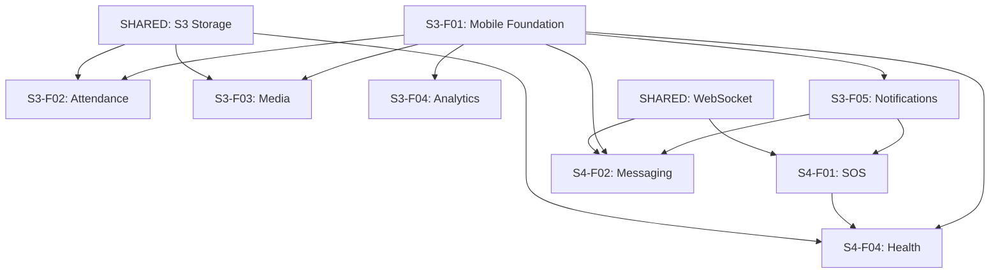

# Sprint 3+4 Detailed Feature Breakdown

Generated: 2025-10-17
Purpose: Detailed expansion of all Sprint 3 & 4 features into user stories with technical specifications

---

## Table of Contents

1. [Sprint 3 Features](#sprint-3-features)
   - [Mobile App Foundation](#s3-f01-mobile-app-foundation)
   - [Attendance Tracking System](#s3-f02-attendance-tracking-system)
   - [Mobile Media Management](#s3-f03-mobile-media-management)
   - [Mobile Analytics & Reporting](#s3-f04-mobile-analytics--reporting)
   - [Mobile Notifications](#s3-f05-mobile-notifications)

2. [Sprint 4 Features](#sprint-4-features)
   - [SOS Emergency System](#s4-f01-sos-emergency-system)
   - [Internal Messaging Module](#s4-f02-internal-messaging-module)
   - [WhatsApp Integration](#s4-f03-whatsapp-integration)
   - [Student Health Tracking](#s4-f04-student-health-tracking)

3. [Shared Infrastructure](#shared-infrastructure)
4. [Cross-Sprint Dependencies](#cross-sprint-dependencies)

---

## Sprint 3 Features

### S3-F01: Mobile App Foundation
**Module:** Mobile Core
**Priority:** P0 (Critical Path)
**Estimated Timeline:** Week 1-2
**Dependencies:** None (Foundation)

#### Story S3-F01-STORY-01: Mobile App Initialization & Project Setup
**As a** Developer
**I want to** Set up the mobile app project with React Native
**So that** We have a solid foundation for mobile development

**Acceptance Criteria:**
- [ ] React Native project initialized with TypeScript support
- [ ] Navigation structure implemented (React Navigation)
- [ ] Project structure follows modular architecture (similar to Sprint 5 shop/)
- [ ] Environment configuration setup (.env support for dev/staging/prod)
- [ ] Build configurations for iOS and Android (if both platforms)
- [ ] App icon and splash screen configured
- [ ] Development environment tested on emulators/simulators

**Technical Specifications:**
```yaml
Technology Stack:
  - React Native: Latest stable
  - React Navigation: v6.x
  - State Management: Zustand (consistent with web app)
  - HTTP Client: Axios (shared configuration with web)
  - Storage: AsyncStorage for local persistence

Project Structure:
  mobile/
  ├── src/
  │   ├── screens/          # Screen components
  │   ├── components/       # Reusable components
  │   ├── navigation/       # Navigation configuration
  │   ├── services/         # API services
  │   ├── store/            # Zustand stores
  │   ├── utils/            # Utility functions
  │   ├── constants/        # Constants and config
  │   └── types/            # TypeScript types
  ├── android/
  ├── ios/
  └── package.json

Environment Variables:
  - REACT_APP_API_BASE_URL
  - REACT_APP_WS_URL
  - REACT_APP_S3_BUCKET_URL
```

**API Endpoints:**
- None (Foundation setup)

**Data Models:**
- None (Foundation setup)

---

#### Story S3-F01-STORY-02: Mobile Authentication System
**As a** Coach/Admin/Balagruh In-Charge
**I want to** Log into the mobile app using my existing credentials
**So that** I can access mobile features securely

**Acceptance Criteria:**
- [ ] Login screen with username/password fields
- [ ] JWT token-based authentication (reusing existing backend)
- [ ] Secure token storage in device keychain/keystore
- [ ] Biometric authentication support (Face ID/Touch ID/Fingerprint)
- [ ] Auto-login if valid token exists
- [ ] Token refresh mechanism implemented
- [ ] Logout functionality
- [ ] Role-based access control (Coach/Admin/InCharge roles)
- [ ] Session timeout handling

**Technical Specifications:**
```typescript
// Authentication Store (Zustand)
interface AuthStore {
  user: User | null;
  token: string | null;
  isAuthenticated: boolean;
  login: (username: string, password: string) => Promise<void>;
  logout: () => Promise<void>;
  refreshToken: () => Promise<void>;
  enableBiometric: () => Promise<void>;
}

// User Type
interface User {
  _id: string;
  username: string;
  role: 'Coach' | 'Admin' | 'Balagruh In-Charge';
  balagruhId?: string;
  permissions: string[];
  profilePicture?: string;
}
```

**API Endpoints:**
```yaml
POST /api/auth/login
  Request:
    username: string
    password: string
  Response:
    token: string
    user: User
    refreshToken: string

POST /api/auth/refresh
  Request:
    refreshToken: string
  Response:
    token: string

POST /api/auth/logout
  Request:
    token: string
  Response:
    success: boolean
```

**Data Models:**
- Reuses existing User model from backend
- SecureStorage for tokens (device-specific)

**Dependencies:**
- react-native-keychain for secure storage
- react-native-biometrics for biometric auth

---

#### Story S3-F01-STORY-03: Mobile Main Navigation & Dashboard
**As a** Mobile App User
**I want to** Navigate between different sections easily
**So that** I can access all mobile features efficiently

**Acceptance Criteria:**
- [ ] Bottom tab navigation for primary sections
- [ ] Dashboard screen showing role-specific quick actions
- [ ] Navigation drawer for additional options
- [ ] Profile section with user details
- [ ] App settings screen
- [ ] About/Help section
- [ ] Deep linking support for notifications
- [ ] Badge indicators for unread notifications

**Technical Specifications:**
```typescript
// Navigation Structure
type RootStackParamList = {
  Auth: undefined;
  Main: undefined;
  Dashboard: undefined;
  Attendance: undefined;
  Media: undefined;
  Reports: undefined;
  Messaging: undefined;  // Sprint 4
  SOS: undefined;        // Sprint 4
  Profile: undefined;
  Settings: undefined;
};

// Dashboard Quick Actions (Role-based)
interface QuickAction {
  id: string;
  title: string;
  icon: string;
  route: string;
  roles: ('Coach' | 'Admin' | 'Balagruh In-Charge')[];
  badge?: number;
}

const quickActions: QuickAction[] = [
  {
    id: 'attendance',
    title: 'Mark Attendance',
    icon: 'camera',
    route: 'Attendance',
    roles: ['Balagruh In-Charge'],
  },
  {
    id: 'media-upload',
    title: 'Upload Content',
    icon: 'upload',
    route: 'Media',
    roles: ['Coach', 'Admin'],
  },
  {
    id: 'reports',
    title: 'View Reports',
    icon: 'chart',
    route: 'Reports',
    roles: ['Admin', 'Coach'],
  },
  {
    id: 'emergency',
    title: 'SOS Alerts',
    icon: 'alert',
    route: 'SOS',
    roles: ['Coach', 'Admin'],
    badge: 0, // Dynamic
  },
];
```

**API Endpoints:**
```yaml
GET /api/mobile/dashboard/:userId
  Response:
    quickActions: QuickAction[]
    recentActivity: Activity[]
    notifications: Notification[]
    stats: {
      pendingTasks: number
      unreadMessages: number
      sosAlerts: number
    }
```

**Data Models:**
```javascript
// Dashboard Schema
const DashboardSchema = new mongoose.Schema({
  userId: { type: mongoose.Schema.Types.ObjectId, ref: 'User' },
  quickActions: [QuickActionSchema],
  lastAccessed: Date,
});
```

---

### S3-F02: Attendance Tracking System
**Module:** Attendance
**Priority:** P0 (Core Feature)
**Estimated Timeline:** Week 2-3
**Dependencies:** S3-F01 (Mobile Foundation), Existing Face-API.js integration

#### Story S3-F02-STORY-01: Photo Upload for Attendance
**As a** Balagruh In-Charge
**I want to** Upload a class photo from my mobile device
**So that** Attendance can be automatically marked using facial recognition

**Acceptance Criteria:**
- [ ] Camera access permission handling
- [ ] Capture photo using device camera
- [ ] Select photo from device gallery (alternative)
- [ ] Photo preview before upload
- [ ] Image compression/optimization (max 5MB)
- [ ] Select associated class/session metadata
- [ ] Date/time stamp auto-applied
- [ ] Geolocation tagging (optional, with permission)
- [ ] Upload progress indicator
- [ ] Retry mechanism for failed uploads
- [ ] Offline queue for uploads (upload when connected)

**Technical Specifications:**
```typescript
// Attendance Upload Interface
interface AttendanceUpload {
  photoUri: string;
  classId: string;
  sessionId: string;
  balagruhId: string;
  uploadedBy: string;
  capturedAt: Date;
  location?: {
    latitude: number;
    longitude: number;
  };
  metadata: {
    deviceInfo: string;
    appVersion: string;
  };
}

// Image Processing
const imageConfig = {
  maxWidth: 1920,
  maxHeight: 1080,
  quality: 0.8,
  format: 'JPEG',
};
```

**API Endpoints:**
```yaml
POST /api/attendance/upload
  Content-Type: multipart/form-data
  Request:
    photo: File
    classId: string
    sessionId: string
    balagruhId: string
    capturedAt: ISO DateTime
    location?: { lat: number, lng: number }
  Response:
    uploadId: string
    processingStatus: 'queued' | 'processing'
    estimatedTime: number (seconds)

GET /api/attendance/upload/:uploadId/status
  Response:
    status: 'queued' | 'processing' | 'completed' | 'failed'
    progress: number (0-100)
    facesDetected: number
    studentsMatched: number
    errors?: string[]
```

**Data Models:**
```javascript
// AttendanceUpload Schema
const AttendanceUploadSchema = new mongoose.Schema({
  _id: mongoose.Schema.Types.ObjectId,
  photoUrl: String, // S3 URL
  classId: { type: mongoose.Schema.Types.ObjectId, ref: 'Class' },
  sessionId: { type: mongoose.Schema.Types.ObjectId, ref: 'Session' },
  balagruhId: { type: mongoose.Schema.Types.ObjectId, ref: 'Balagruh' },
  uploadedBy: { type: mongoose.Schema.Types.ObjectId, ref: 'User' },
  capturedAt: Date,
  uploadedAt: { type: Date, default: Date.now },
  location: {
    type: { type: String, default: 'Point' },
    coordinates: [Number], // [longitude, latitude]
  },
  processingStatus: {
    type: String,
    enum: ['queued', 'processing', 'completed', 'failed'],
    default: 'queued',
  },
  facialRecognitionResults: {
    facesDetected: Number,
    studentsMatched: Number,
    matchDetails: [{
      studentId: { type: mongoose.Schema.Types.ObjectId, ref: 'Student' },
      confidence: Number,
      boundingBox: {
        x: Number, y: Number, width: Number, height: Number,
      },
    }],
    processingTime: Number, // milliseconds
    errors: [String],
  },
  metadata: {
    deviceInfo: String,
    appVersion: String,
    networkType: String,
  },
});

AttendanceUploadSchema.index({ balagruhId: 1, capturedAt: -1 });
AttendanceUploadSchema.index({ processingStatus: 1 });
```

**Dependencies:**
- react-native-image-picker for camera/gallery access
- react-native-image-resizer for image optimization
- AWS S3 SDK for upload
- Existing Face-API.js backend integration

---

#### Story S3-F02-STORY-02: Attendance Processing & Results
**As a** Balagruh In-Charge
**I want to** View facial recognition results and attendance summary
**So that** I can verify and confirm attendance records

**Acceptance Criteria:**
- [ ] Real-time processing status updates
- [ ] Push notification when processing completes
- [ ] Display detected faces with bounding boxes
- [ ] List of matched students with confidence scores
- [ ] List of unmatched faces for manual identification
- [ ] Ability to manually add/remove students from attendance
- [ ] Ability to mark students absent who were incorrectly marked present
- [ ] Attendance summary (total, present, absent, unverified)
- [ ] Save/Submit final attendance record
- [ ] View history of attendance uploads

**Technical Specifications:**
```typescript
// Attendance Results Interface
interface AttendanceResults {
  uploadId: string;
  classId: string;
  sessionId: string;
  date: Date;
  totalStudents: number;
  presentCount: number;
  absentCount: number;
  unverifiedCount: number;
  students: {
    studentId: string;
    name: string;
    rollNumber: string;
    status: 'present' | 'absent' | 'unverified';
    confidence: number;
    thumbnail?: string;
    manualOverride?: boolean;
  }[];
  processingTime: number;
}

// Manual Override Action
interface AttendanceOverride {
  uploadId: string;
  studentId: string;
  action: 'mark-present' | 'mark-absent' | 'identify';
  notes?: string;
}
```

**API Endpoints:**
```yaml
GET /api/attendance/results/:uploadId
  Response: AttendanceResults

POST /api/attendance/override
  Request:
    uploadId: string
    studentId: string
    action: 'mark-present' | 'mark-absent' | 'identify'
    notes?: string
  Response:
    success: boolean
    updatedResults: AttendanceResults

POST /api/attendance/submit
  Request:
    uploadId: string
    finalAttendance: {
      studentId: string
      status: 'present' | 'absent'
    }[]
    notes?: string
  Response:
    attendanceRecordId: string
    success: boolean

GET /api/attendance/history
  Query:
    balagruhId: string
    startDate?: ISO Date
    endDate?: ISO Date
    limit?: number
  Response:
    uploads: AttendanceUpload[]
    pagination: { total: number, page: number, limit: number }
```

**Data Models:**
```javascript
// Final Attendance Record Schema
const AttendanceRecordSchema = new mongoose.Schema({
  _id: mongoose.Schema.Types.ObjectId,
  uploadId: { type: mongoose.Schema.Types.ObjectId, ref: 'AttendanceUpload' },
  classId: { type: mongoose.Schema.Types.ObjectId, ref: 'Class' },
  sessionId: { type: mongoose.Schema.Types.ObjectId, ref: 'Session' },
  balagruhId: { type: mongoose.Schema.Types.ObjectId, ref: 'Balagruh' },
  date: Date,
  recordedBy: { type: mongoose.Schema.Types.ObjectId, ref: 'User' },
  submittedAt: { type: Date, default: Date.now },
  attendance: [{
    studentId: { type: mongoose.Schema.Types.ObjectId, ref: 'Student' },
    status: { type: String, enum: ['present', 'absent'] },
    manualOverride: Boolean,
    confidence: Number,
    notes: String,
  }],
  summary: {
    totalStudents: Number,
    present: Number,
    absent: Number,
  },
  notes: String,
});

AttendanceRecordSchema.index({ balagruhId: 1, date: -1 });
AttendanceRecordSchema.index({ classId: 1, date: -1 });
```

---

### S3-F03: Mobile Media Management
**Module:** Media
**Priority:** P1 (High Priority)
**Estimated Timeline:** Week 2-3
**Dependencies:** S3-F01 (Mobile Foundation), AWS S3 Integration

#### Story S3-F03-STORY-01: Course Content Upload
**As a** Coach
**I want to** Upload course content (videos, documents, images) from my mobile device
**So that** Students can access learning materials

**Acceptance Criteria:**
- [ ] Multi-file selection support
- [ ] Support for multiple file types (video: mp4/mov, documents: pdf/doc, images: jpg/png)
- [ ] File size validation (max 100MB per file)
- [ ] Select course/module to associate content
- [ ] Add title, description, and tags to uploaded content
- [ ] Upload progress indicator for each file
- [ ] Ability to pause/resume uploads
- [ ] Batch upload support (multiple files at once)
- [ ] Preview uploaded content before publishing
- [ ] Publish/Unpublish content control

**Technical Specifications:**
```typescript
// Media Upload Interface
interface MediaUpload {
  files: FileInfo[];
  courseId: string;
  moduleId?: string;
  uploadedBy: string;
  metadata: {
    title: string;
    description: string;
    tags: string[];
    category: 'video' | 'document' | 'image' | 'audio';
    accessLevel: 'public' | 'restricted';
  };
}

interface FileInfo {
  uri: string;
  name: string;
  type: string;
  size: number;
  uploadProgress: number;
  uploadStatus: 'pending' | 'uploading' | 'completed' | 'failed';
}

// Upload Configuration
const uploadConfig = {
  maxFileSize: 100 * 1024 * 1024, // 100MB
  allowedVideoFormats: ['mp4', 'mov', 'avi'],
  allowedDocFormats: ['pdf', 'doc', 'docx', 'ppt', 'pptx'],
  allowedImageFormats: ['jpg', 'jpeg', 'png', 'gif'],
  chunkSize: 5 * 1024 * 1024, // 5MB chunks for multipart upload
};
```

**API Endpoints:**
```yaml
POST /api/media/upload/initiate
  Request:
    fileName: string
    fileType: string
    fileSize: number
    courseId: string
    moduleId?: string
    metadata: object
  Response:
    uploadId: string
    uploadUrl: string (S3 presigned URL)
    expiresIn: number

PUT /api/media/upload/chunk
  Content-Type: multipart/form-data
  Request:
    uploadId: string
    chunkNumber: number
    totalChunks: number
    file: Blob
  Response:
    chunkUploaded: boolean
    progress: number

POST /api/media/upload/complete
  Request:
    uploadId: string
  Response:
    mediaId: string
    url: string
    thumbnailUrl?: string

GET /api/media/content
  Query:
    courseId?: string
    moduleId?: string
    category?: string
    uploadedBy?: string
    limit?: number
    offset?: number
  Response:
    content: MediaContent[]
    pagination: object
```

**Data Models:**
```javascript
// MediaContent Schema
const MediaContentSchema = new mongoose.Schema({
  _id: mongoose.Schema.Types.ObjectId,
  title: { type: String, required: true },
  description: String,
  category: {
    type: String,
    enum: ['video', 'document', 'image', 'audio'],
    required: true,
  },
  fileUrl: { type: String, required: true },
  thumbnailUrl: String,
  fileName: String,
  fileSize: Number,
  fileType: String,
  duration: Number, // For videos/audio
  courseId: { type: mongoose.Schema.Types.ObjectId, ref: 'Course' },
  moduleId: { type: mongoose.Schema.Types.ObjectId, ref: 'Module' },
  uploadedBy: { type: mongoose.Schema.Types.ObjectId, ref: 'User', required: true },
  uploadedAt: { type: Date, default: Date.now },
  tags: [String],
  accessLevel: { type: String, enum: ['public', 'restricted'], default: 'restricted' },
  isPublished: { type: Boolean, default: false },
  publishedAt: Date,
  viewCount: { type: Number, default: 0 },
  metadata: {
    deviceInfo: String,
    appVersion: String,
  },
});

MediaContentSchema.index({ courseId: 1, uploadedAt: -1 });
MediaContentSchema.index({ uploadedBy: 1, uploadedAt: -1 });
MediaContentSchema.index({ category: 1, isPublished: 1 });
```

**Dependencies:**
- react-native-document-picker for file selection
- react-native-fs for file system access
- AWS S3 SDK for multipart upload
- react-native-video for video preview (optional)

---

### S3-F04: Mobile Analytics & Reporting
**Module:** Reports
**Priority:** P1 (High Priority)
**Estimated Timeline:** Week 3
**Dependencies:** S3-F01 (Mobile Foundation), S3-F02 (Attendance data)

#### Story S3-F04-STORY-01: Admin Performance Dashboard
**As an** Admin
**I want to** View performance metrics and analytics on mobile
**So that** I can monitor student and coach performance on the go

**Acceptance Criteria:**
- [ ] Dashboard with key metrics (attendance rate, course completion, coin balances)
- [ ] Date range selector (today, week, month, custom)
- [ ] Balagruh selector (for multi-balagruh admins)
- [ ] Visual charts (bar, line, pie) for data visualization
- [ ] Top performers list (students and coaches)
- [ ] Alert indicators for low attendance or performance
- [ ] Export report as PDF (optional)
- [ ] Drill-down capability into detailed views
- [ ] Refresh to update data

**Technical Specifications:**
```typescript
// Dashboard Metrics Interface
interface DashboardMetrics {
  dateRange: {
    startDate: Date;
    endDate: Date;
  };
  balagruhId?: string;
  metrics: {
    attendance: {
      averageRate: number;
      trend: 'up' | 'down' | 'stable';
      byClass: { classId: string; className: string; rate: number }[];
    };
    courseCompletion: {
      averageRate: number;
      byCourse: { courseId: string; courseName: string; rate: number }[];
    };
    coinEconomy: {
      totalDistributed: number;
      totalSpent: number;
      averageBalance: number;
    };
    topPerformers: {
      students: { studentId: string; name: string; score: number }[];
      coaches: { coachId: string; name: string; rating: number }[];
    };
  };
  alerts: {
    type: 'attendance' | 'performance' | 'inventory';
    severity: 'low' | 'medium' | 'high';
    message: string;
    count: number;
  }[];
}

// Chart Data Format
interface ChartData {
  labels: string[];
  datasets: {
    label: string;
    data: number[];
    color: string;
  }[];
}
```

**API Endpoints:**
```yaml
GET /api/reports/dashboard
  Query:
    balagruhId?: string
    startDate: ISO Date
    endDate: ISO Date
  Response: DashboardMetrics

GET /api/reports/attendance
  Query:
    balagruhId?: string
    classId?: string
    startDate: ISO Date
    endDate: ISO Date
    groupBy: 'day' | 'week' | 'month'
  Response:
    data: ChartData
    summary: { totalClasses: number, avgRate: number }

GET /api/reports/course-completion
  Query:
    balagruhId?: string
    courseId?: string
    startDate: ISO Date
    endDate: ISO Date
  Response:
    data: ChartData
    summary: { totalStudents: number, completedCount: number }

POST /api/reports/export
  Request:
    reportType: 'dashboard' | 'attendance' | 'completion'
    filters: object
    format: 'pdf' | 'csv'
  Response:
    downloadUrl: string
    expiresIn: number
```

**Data Models:**
- Aggregates data from existing AttendanceRecord, Course, Student schemas
- No new schemas required (reporting layer)

---

### S3-F05: Mobile Notifications
**Module:** Notifications
**Priority:** P0 (Critical for Sprint 4)
**Estimated Timeline:** Week 2-3
**Dependencies:** S3-F01 (Mobile Foundation), Firebase Cloud Messaging

#### Story S3-F05-STORY-01: Push Notification Infrastructure
**As a** Mobile App User
**I want to** Receive push notifications for important events
**So that** I stay informed about attendance, emergencies, and messages

**Acceptance Criteria:**
- [ ] Firebase Cloud Messaging (FCM) integration
- [ ] Device token registration on app launch
- [ ] Notification permission handling
- [ ] Background notification handling
- [ ] Foreground notification handling
- [ ] Notification click handling (deep linking to relevant screen)
- [ ] Notification categories (attendance, SOS, message, alert)
- [ ] Badge count management
- [ ] Notification preferences in settings
- [ ] Notification history screen
- [ ] Mark notifications as read

**Technical Specifications:**
```typescript
// Notification Interface
interface Notification {
  _id: string;
  userId: string;
  title: string;
  body: string;
  category: 'attendance' | 'sos' | 'message' | 'alert' | 'task';
  priority: 'low' | 'medium' | 'high' | 'urgent';
  data: {
    targetScreen?: string;
    targetId?: string;
    [key: string]: any;
  };
  isRead: boolean;
  createdAt: Date;
  expiresAt?: Date;
}

// Push Notification Payload (FCM)
interface FCMPayload {
  notification: {
    title: string;
    body: string;
    badge: number;
    sound: string;
  };
  data: {
    category: string;
    priority: string;
    targetScreen?: string;
    targetId?: string;
  };
  android: {
    priority: 'high' | 'normal';
    channelId: string;
  };
  apns: {
    payload: {
      aps: {
        sound: string;
        badge: number;
      };
    };
  };
}

// Notification Preferences
interface NotificationPreferences {
  userId: string;
  categories: {
    attendance: { enabled: boolean; sound: boolean };
    sos: { enabled: boolean; sound: boolean };
    message: { enabled: boolean; sound: boolean };
    alert: { enabled: boolean; sound: boolean };
  };
  quietHours: {
    enabled: boolean;
    startTime: string; // HH:mm
    endTime: string;   // HH:mm
  };
}
```

**API Endpoints:**
```yaml
POST /api/notifications/register-device
  Request:
    userId: string
    deviceToken: string
    platform: 'ios' | 'android'
    deviceInfo: object
  Response:
    success: boolean
    deviceId: string

POST /api/notifications/send
  Request:
    userIds: string[]
    title: string
    body: string
    category: string
    priority: string
    data: object
  Response:
    notificationId: string
    sent: number
    failed: number

GET /api/notifications/history
  Query:
    userId: string
    limit?: number
    offset?: number
  Response:
    notifications: Notification[]
    unreadCount: number
    pagination: object

PUT /api/notifications/:notificationId/read
  Response:
    success: boolean

PUT /api/notifications/read-all
  Request:
    userId: string
  Response:
    success: boolean
    updatedCount: number

GET /api/notifications/preferences/:userId
  Response: NotificationPreferences

PUT /api/notifications/preferences/:userId
  Request: NotificationPreferences
  Response:
    success: boolean
```

**Data Models:**
```javascript
// Notification Schema
const NotificationSchema = new mongoose.Schema({
  _id: mongoose.Schema.Types.ObjectId,
  userId: { type: mongoose.Schema.Types.ObjectId, ref: 'User', required: true },
  title: { type: String, required: true },
  body: { type: String, required: true },
  category: {
    type: String,
    enum: ['attendance', 'sos', 'message', 'alert', 'task'],
    required: true,
  },
  priority: {
    type: String,
    enum: ['low', 'medium', 'high', 'urgent'],
    default: 'medium',
  },
  data: mongoose.Schema.Types.Mixed,
  isRead: { type: Boolean, default: false },
  createdAt: { type: Date, default: Date.now },
  expiresAt: Date,
});

NotificationSchema.index({ userId: 1, createdAt: -1 });
NotificationSchema.index({ userId: 1, isRead: 1 });
NotificationSchema.index({ expiresAt: 1 }, { expireAfterSeconds: 0 });

// DeviceToken Schema
const DeviceTokenSchema = new mongoose.Schema({
  _id: mongoose.Schema.Types.ObjectId,
  userId: { type: mongoose.Schema.Types.ObjectId, ref: 'User', required: true },
  deviceToken: { type: String, required: true, unique: true },
  platform: { type: String, enum: ['ios', 'android'], required: true },
  deviceInfo: {
    model: String,
    osVersion: String,
    appVersion: String,
  },
  isActive: { type: Boolean, default: true },
  registeredAt: { type: Date, default: Date.now },
  lastUsedAt: Date,
});

DeviceTokenSchema.index({ userId: 1 });
DeviceTokenSchema.index({ deviceToken: 1 });

// NotificationPreferences Schema
const NotificationPreferencesSchema = new mongoose.Schema({
  userId: { type: mongoose.Schema.Types.ObjectId, ref: 'User', required: true, unique: true },
  categories: {
    attendance: { enabled: { type: Boolean, default: true }, sound: { type: Boolean, default: true } },
    sos: { enabled: { type: Boolean, default: true }, sound: { type: Boolean, default: true } },
    message: { enabled: { type: Boolean, default: true }, sound: { type: Boolean, default: true } },
    alert: { enabled: { type: Boolean, default: true }, sound: { type: Boolean, default: true } },
  },
  quietHours: {
    enabled: { type: Boolean, default: false },
    startTime: String,
    endTime: String,
  },
  updatedAt: { type: Date, default: Date.now },
});
```

**Dependencies:**
- @react-native-firebase/messaging for FCM
- react-native-push-notification for local notifications
- Firebase Admin SDK (backend) for sending notifications

---

## Sprint 4 Features

### S4-F01: SOS Emergency System
**Module:** SOS
**Priority:** P0 (Critical - Safety Feature)
**Estimated Timeline:** Week 3
**Dependencies:** S3-F01 (Mobile App), S3-F05 (Notifications)

#### Story S4-F01-STORY-01: Desktop SOS Trigger
**As a** Student
**I want to** Trigger an SOS emergency alert from my desktop app
**So that** I can quickly get help in emergencies

**Acceptance Criteria:**
- [ ] SOS button prominently displayed on student dashboard
- [ ] Single-click activation (no confirmation to avoid delays)
- [ ] Optional emergency category selection (Medical, Safety, Mental Health, Other)
- [ ] Optional text input for brief description (max 200 chars)
- [ ] Auto-include student location (Balagruh, room number if available)
- [ ] Auto-include student details (name, ID, photo)
- [ ] Visual confirmation that SOS was sent
- [ ] Display estimated response time
- [ ] Ability to cancel false alarms (within 30 seconds)
- [ ] SOS status tracking (sent → acknowledged → responding → resolved)

**Technical Specifications:**
```typescript
// SOS Alert Interface
interface SOSAlert {
  _id: string;
  studentId: string;
  balagruhId: string;
  category: 'medical' | 'safety' | 'mental-health' | 'other' | 'unspecified';
  description?: string;
  location: {
    balagruhName: string;
    roomNumber?: string;
    coordinates?: { lat: number; lng: number };
  };
  priority: 'high' | 'urgent' | 'critical';
  status: 'sent' | 'acknowledged' | 'responding' | 'resolved' | 'cancelled';
  triggeredAt: Date;
  acknowledgedAt?: Date;
  resolvedAt?: Date;
  respondingUsers: {
    userId: string;
    acknowledgedAt: Date;
    arrivedAt?: Date;
  }[];
  resolution: {
    resolvedBy?: string;
    notes?: string;
    outcome: 'resolved' | 'false-alarm' | 'escalated';
  };
}

// Desktop Component (React)
const SOSButton: React.FC = () => {
  const [showCategories, setShowCategories] = useState(false);
  const [description, setDescription] = useState('');

  const triggerSOS = async (category: string) => {
    const alert = await api.post('/api/sos/trigger', {
      studentId: currentUser.id,
      category,
      description,
      location: getCurrentLocation(),
    });

    // Show confirmation UI
    showSOSConfirmation(alert);
  };

  return (
    <button className="sos-button" onClick={() => setShowCategories(true)}>
      SOS Emergency
    </button>
  );
};
```

**API Endpoints:**
```yaml
POST /api/sos/trigger
  Request:
    studentId: string
    balagruhId: string
    category?: string
    description?: string
    location: object
  Response:
    alertId: string
    estimatedResponseTime: number
    status: string

GET /api/sos/status/:alertId
  Response: SOSAlert

POST /api/sos/:alertId/cancel
  Request:
    reason: string
  Response:
    success: boolean

POST /api/sos/:alertId/acknowledge
  Request:
    userId: string
  Response:
    success: boolean

POST /api/sos/:alertId/resolve
  Request:
    resolvedBy: string
    notes: string
    outcome: string
  Response:
    success: boolean
```

**Data Models:**
```javascript
// SOSAlert Schema
const SOSAlertSchema = new mongoose.Schema({
  _id: mongoose.Schema.Types.ObjectId,
  studentId: { type: mongoose.Schema.Types.ObjectId, ref: 'Student', required: true },
  balagruhId: { type: mongoose.Schema.Types.ObjectId, ref: 'Balagruh', required: true },
  category: {
    type: String,
    enum: ['medical', 'safety', 'mental-health', 'other', 'unspecified'],
    default: 'unspecified',
  },
  description: { type: String, maxlength: 200 },
  location: {
    balagruhName: String,
    roomNumber: String,
    coordinates: {
      type: { type: String, default: 'Point' },
      coordinates: [Number],
    },
  },
  priority: {
    type: String,
    enum: ['high', 'urgent', 'critical'],
    default: 'urgent',
  },
  status: {
    type: String,
    enum: ['sent', 'acknowledged', 'responding', 'resolved', 'cancelled'],
    default: 'sent',
  },
  triggeredAt: { type: Date, default: Date.now },
  acknowledgedAt: Date,
  resolvedAt: Date,
  respondingUsers: [{
    userId: { type: mongoose.Schema.Types.ObjectId, ref: 'User' },
    acknowledgedAt: Date,
    arrivedAt: Date,
  }],
  resolution: {
    resolvedBy: { type: mongoose.Schema.Types.ObjectId, ref: 'User' },
    notes: String,
    outcome: { type: String, enum: ['resolved', 'false-alarm', 'escalated'] },
  },
  escalationLog: [{
    timestamp: Date,
    action: String,
    userId: { type: mongoose.Schema.Types.ObjectId, ref: 'User' },
  }],
});

SOSAlertSchema.index({ studentId: 1, triggeredAt: -1 });
SOSAlertSchema.index({ balagruhId: 1, status: 1 });
SOSAlertSchema.index({ status: 1, priority: -1 });
```

---

#### Story S4-F01-STORY-02: Mobile SOS Alert Receiver
**As a** Coach/Admin
**I want to** Receive SOS alerts on my mobile device immediately
**So that** I can respond quickly to student emergencies

**Acceptance Criteria:**
- [ ] Receive high-priority push notification for SOS alerts
- [ ] Unique notification sound for SOS (different from regular notifications)
- [ ] Full-screen alert UI if app is open
- [ ] Display student details (name, photo, location)
- [ ] Display emergency category and description
- [ ] One-tap acknowledge button
- [ ] One-tap "I'm responding" button
- [ ] Call student/balagruh directly from alert
- [ ] Navigate to alert location (if coordinates available)
- [ ] View other responders in real-time
- [ ] Add notes/updates to alert
- [ ] Mark alert as resolved
- [ ] View alert history

**Technical Specifications:**
```typescript
// Mobile SOS Alert Component
interface SOSAlertScreenProps {
  alert: SOSAlert;
  onAcknowledge: () => void;
  onRespond: () => void;
  onResolve: (notes: string, outcome: string) => void;
}

const SOSAlertScreen: React.FC<SOSAlertScreenProps> = ({ alert, onAcknowledge, onRespond, onResolve }) => {
  return (
    <View style={styles.urgentContainer}>
      <Text style={styles.urgentHeader}>EMERGENCY ALERT</Text>
      <StudentCard student={alert.student} />
      <AlertDetails alert={alert} />
      <RespondersStatus responders={alert.respondingUsers} />
      <ActionButtons
        onAcknowledge={onAcknowledge}
        onRespond={onRespond}
        onResolve={() => showResolveModal()}
        onCall={() => makeCall(alert.student.phone)}
        onNavigate={() => openMaps(alert.location.coordinates)}
      />
    </View>
  );
};

// Real-time Updates via WebSocket
const useSOSRealtime = (alertId: string) => {
  const [alert, setAlert] = useState<SOSAlert | null>(null);

  useEffect(() => {
    const ws = new WebSocket(`${WS_URL}/sos/${alertId}`);

    ws.onmessage = (event) => {
      const update = JSON.parse(event.data);
      setAlert(prev => ({ ...prev, ...update }));
    };

    return () => ws.close();
  }, [alertId]);

  return alert;
};
```

**API Endpoints:**
```yaml
GET /api/sos/active
  Query:
    balagruhId?: string
    userId?: string
  Response:
    alerts: SOSAlert[]
    count: number

GET /api/sos/history
  Query:
    balagruhId?: string
    startDate?: ISO Date
    endDate?: ISO Date
    status?: string
    limit?: number
  Response:
    alerts: SOSAlert[]
    pagination: object

WebSocket /ws/sos/:alertId
  Events:
    - alert.acknowledged
    - alert.responding
    - alert.resolved
    - alert.updated
    - responder.joined
```

---

#### Story S4-F01-STORY-03: SOS Escalation & Workflow
**As an** Admin
**I want to** Define escalation rules for SOS alerts
**So that** Alerts reach the right people at the right time

**Acceptance Criteria:**
- [ ] Define escalation tiers (Tier 1: Coaches, Tier 2: Admins, Tier 3: External)
- [ ] Configure escalation timeouts (e.g., escalate if not acknowledged in 2 mins)
- [ ] Auto-escalate based on category (medical → immediate Tier 2)
- [ ] Broadcast to multiple users simultaneously
- [ ] SMS/Call escalation for critical alerts
- [ ] Integration with emergency services (optional - phone numbers)
- [ ] Alert fatigue prevention (cooldown periods for false alarms)
- [ ] Compliance logging for audit trail

**Technical Specifications:**
```typescript
// Escalation Configuration
interface EscalationRule {
  balagruhId: string;
  category: string;
  tiers: {
    tier: number;
    roles: string[];
    userIds: string[];
    timeout: number; // seconds
    notificationChannels: ('push' | 'sms' | 'call')[];
  }[];
  criticalThreshold: number; // auto-escalate if not acknowledged in X seconds
}

// Escalation Service
class SOSEscalationService {
  async processAlert(alert: SOSAlert) {
    const rules = await this.getEscalationRules(alert.balagruhId, alert.category);

    for (const tier of rules.tiers) {
      await this.notifyTier(alert, tier);
      const acknowledged = await this.waitForAcknowledgment(alert._id, tier.timeout);

      if (acknowledged) break;

      // Escalate to next tier
      await this.logEscalation(alert._id, tier.tier + 1);
    }
  }

  async notifyTier(alert: SOSAlert, tier: EscalationTier) {
    const users = await this.getUsersForTier(tier);

    for (const channel of tier.notificationChannels) {
      if (channel === 'push') {
        await this.sendPushNotifications(users, alert);
      } else if (channel === 'sms') {
        await this.sendSMS(users, alert);
      } else if (channel === 'call') {
        await this.triggerAutomatedCall(users, alert);
      }
    }
  }
}
```

**API Endpoints:**
```yaml
GET /api/sos/escalation-rules/:balagruhId
  Response:
    rules: EscalationRule[]

PUT /api/sos/escalation-rules/:balagruhId
  Request:
    rules: EscalationRule[]
  Response:
    success: boolean

POST /api/sos/:alertId/escalate
  Request:
    reason: string
    targetTier: number
  Response:
    success: boolean
    notifiedUsers: number
```

**Data Models:**
```javascript
// EscalationRule Schema
const EscalationRuleSchema = new mongoose.Schema({
  balagruhId: { type: mongoose.Schema.Types.ObjectId, ref: 'Balagruh', required: true },
  category: {
    type: String,
    enum: ['medical', 'safety', 'mental-health', 'other', 'unspecified'],
    required: true,
  },
  tiers: [{
    tier: Number,
    roles: [String],
    userIds: [{ type: mongoose.Schema.Types.ObjectId, ref: 'User' }],
    timeout: { type: Number, default: 120 }, // seconds
    notificationChannels: [{ type: String, enum: ['push', 'sms', 'call'] }],
  }],
  criticalThreshold: { type: Number, default: 60 },
  isActive: { type: Boolean, default: true },
  createdBy: { type: mongoose.Schema.Types.ObjectId, ref: 'User' },
  updatedAt: { type: Date, default: Date.now },
});

EscalationRuleSchema.index({ balagruhId: 1, category: 1 }, { unique: true });
```

---

### S4-F02: Internal Messaging Module
**Module:** Messaging
**Priority:** P1 (High Priority)
**Estimated Timeline:** Week 3-4
**Dependencies:** S3-F01 (Mobile App), S3-F05 (Notifications)

#### Story S4-F02-STORY-01: Direct Messaging
**As a** Coach/Admin/Balagruh In-Charge
**I want to** Send direct messages to other staff members
**So that** I can communicate quickly about student matters

**Acceptance Criteria:**
- [ ] User search/directory to find message recipients
- [ ] Start 1-on-1 conversation
- [ ] Send text messages
- [ ] Send images/attachments
- [ ] Message read receipts
- [ ] Typing indicators
- [ ] Message history pagination
- [ ] Search within conversations
- [ ] Push notifications for new messages
- [ ] Unread message count badges
- [ ] Delete messages (sender only, within 5 minutes)
- [ ] Block/Report users (admin function)

**Technical Specifications:**
```typescript
// Message Interface
interface Message {
  _id: string;
  conversationId: string;
  senderId: string;
  recipientId: string;
  messageType: 'text' | 'image' | 'file';
  content: string;
  attachments?: {
    url: string;
    fileName: string;
    fileSize: number;
    mimeType: string;
  }[];
  sentAt: Date;
  deliveredAt?: Date;
  readAt?: Date;
  isDeleted: boolean;
  deletedAt?: Date;
}

// Conversation Interface
interface Conversation {
  _id: string;
  type: '1-on-1' | 'group';
  participants: {
    userId: string;
    joinedAt: Date;
    lastReadAt: Date;
    unreadCount: number;
  }[];
  lastMessage: Message;
  createdAt: Date;
  updatedAt: Date;
}

// Messaging Component
const ChatScreen: React.FC = () => {
  const [messages, setMessages] = useState<Message[]>([]);
  const [inputText, setInputText] = useState('');
  const ws = useWebSocket(`/ws/chat/${conversationId}`);

  useEffect(() => {
    ws.on('message.new', (message: Message) => {
      setMessages(prev => [...prev, message]);
      markAsRead(message._id);
    });

    ws.on('message.read', (messageId: string) => {
      updateMessageStatus(messageId, 'read');
    });
  }, []);

  const sendMessage = async () => {
    const message = await api.post('/api/messages/send', {
      conversationId,
      content: inputText,
      messageType: 'text',
    });

    ws.emit('message.sent', message);
    setInputText('');
  };

  return <MessageUI messages={messages} onSend={sendMessage} />;
};
```

**API Endpoints:**
```yaml
POST /api/messages/conversations/create
  Request:
    participantIds: string[]
    type: '1-on-1' | 'group'
    name?: string (for groups)
  Response:
    conversationId: string
    conversation: Conversation

GET /api/messages/conversations
  Query:
    userId: string
    limit?: number
    offset?: number
  Response:
    conversations: Conversation[]
    pagination: object

GET /api/messages/:conversationId
  Query:
    limit?: number
    before?: ISO Date (for pagination)
  Response:
    messages: Message[]
    hasMore: boolean

POST /api/messages/send
  Request:
    conversationId: string
    content: string
    messageType: 'text' | 'image' | 'file'
    attachments?: File[]
  Response:
    messageId: string
    message: Message

PUT /api/messages/:messageId/read
  Response:
    success: boolean

DELETE /api/messages/:messageId
  Response:
    success: boolean

GET /api/messages/search
  Query:
    query: string
    conversationId?: string
    userId: string
  Response:
    messages: Message[]

WebSocket /ws/chat/:conversationId
  Events:
    - message.new
    - message.read
    - message.deleted
    - user.typing
    - user.online
```

**Data Models:**
```javascript
// Message Schema
const MessageSchema = new mongoose.Schema({
  _id: mongoose.Schema.Types.ObjectId,
  conversationId: { type: mongoose.Schema.Types.ObjectId, ref: 'Conversation', required: true },
  senderId: { type: mongoose.Schema.Types.ObjectId, ref: 'User', required: true },
  recipientId: { type: mongoose.Schema.Types.ObjectId, ref: 'User' }, // For 1-on-1
  messageType: { type: String, enum: ['text', 'image', 'file'], default: 'text' },
  content: { type: String, required: true },
  attachments: [{
    url: String,
    fileName: String,
    fileSize: Number,
    mimeType: String,
  }],
  sentAt: { type: Date, default: Date.now },
  deliveredAt: Date,
  readAt: Date,
  isDeleted: { type: Boolean, default: false },
  deletedAt: Date,
});

MessageSchema.index({ conversationId: 1, sentAt: -1 });
MessageSchema.index({ senderId: 1, sentAt: -1 });

// Conversation Schema
const ConversationSchema = new mongoose.Schema({
  _id: mongoose.Schema.Types.ObjectId,
  type: { type: String, enum: ['1-on-1', 'group'], default: '1-on-1' },
  name: String, // For group conversations
  participants: [{
    userId: { type: mongoose.Schema.Types.ObjectId, ref: 'User', required: true },
    joinedAt: { type: Date, default: Date.now },
    lastReadAt: Date,
    unreadCount: { type: Number, default: 0 },
  }],
  lastMessage: {
    content: String,
    senderId: { type: mongoose.Schema.Types.ObjectId, ref: 'User' },
    sentAt: Date,
  },
  createdAt: { type: Date, default: Date.now },
  updatedAt: { type: Date, default: Date.now },
});

ConversationSchema.index({ 'participants.userId': 1 });
ConversationSchema.index({ updatedAt: -1 });
```

---

#### Story S4-F02-STORY-02: Group Messaging
**As an** Admin
**I want to** Create group conversations for teams
**So that** Staff can coordinate and share information efficiently

**Acceptance Criteria:**
- [ ] Create group conversations with multiple participants
- [ ] Add/remove participants (creator/admin only)
- [ ] Set group name and icon
- [ ] All features from 1-on-1 messaging work in groups
- [ ] Member list view
- [ ] Leave group option
- [ ] Delivery/read receipts show per participant
- [ ] @mention functionality
- [ ] Mute group notifications
- [ ] Pin important messages

**Technical Specifications:**
```typescript
// Group Conversation Interface
interface GroupConversation extends Conversation {
  name: string;
  icon?: string;
  description?: string;
  admins: string[]; // User IDs
  settings: {
    allowMemberAdd: boolean;
    allowMemberRemove: boolean;
    messageRetentionDays: number;
  };
}

// Group Management
const GroupManagement = {
  async createGroup(name: string, participantIds: string[], creatorId: string) {
    return await api.post('/api/messages/groups/create', {
      name,
      participantIds,
      creatorId,
    });
  },

  async addMember(groupId: string, userId: string) {
    return await api.post(`/api/messages/groups/${groupId}/members`, { userId });
  },

  async removeMember(groupId: string, userId: string) {
    return await api.delete(`/api/messages/groups/${groupId}/members/${userId}`);
  },

  async updateGroup(groupId: string, updates: Partial<GroupConversation>) {
    return await api.put(`/api/messages/groups/${groupId}`, updates);
  },
};
```

**API Endpoints:**
```yaml
POST /api/messages/groups/create
  Request:
    name: string
    participantIds: string[]
    creatorId: string
    description?: string
  Response:
    groupId: string
    group: GroupConversation

POST /api/messages/groups/:groupId/members
  Request:
    userId: string
  Response:
    success: boolean

DELETE /api/messages/groups/:groupId/members/:userId
  Response:
    success: boolean

PUT /api/messages/groups/:groupId
  Request:
    name?: string
    icon?: string
    description?: string
    settings?: object
  Response:
    success: boolean
    group: GroupConversation

POST /api/messages/groups/:groupId/leave
  Request:
    userId: string
  Response:
    success: boolean
```

---

### S4-F03: WhatsApp Integration
**Module:** WhatsApp
**Priority:** P2 (Medium Priority - May already exist from Sprint 2)
**Estimated Timeline:** Week 4
**Dependencies:** WhatsApp Business API access

#### Story S4-F03-STORY-01: WhatsApp Notifications
**As a** System Administrator
**I want to** Send WhatsApp notifications for critical events
**So that** Parents and staff are informed via their preferred channel

**Acceptance Criteria:**
- [ ] WhatsApp Business API integration
- [ ] Send notifications for: SOS alerts, Attendance summaries, Important announcements
- [ ] Template message support (pre-approved templates)
- [ ] Delivery status tracking
- [ ] Opt-in/opt-out management
- [ ] Rate limiting compliance
- [ ] Fallback to SMS if WhatsApp fails
- [ ] Message history/audit log

**Technical Specifications:**
```typescript
// WhatsApp Service
class WhatsAppService {
  private apiUrl = 'https://graph.facebook.com/v17.0';

  async sendTemplateMessage(
    phoneNumber: string,
    templateName: string,
    parameters: string[]
  ) {
    const payload = {
      messaging_product: 'whatsapp',
      to: phoneNumber,
      type: 'template',
      template: {
        name: templateName,
        language: { code: 'en' },
        components: [{
          type: 'body',
          parameters: parameters.map(p => ({ type: 'text', text: p })),
        }],
      },
    };

    return await this.sendMessage(payload);
  }

  async sendSOSAlert(phoneNumber: string, studentName: string, category: string) {
    // Template: "SOS Alert: {{1}} has triggered an emergency alert ({{2}}). Please respond immediately."
    return await this.sendTemplateMessage(
      phoneNumber,
      'sos_alert',
      [studentName, category]
    );
  }
}
```

**API Endpoints:**
```yaml
POST /api/whatsapp/send
  Request:
    phoneNumbers: string[]
    messageType: 'template' | 'text'
    templateName?: string
    parameters?: string[]
    text?: string
  Response:
    messageIds: string[]
    sent: number
    failed: number

GET /api/whatsapp/status/:messageId
  Response:
    status: 'sent' | 'delivered' | 'read' | 'failed'
    timestamp: ISO Date

POST /api/whatsapp/opt-in
  Request:
    userId: string
    phoneNumber: string
  Response:
    success: boolean

POST /api/whatsapp/opt-out
  Request:
    userId: string
  Response:
    success: boolean
```

**Data Models:**
```javascript
// WhatsAppMessage Schema
const WhatsAppMessageSchema = new mongoose.Schema({
  _id: mongoose.Schema.Types.ObjectId,
  phoneNumber: { type: String, required: true },
  userId: { type: mongoose.Schema.Types.ObjectId, ref: 'User' },
  messageType: { type: String, enum: ['template', 'text'], required: true },
  templateName: String,
  parameters: [String],
  text: String,
  status: {
    type: String,
    enum: ['queued', 'sent', 'delivered', 'read', 'failed'],
    default: 'queued',
  },
  whatsappMessageId: String,
  sentAt: Date,
  deliveredAt: Date,
  readAt: Date,
  errorMessage: String,
  metadata: {
    triggeredBy: String,
    eventType: String,
    eventId: String,
  },
});

WhatsAppMessageSchema.index({ phoneNumber: 1, sentAt: -1 });
WhatsAppMessageSchema.index({ status: 1 });
```

**NOTE:** Verify if Sprint 2 already implemented WhatsApp integration. If yes, extend existing implementation instead of building from scratch.

---

### S4-F04: Student Health Tracking
**Module:** Health
**Priority:** P2 (Medium Priority)
**Estimated Timeline:** Week 4
**Dependencies:** S3-F01 (Mobile App), S4-F01 (SOS System)

#### Story S4-F04-STORY-01: Health Data Entry
**As a** Balagruh In-Charge
**I want to** Record student health metrics
**So that** We can monitor well-being over time

**Acceptance Criteria:**
- [ ] Mobile form for health data entry
- [ ] Record metrics: Weight, Height, Temperature, Blood Pressure, Notes
- [ ] Date/time stamp for each entry
- [ ] Select student from list
- [ ] Bulk entry mode (for routine checkups)
- [ ] Photo upload for health documents
- [ ] Mark as routine checkup or incident
- [ ] Alert generation for abnormal values
- [ ] Sync with SOS system (auto-create health entry for SOS medical alerts)

**Technical Specifications:**
```typescript
// Health Record Interface
interface HealthRecord {
  _id: string;
  studentId: string;
  balagruhId: string;
  recordedBy: string;
  recordedAt: Date;
  recordType: 'routine' | 'incident' | 'sos-followup';
  metrics: {
    weight?: { value: number; unit: 'kg' };
    height?: { value: number; unit: 'cm' };
    temperature?: { value: number; unit: 'celsius' };
    bloodPressure?: { systolic: number; diastolic: number };
    heartRate?: number;
  };
  symptoms?: string[];
  notes?: string;
  attachments?: {
    url: string;
    type: 'image' | 'document';
    description: string;
  }[];
  alerts: {
    type: 'abnormal-value' | 'critical-value';
    metric: string;
    severity: 'low' | 'medium' | 'high';
    message: string;
  }[];
  linkedSOSId?: string;
}

// Mobile Health Entry Form
const HealthEntryForm: React.FC = () => {
  const [student, setStudent] = useState<Student | null>(null);
  const [metrics, setMetrics] = useState<HealthMetrics>({});
  const [notes, setNotes] = useState('');

  const submitHealthRecord = async () => {
    const record = await api.post('/api/health/records', {
      studentId: student._id,
      metrics,
      notes,
      recordType: 'routine',
    });

    if (record.alerts.length > 0) {
      showAlerts(record.alerts);
    }
  };

  return <HealthForm />;
};
```

**API Endpoints:**
```yaml
POST /api/health/records
  Request:
    studentId: string
    metrics: object
    recordType: string
    notes?: string
    attachments?: File[]
  Response:
    recordId: string
    record: HealthRecord
    alerts: Alert[]

GET /api/health/records/:studentId
  Query:
    startDate?: ISO Date
    endDate?: ISO Date
    recordType?: string
    limit?: number
  Response:
    records: HealthRecord[]
    summary: {
      totalRecords: number
      lastCheckup: ISO Date
      trends: object
    }

GET /api/health/alerts
  Query:
    balagruhId?: string
    severity?: string
    status?: 'active' | 'resolved'
  Response:
    alerts: Alert[]

PUT /api/health/alerts/:alertId/resolve
  Request:
    resolvedBy: string
    notes: string
  Response:
    success: boolean
```

**Data Models:**
```javascript
// HealthRecord Schema
const HealthRecordSchema = new mongoose.Schema({
  _id: mongoose.Schema.Types.ObjectId,
  studentId: { type: mongoose.Schema.Types.ObjectId, ref: 'Student', required: true },
  balagruhId: { type: mongoose.Schema.Types.ObjectId, ref: 'Balagruh', required: true },
  recordedBy: { type: mongoose.Schema.Types.ObjectId, ref: 'User', required: true },
  recordedAt: { type: Date, default: Date.now },
  recordType: {
    type: String,
    enum: ['routine', 'incident', 'sos-followup'],
    default: 'routine',
  },
  metrics: {
    weight: { value: Number, unit: { type: String, default: 'kg' } },
    height: { value: Number, unit: { type: String, default: 'cm' } },
    temperature: { value: Number, unit: { type: String, default: 'celsius' } },
    bloodPressure: { systolic: Number, diastolic: Number },
    heartRate: Number,
  },
  symptoms: [String],
  notes: String,
  attachments: [{
    url: String,
    type: { type: String, enum: ['image', 'document'] },
    description: String,
  }],
  alerts: [{
    type: { type: String, enum: ['abnormal-value', 'critical-value'] },
    metric: String,
    severity: { type: String, enum: ['low', 'medium', 'high'] },
    message: String,
  }],
  linkedSOSId: { type: mongoose.Schema.Types.ObjectId, ref: 'SOSAlert' },
});

HealthRecordSchema.index({ studentId: 1, recordedAt: -1 });
HealthRecordSchema.index({ balagruhId: 1, recordedAt: -1 });

// HealthAlert Schema
const HealthAlertSchema = new mongoose.Schema({
  _id: mongoose.Schema.Types.ObjectId,
  studentId: { type: mongoose.Schema.Types.ObjectId, ref: 'Student', required: true },
  balagruhId: { type: mongoose.Schema.Types.ObjectId, ref: 'Balagruh', required: true },
  recordId: { type: mongoose.Schema.Types.ObjectId, ref: 'HealthRecord', required: true },
  alertType: { type: String, enum: ['abnormal-value', 'critical-value'], required: true },
  metric: String,
  severity: { type: String, enum: ['low', 'medium', 'high'], required: true },
  message: String,
  status: { type: String, enum: ['active', 'resolved'], default: 'active' },
  createdAt: { type: Date, default: Date.now },
  resolvedAt: Date,
  resolvedBy: { type: mongoose.Schema.Types.ObjectId, ref: 'User' },
  resolution: String,
});

HealthAlertSchema.index({ balagruhId: 1, status: 1 });
HealthAlertSchema.index({ studentId: 1, createdAt: -1 });
```

---

#### Story S4-F04-STORY-02: Health Trends Dashboard
**As a** Coach/Admin
**I want to** View student health trends over time
**So that** I can identify concerning patterns early

**Acceptance Criteria:**
- [ ] Individual student health timeline
- [ ] Trend charts for each metric (weight, height, etc.)
- [ ] Growth charts with percentile curves (for age/gender)
- [ ] Incident history with SOS correlation
- [ ] Export health report as PDF
- [ ] Filter by date range
- [ ] Compare with class/balagruh averages (anonymized)
- [ ] Alert indicators for declining trends

**Technical Specifications:**
```typescript
// Health Trends Interface
interface HealthTrends {
  studentId: string;
  dateRange: { startDate: Date; endDate: Date };
  metrics: {
    [key: string]: {
      data: { date: Date; value: number }[];
      trend: 'improving' | 'stable' | 'declining';
      percentileRank?: number;
    };
  };
  incidents: {
    date: Date;
    type: string;
    linkedSOSId?: string;
  }[];
  growthCurve: {
    height: { age: number; height: number; percentile: number }[];
    weight: { age: number; weight: number; percentile: number }[];
  };
}
```

**API Endpoints:**
```yaml
GET /api/health/trends/:studentId
  Query:
    startDate: ISO Date
    endDate: ISO Date
    metrics?: string[] (comma-separated)
  Response:
    trends: HealthTrends
    recommendations: string[]
```

---

## Shared Infrastructure

### SHARED-01: WebSocket Real-Time Infrastructure
**Priority:** P0 (Required for SOS and Messaging)
**Timeline:** Week 2-3

**Requirements:**
- WebSocket server implementation (Socket.io)
- Room-based messaging (conversations, SOS alerts)
- Authentication via JWT tokens
- Reconnection handling
- Presence tracking (online/offline status)
- Message queuing for offline users

**Technical Specifications:**
```typescript
// WebSocket Server (backend/server.js)
import { Server } from 'socket.io';

const io = new Server(server, {
  cors: { origin: '*' },
  transports: ['websocket', 'polling'],
});

io.use(async (socket, next) => {
  const token = socket.handshake.auth.token;
  const user = await verifyJWT(token);
  if (user) {
    socket.userId = user._id;
    socket.role = user.role;
    next();
  } else {
    next(new Error('Authentication failed'));
  }
});

io.on('connection', (socket) => {
  console.log(`User ${socket.userId} connected`);

  // Join user-specific room
  socket.join(`user:${socket.userId}`);

  // Join balagruh room
  if (socket.balagruhId) {
    socket.join(`balagruh:${socket.balagruhId}`);
  }

  // Messaging handlers
  socket.on('message.send', handleMessageSend);
  socket.on('message.read', handleMessageRead);
  socket.on('typing.start', handleTypingStart);

  // SOS handlers
  socket.on('sos.trigger', handleSOSTrigger);
  socket.on('sos.acknowledge', handleSOSAcknowledge);

  // Disconnect
  socket.on('disconnect', () => {
    console.log(`User ${socket.userId} disconnected`);
  });
});

// Broadcast to specific user
const sendToUser = (userId: string, event: string, data: any) => {
  io.to(`user:${userId}`).emit(event, data);
};

// Broadcast to balagruh
const sendToBalagruh = (balagruhId: string, event: string, data: any) => {
  io.to(`balagruh:${balagruhId}`).emit(event, data);
};
```

---

### SHARED-02: AWS S3 Media Storage
**Priority:** P0 (Required for Attendance and Media)
**Timeline:** Week 1-2

**Requirements:**
- S3 bucket configuration for mobile uploads
- Presigned URL generation for secure uploads
- Separate folders: attendance-photos/, course-content/, health-documents/
- Image optimization pipeline (Lambda function)
- CDN integration (CloudFront) for fast delivery
- Backup and versioning policies

**Technical Specifications:**
```typescript
// S3 Service
import AWS from 'aws-sdk';

const s3 = new AWS.S3({
  accessKeyId: process.env.AWS_ACCESS_KEY_ID,
  secretAccessKey: process.env.AWS_SECRET_ACCESS_KEY,
  region: process.env.AWS_REGION,
});

class S3Service {
  async generatePresignedUrl(
    fileName: string,
    fileType: string,
    folder: string
  ): Promise<{ uploadUrl: string; fileUrl: string }> {
    const key = `${folder}/${Date.now()}-${fileName}`;

    const uploadUrl = await s3.getSignedUrlPromise('putObject', {
      Bucket: process.env.S3_BUCKET_NAME,
      Key: key,
      ContentType: fileType,
      Expires: 3600, // 1 hour
    });

    const fileUrl = `https://${process.env.S3_BUCKET_NAME}.s3.amazonaws.com/${key}`;

    return { uploadUrl, fileUrl };
  }

  async uploadFile(file: Buffer, key: string, contentType: string) {
    return await s3.putObject({
      Bucket: process.env.S3_BUCKET_NAME,
      Key: key,
      Body: file,
      ContentType: contentType,
    }).promise();
  }

  async deleteFile(key: string) {
    return await s3.deleteObject({
      Bucket: process.env.S3_BUCKET_NAME,
      Key: key,
    }).promise();
  }
}

export default new S3Service();
```

---

## Cross-Sprint Dependencies

### Dependency Map



### Critical Path
1. **Week 1:** S3-F01 (Mobile Foundation) - BLOCKS everything
2. **Week 2:** S3-F05 (Notifications) - BLOCKS Sprint 4 features
3. **Week 2-3:** SHARED-01 (WebSocket) - BLOCKS SOS and Messaging
4. **Week 3:** S4-F01 (SOS) - Safety-critical feature
5. **Week 3-4:** S4-F02 (Messaging) - Communication

### Parallel Development Opportunities
- S3-F02 (Attendance) can be built alongside S3-F03 (Media) - both depend only on Foundation
- S3-F04 (Analytics) can be built alongside Attendance/Media - mostly reporting layer
- S4-F03 (WhatsApp) can be built independently anytime
- S4-F04 (Health) can be built alongside Messaging

---

## Estimation Summary

| Feature | Stories | Estimated Days | Priority | Dependencies |
|---------|---------|---------------|----------|--------------|
| S3-F01: Mobile Foundation | 3 | 10 | P0 | None |
| S3-F02: Attendance Tracking | 2 | 8 | P0 | S3-F01, Face-API |
| S3-F03: Mobile Media | 1 | 6 | P1 | S3-F01, S3 |
| S3-F04: Mobile Analytics | 1 | 5 | P1 | S3-F01, Data |
| S3-F05: Mobile Notifications | 1 | 7 | P0 | S3-F01, FCM |
| **Sprint 3 Total** | **8** | **36** | | |
| S4-F01: SOS Emergency | 3 | 10 | P0 | S3-F01, S3-F05 |
| S4-F02: Internal Messaging | 2 | 8 | P1 | S3-F01, S3-F05, WS |
| S4-F03: WhatsApp Integration | 1 | 4 | P2 | WhatsApp API |
| S4-F04: Student Health | 2 | 7 | P2 | S3-F01, S4-F01 |
| **Sprint 4 Total** | **8** | **29** | | |
| **SHARED Infrastructure** | - | **5** | P0 | - |
| **TOTAL** | **16** | **70 days** | | |

**With AI-assisted development (35% faster based on Sprint 5):** ~45-50 days
**Target timeline: 4 weeks (28 days)** with parallel workstreams and 2 developers

---

## Next Steps

1. Review this feature breakdown for completeness
2. Clarify any outstanding questions (platforms, specific workflows)
3. Proceed to draft full Sprint 3+4 Combined MPSD using Sprint 2-5 template structure
4. Include all technical specs, API docs, data models from this breakdown

---

**Document Status:** DRAFT - Ready for Review
**Last Updated:** 2025-10-17
