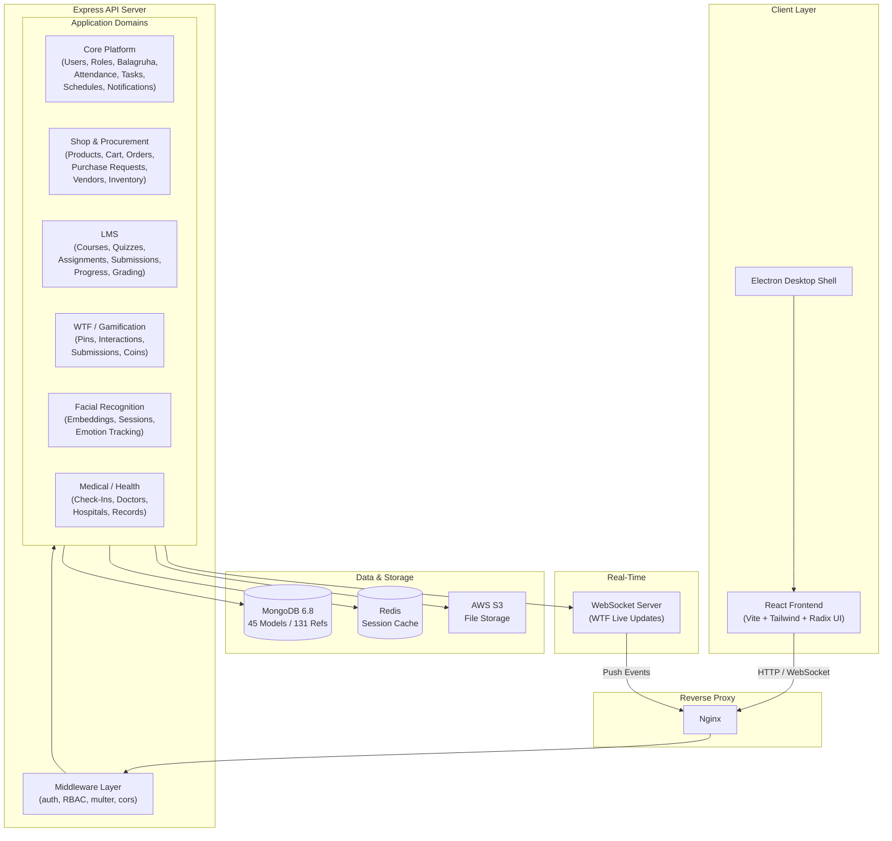
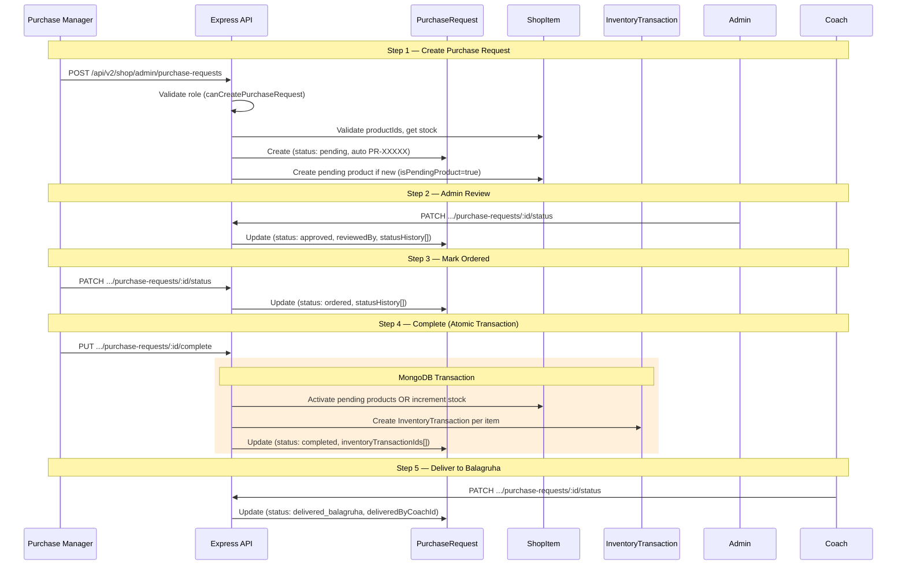
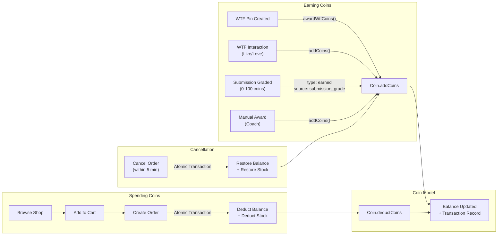
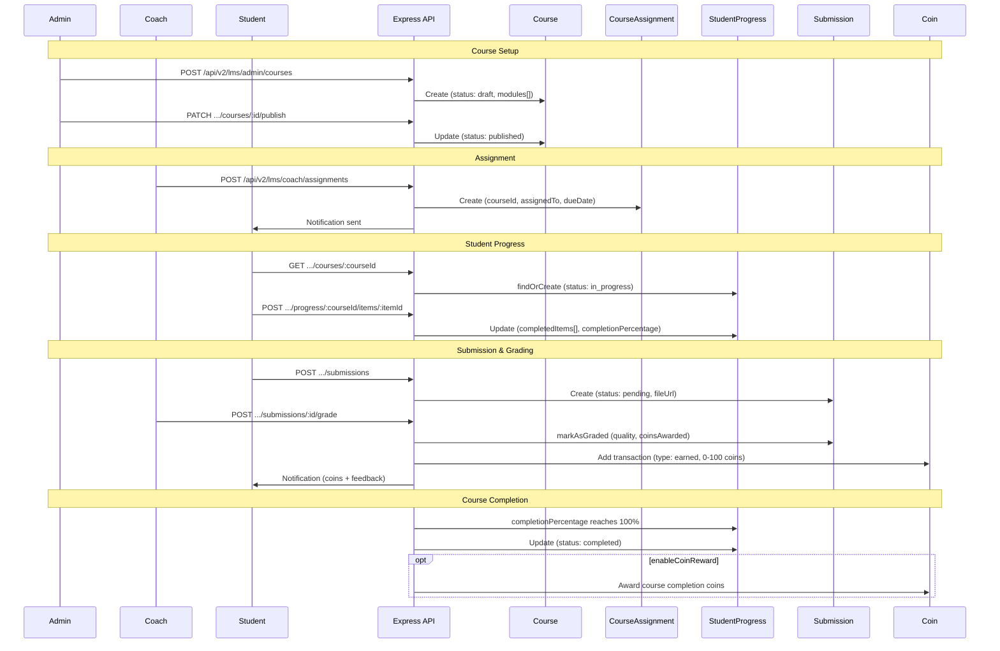
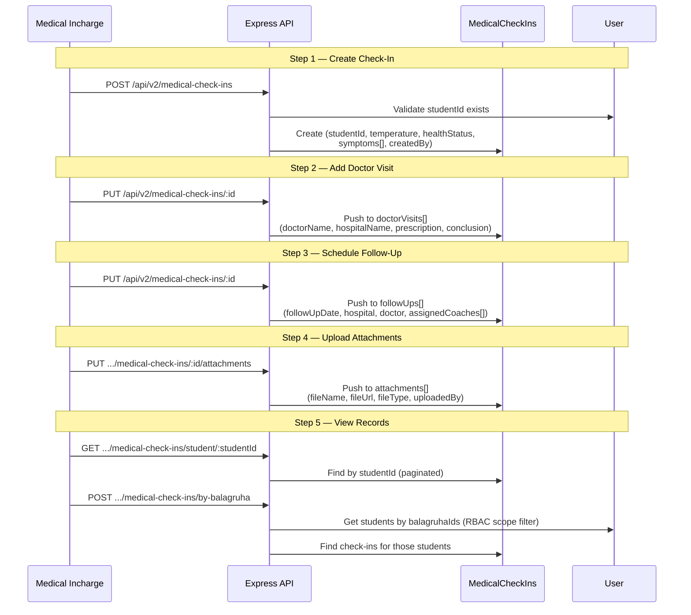

# ISF Playground - Database Architecture

**Generated:** March 16, 2026
**Stories:** 4.1 (Schema Map), 4.2 (Relationships & Data Flows), 4.3 (Controller Dependencies & Quality Findings), 4.4 (Architecture Diagrams)
**Total Models:** 43 (2 archived in Story 6.5) | **Total Relationships:** 131 | **Total Controllers Mapped:** 51 | **Quality Findings:** 9
**Database:** MongoDB 6.8.0 with Mongoose 8.10.2

---

## Table of Contents

- [Schema Map (Story 4.1)](#core-platform) — 45 models across 6 domains
- [Cross-Reference Summary](#cross-reference-summary) — Model counts, collection names, ObjectId reference map
- [Model Relationships (Story 4.2)](#model-relationships) — 131 ObjectId references, hub models, pattern summary
- [Data Flow Documentation (Story 4.2)](#data-flow-documentation) — Purchase, Coin, LMS, Medical lifecycles
- [Controller-Model Dependencies (Story 4.3)](#controller-model-dependencies) — 51 controllers, 3-tier access pattern
- [Schema Quality Findings (Story 4.3)](#schema-quality-findings) — 9 findings (2 HIGH, 4 MEDIUM, 3 LOW)
- [Architecture Diagrams (Story 4.4)](#architecture-diagrams) — 7 Mermaid diagrams

### Schema Map — Models by Domain

### Core Platform (15 active models, 2 archived)
1. [User](#user-backendmodelsuserjs)
2. [Student](#student-backendmodelsstudentjs)
3. [Role](#role-backendmodelsrolejs)
4. [Balagruha](#balagruha-backendmodelsbalagruhajs)
5. [Attendance](#attendance-backendmodelsattendancejs)
6. ~~ActivityLog~~ — **ARCHIVED** (Story 6.5, zero imports, moved to `backend/models/_archived/`)
7. [Notification](#notification-backendmodelsnotificationjs)
8. [UserNotificationView](#usernotificationview-backendmodelsusernotificationviewjs)
9. [Schedules](#schedules-backendmodelsschedulesjs)
10. [Task](#task-backendmodelstaskjs)
11. [SportsTasks](#sportstasks-backendmodelssportstasksjs)
12. [TrainingSession](#trainingsession-backendmodelstrainingsessionjs)
13. [Machine](#machine-backendmodelsmachinejs)
14. ~~MachineAssignment~~ — **ARCHIVED** (Story 6.5, zero imports + broken ref: "Admin", moved to `backend/models/_archived/`)
15. [MachineActiveLog](#machineactivelog-backendmodelsmachineactivelogjs)
16. [OfflineReqQueue](#offlinereqqueue-backendmodelsofflinereqqueuejs)
17. [StudentMoodTracker](#studentmoodtracker-backendmodelsstudentmoodtrackerjs)

### Shop/Procurement (8 models)
18. [Vendor](#vendor-backendmodelsvendorjs)
19. [ShopItem](#shopitem-backendmodelsshopitemjs)
20. [PurchaseRequest](#purchaserequest-backendmodelspurchaserequestjs)
21. [PurchaseOrders](#purchaseorders-backendmodelspurchaseordersjs)
22. [RepairRequests](#repairrequests-backendmodelsrepairrequestsjs)
23. [InventoryTransaction](#inventorytransaction-backendmodelsinventorytransactionjs)
24. [Cart](#cart-backendmodelscartjs)
25. [Order](#order-backendmodelsorderjs)

### LMS (8 models)
26. [Course](#course-backendmodelscoursejs)
27. [ContentLibrary](#contentlibrary-backendmodelscontentlibraryjs)
28. [Quiz](#quiz-backendmodelsquizjs)
29. [QuestionBank](#questionbank-backendmodelsquestionbankjs)
30. [Assignment](#assignment-backendmodelsassignmentjs)
31. [CourseAssignment](#courseassignment-backendmodelscourseassignmentjs)
32. [StudentProgress](#studentprogress-backendmodelsstudentprogressjs)
33. [Submission](#submission-backendmodelssubmissionjs)

### WTF/Gamification (5 models)
34. [WtfPin](#wtfpin-backendmodelswtfpinjs)
35. [WtfSettings](#wtfsettings-backendmodelswtfsettingsjs)
36. [WtfStudentInteraction](#wtfstudentinteraction-backendmodelswtfstudentinteractionjs)
37. [WtfSubmission](#wtfsubmission-backendmodelswtfsubmissionjs)
38. [Coin](#coin-backendmodelscoinjs)

### Facial Recognition (3 models)
39. [FaceEmbedding](#faceembedding-backendmodelsfaceembeddingjs)
40. [FRSession](#frsession-backendmodelsfrsessionjs)
41. [EmotionTracking](#emotiontracking-backendmodelsemotiontrackingjs)

### Medical/Health (4 models)
42. [Medical](#medical-backendmodelsmedicaljs)
43. [MedicalCheckIns](#medicalcheckins-backendmodelsmedicalcheckinsjs)
44. [Doctor](#doctor-backendmodelsdoctorjs)
45. [Hospital](#hospital-backendmodelshospitaljs)

---

## Core Platform

---

### User (`backend/models/user.js`)

**Collection:** users
**Timestamps:** yes
**toJSON/toObject virtuals:** yes

| Field | Type | Required | Default | Ref | Notes |
|-------|------|----------|---------|-----|-------|
| name | String | yes ("Name is required") | -- | -- | trim |
| email | String | no | -- | -- | unique, sparse, trim, lowercase, regex validated |
| userId | Number | no | -- | -- | unique, sparse |
| password | String | no | -- | -- | hashed via pre-save hook |
| role | String | yes ("Role is required") | -- | -- | enum: admin, coach, balagruha-incharge, student, purchase-manager, medical-incharge, sports-coach, music-coach, amma |
| status | String | no | "active" | -- | enum: active, inactive |
| lastLogin | Date | no | -- | -- | -- |
| passwordResetToken | String | no | -- | -- | -- |
| passwordResetExpires | Date | no | -- | -- | -- |
| loginAttempts | Number | no | 0 | -- | -- |
| lockUntil | Date | no | -- | -- | -- |
| age | Number | conditional | -- | -- | required if role === "student" |
| gender | String | conditional | -- | -- | enum: male, female, other; required if role === "student" |
| balagruhaIds | [ObjectId] | no | -- | Balagruha | array of refs |
| parentalStatus | String | no | "" | -- | enum: "has both", "has one", "has none", "has guardian", "" |
| guardianName1 | String | no | -- | -- | -- |
| guardianName2 | String | no | -- | -- | -- |
| guardianContact1 | String | no | -- | -- | -- |
| guardianContact2 | String | no | -- | -- | -- |
| performanceReports | [ObjectId] | no | -- | Report | array of refs |
| attendanceRecords | [ObjectId] | no | -- | Attendance | array of refs |
| medicalRecords | [ObjectId] | no | -- | MedicalRecord | array of refs |
| assignedMachines | [ObjectId] | no | -- | Machine | array of refs |
| facialDataUrl | String | no | -- | -- | S3 URL or local path for photo display |

**Indexes:** `{ balagruhaIds: 1 }`, `email` (unique, sparse), `userId` (unique, sparse)
**Virtuals:** none explicitly defined (virtuals enabled via schema options)
**Hooks:** pre-save -- hashes password via bcrypt if modified
**Instance Methods:**
- `comparePassword(candidatePassword)` -- bcrypt compare
- `isLocked()` -- checks lockUntil > now
- `incrementLoginAttempts()` -- increments attempts, locks after 10
- `resetLoginAttempts()` -- resets attempts and removes lock
- `canCreatePurchaseRequest()` -- checks allowed roles
- `hasBalagruhaAccess(balagruhaId)` -- checks balagruhaIds array
- `getAllBalagruhaIds()` -- returns balagruhaIds array
- `getBalagruhaIdsAsStrings()` -- returns stringified array

---

### Student (`backend/models/student.js`)

**Collection:** students
**Timestamps:** yes
**toJSON/toObject virtuals:** yes

| Field | Type | Required | Default | Ref | Notes |
|-------|------|----------|---------|-----|-------|
| name | String | yes | -- | -- | -- |
| age | Number | yes | -- | -- | -- |
| gender | String | yes | -- | -- | enum: Male, Female, Other |
| balagruhaId | ObjectId | no | -- | Balagruha | single ref |
| parentalStatus | String | no | -- | -- | enum: Has Both, Has One, Has None, Has Guardian |
| guardianContact | String | no | -- | -- | -- |
| performanceReports | [ObjectId] | no | -- | Report | array of refs |
| attendanceRecords | [ObjectId] | no | -- | Attendance | array of refs |
| medicalRecords | [ObjectId] | no | -- | MedicalRecord | array of refs |

**Indexes:** none explicitly defined
**Virtuals:** none
**Hooks:** none
**Methods:** none

---

### Role (`backend/models/role.js`)

**Collection:** roles
**Timestamps:** yes
**toJSON/toObject virtuals:** yes

| Field | Type | Required | Default | Ref | Notes |
|-------|------|----------|---------|-----|-------|
| roleName | String | yes | -- | -- | unique |
| permissions | Array | no | -- | -- | subdocument array (see below) |
| permissions[].module | String | yes | -- | -- | module name (e.g., "User Management", "shop") |
| permissions[].actions | [String] | no | -- | -- | enum: Create, Read, Update, Delete, Manage |
| permissions[].scope | String | no | "own" | -- | enum: own, balagruh, all |

**Indexes:** `roleName` (unique)
**Virtuals:** none
**Hooks:** none
**Methods:** none

---

### Balagruha (`backend/models/balagruha.js`)

**Collection:** balagruhas
**Timestamps:** yes
**toJSON/toObject virtuals:** yes

| Field | Type | Required | Default | Ref | Notes |
|-------|------|----------|---------|-----|-------|
| name | String | yes | -- | -- | trim, unique |
| location | String | yes | -- | -- | trim |
| assignedMachines | [ObjectId] | no | -- | Machine | array of refs |

**Indexes:** `name` (unique)
**Virtuals:** none
**Hooks:** none
**Methods:** none

---

### Attendance (`backend/models/attendance.js`)

**Collection:** attendances
**Timestamps:** yes

| Field | Type | Required | Default | Ref | Notes |
|-------|------|----------|---------|-----|-------|
| balagruhaId | ObjectId | no | -- | Balagruha | -- |
| studentId | ObjectId | no | -- | User | -- |
| date | Date | no | Date.now | -- | -- |
| dateString | String | no | -- | -- | -- |
| status | String | yes | "absent" | -- | enum: present, absent |
| notes | String | no | -- | -- | -- |
| isManualOverride | Boolean | no | false | -- | index: true; FR rebuild support |
| frSessionId | ObjectId | no | null | FRSession | links to FR session if attempted |
| overrideReason | String | no | null | -- | enum: fr_failed, fr_unavailable, technical_issue, user_preference, emergency, other |
| markedBy | ObjectId | no | null | User | who manually marked attendance |

**Indexes:** `{ isManualOverride: 1 }` (field-level), `{ studentId: 1 }`, `{ balagruhaId: 1 }`, `{ balagruhaId: 1, date: -1 }`, `{ studentId: 1, date: -1 }` (Story 6.7)
**Virtuals:** none
**Hooks:** none
**Methods:** none

---

### ActivityLog (`backend/models/activitylog.js`)

**Collection:** activitylogs
**Timestamps:** yes

| Field | Type | Required | Default | Ref | Notes |
|-------|------|----------|---------|-----|-------|
| userId | ObjectId | no | -- | User | -- |
| action | String | yes | -- | -- | -- |
| timestamp | Date | no | Date.now | -- | -- |
| ipAddress | String | no | -- | -- | -- |
| details | String | no | -- | -- | -- |

**Indexes:** none
**Virtuals:** none
**Hooks:** none
**Methods:** none

---

### Notification (`backend/models/notification.js`)

**Collection:** notifications
**Timestamps:** yes

| Field | Type | Required | Default | Ref | Notes |
|-------|------|----------|---------|-----|-------|
| userId | ObjectId | conditional | -- | User | required when isPersonal !== false |
| title | String | yes | -- | -- | trim |
| message | String | yes | -- | -- | trim |
| type | String | no | "PERSONAL" | -- | enum: PERSONAL, COMMON, ACHIEVEMENT, COACH_MESSAGE, SYSTEM_UPDATE |
| category | String | no | "GENERAL" | -- | enum: WTF_PIN_ADDED, COINS_AWARDED, ACHIEVEMENT_UNLOCKED, COACH_MESSAGE, ISF_SHOP_UPDATE, SYSTEM_ANNOUNCEMENT, TASK_ASSIGNED, ATTENDANCE_REMINDER, WORKSHOP_ANNOUNCEMENT, COMMUNITY_UPDATE, NEW_CONTENT, GENERAL |
| isRead | Boolean | no | false | -- | -- |
| isPersonal | Boolean | no | true | -- | -- |
| priority | String | no | "MEDIUM" | -- | enum: LOW, MEDIUM, HIGH, URGENT |
| metadata.pinId | ObjectId | no | -- | wtf_pin | -- |
| metadata.contentType | String | no | -- | -- | -- |
| metadata.pinnedBy | ObjectId | no | -- | User | -- |
| metadata.coinAmount | Number | no | -- | -- | -- |
| metadata.coinSource | String | no | -- | -- | -- |
| metadata.achievementId | String | no | -- | -- | -- |
| metadata.achievementName | String | no | -- | -- | -- |
| metadata.taskId | ObjectId | no | -- | task | -- |
| metadata.coachId | ObjectId | no | -- | User | -- |
| metadata.relatedEntityId | ObjectId | no | -- | -- | -- |
| metadata.relatedEntityType | String | no | -- | -- | -- |
| metadata.actionUrl | String | no | -- | -- | URL for click navigation |
| expiresAt | Date | no | null | -- | null = never expires |
| targetAudience | [String] | no | null | -- | roles or user IDs |
| isSystemWide | Boolean | no | false | -- | -- |
| isGlobal | Boolean | no | false | -- | -- |
| lastViewedAt | Date | no | null | -- | -- |
| createdAt | Date | no | Date.now | -- | explicit + timestamps |
| updatedAt | Date | no | Date.now | -- | explicit + timestamps |

**Indexes:**
- `{ userId: 1, isRead: 1, createdAt: -1 }`
- `{ type: 1, category: 1, createdAt: -1 }`
- `{ isGlobal: 1, createdAt: -1 }`
- `{ expiresAt: 1 }` (TTL index, expireAfterSeconds: 0)

**Virtuals:** none
**Hooks:** none
**Instance Methods:**
- `markAsRead()` -- sets isRead=true
- `markAsUnread()` -- sets isRead=false

**Static Methods:**
- `createPersonal(userId, title, message, category, metadata)`
- `createCommon(title, message, category, targetAudience, metadata)`
- `createSystemWide(title, message, category, metadata)`
- `getUserNotifications(userId, limit, skip)`
- `getUserNotificationsSmart(userId, limit, skip)`
- `getUnreadCount(userId)`
- `getSmartUnreadCount(userId)`
- `markAllAsRead(userId)`
- `cleanupExpired()`

---

### UserNotificationView (`backend/models/userNotificationView.js`)

**Collection:** usernotificationviews
**Timestamps:** yes

| Field | Type | Required | Default | Ref | Notes |
|-------|------|----------|---------|-----|-------|
| userId | ObjectId | yes | -- | User | unique (one per user) |
| lastViewedAt | Date | no | Date.now | -- | -- |
| seenCommonNotifications | Array | no | -- | -- | subdocument array |
| seenCommonNotifications[].notificationId | ObjectId | no | -- | Notification | -- |
| seenCommonNotifications[].seenAt | Date | no | Date.now | -- | -- |
| lastCleanupAt | Date | no | Date.now | -- | -- |

**Indexes:** `{ userId: 1 }`, `{ lastViewedAt: -1 }`
**Virtuals:** none
**Hooks:** none
**Static Methods:**
- `getOrCreateUserView(userId)`
- `updateLastViewed(userId, timestamp)`
- `markCommonNotificationAsSeen(userId, notificationId)`
- `cleanupOldSeenNotifications()`

---

### Schedules (`backend/models/schedules.js`)

**Collection:** schedules (model name: "schedules")
**Timestamps:** yes

| Field | Type | Required | Default | Ref | Notes |
|-------|------|----------|---------|-----|-------|
| balagruhaId | ObjectId | yes | -- | Balagruha | -- |
| assignedTo | ObjectId | yes | -- | User | -- |
| startTime | Date | yes | -- | -- | -- |
| endTime | Date | yes | -- | -- | -- |
| date | Date | yes | -- | -- | -- |
| title | String | no | -- | -- | -- |
| description | String | no | -- | -- | -- |
| timeSlot | String | no | -- | -- | -- |
| dateString | String | no | -- | -- | -- |
| status | String | no | "pending" | -- | enum: pending, inprogress, completed, cancelled |
| createdBy | ObjectId | yes | -- | User | -- |

**Indexes:** compound unique `{ balagruhaId: 1, assignedTo: 1, startTime: 1, endTime: 1, date: 1 }`
**Virtuals:** none
**Hooks:** none
**Methods:** none

---

### Task (`backend/models/task.js`)

**Collection:** tasks
**Timestamps:** yes

| Field | Type | Required | Default | Ref | Notes |
|-------|------|----------|---------|-----|-------|
| title | String | yes | -- | -- | -- |
| description | String | yes | -- | -- | -- |
| drillOrExerciseType | String | no | "" | -- | for sports-based tasks |
| duration | String | no | "" | -- | for sports-based tasks |
| assignedUser | ObjectId | yes | -- | User | -- |
| createdBy | ObjectId | yes | -- | User | creator (Admin or Coach) |
| deadline | Date | yes | -- | -- | -- |
| priority | String | no | "medium" | -- | enum: low, medium, high |
| status | String | no | "pending" | -- | enum: pending, in progress, completed |
| labels | [String] | no | -- | -- | categorization tags |
| type | String | no | "general" | -- | enum: sports, fitness, nutrition, general, music, purchase, repair, medical |
| comments | Array | no | -- | -- | subdocument (see below) |
| comments[].user | ObjectId | no | -- | User | -- |
| comments[].comment | String | no | -- | -- | -- |
| comments[].attachments | Array | no | -- | -- | fileName, fileUrl, fileType, uploadedBy (ref User), uploadedAt |
| comments[].createdAt | Date | no | Date.now | -- | -- |
| attachments | Array | no | -- | -- | fileName, fileUrl, fileType, uploadedBy (ref User), uploadedAt |
| performanceMetrics.time | String | no | "" | -- | -- |
| performanceMetrics.score | String | no | "" | -- | -- |
| performanceMetrics.repetitions | String | no | "" | -- | -- |
| machineDetails | String | no | "" | -- | for purchase orders |
| vendorDetails | String | no | "" | -- | for purchase orders |
| costEstimate | Number | no | 0 | -- | for purchase orders |
| requiredParts | String | no | "" | -- | for purchase orders |
| repairDetails | String | no | -- | -- | for repairs |
| balagruhaId | ObjectId | no | -- | Balagruha | for medical tasks |
| students | [ObjectId] | no | -- | User | for medical tasks |

**Indexes:** `{ assignedUser: 1 }`, `{ balagruhaId: 1 }`, `{ status: 1 }`, `{ assignedUser: 1, status: 1 }`, `{ balagruhaId: 1, status: 1 }`, `{ createdAt: -1 }` (Story 6.7)
**Virtuals:** none
**Hooks:** none
**Methods:** none

---

### SportsTasks (`backend/models/sportsTasks.js`)

**Collection:** sports_tasks (model name: "sports_tasks")
**Timestamps:** yes

| Field | Type | Required | Default | Ref | Notes |
|-------|------|----------|---------|-----|-------|
| title | String | yes | -- | -- | -- |
| description | String | yes | -- | -- | -- |
| drillOrExerciseType | String | no | "" | -- | -- |
| duration | String | no | "" | -- | -- |
| assignedUser | ObjectId | yes | -- | User | -- |
| createdBy | ObjectId | yes | -- | User | -- |
| deadline | Date | yes | -- | -- | -- |
| priority | String | no | "medium" | -- | enum: low, medium, high |
| status | String | no | "pending" | -- | enum: pending, in progress, completed |
| comments | Array | no | -- | -- | subdoc: user (ref User), comment, attachments[], createdAt |
| attachments | Array | no | -- | -- | fileName, fileUrl, fileType, uploadedBy (ref User), uploadedAt |
| performanceMetrics.time | String | no | "" | -- | -- |
| performanceMetrics.score | String | no | "" | -- | -- |
| performanceMetrics.repetitions | String | no | "" | -- | -- |

**Indexes:** `{ assignedUser: 1 }`, `{ status: 1 }`, `{ assignedUser: 1, status: 1 }`, `{ createdAt: -1 }` (Story 6.7)
**Virtuals:** none
**Hooks:** none
**Methods:** none

---

### TrainingSession (`backend/models/trainingSession.js`)

**Collection:** training_sessions (model name: "training_sessions")
**Timestamps:** yes

| Field | Type | Required | Default | Ref | Notes |
|-------|------|----------|---------|-----|-------|
| title | String | yes | -- | -- | -- |
| description | String | yes | -- | -- | -- |
| date | Date | yes | -- | -- | -- |
| location | String | no | "" | -- | -- |
| labels | [String] | no | -- | -- | -- |
| type | String | no | "general" | -- | enum: sports, fitness, nutrition, general, music |
| drillsAndExercises | String | no | "" | -- | -- |
| notificationPreferences | [String] | no | "" | -- | -- |
| status | String | no | "active" | -- | enum: active, cancelled |
| createdBy | ObjectId | yes | -- | User | -- |
| balagruhaId | ObjectId | yes | -- | Balagruha | -- |
| assignedStudents | [ObjectId] | no | -- | User | array of student IDs |

**Indexes:** none
**Virtuals:** none
**Hooks:** none
**Methods:** none

---

### Machine (`backend/models/machine.js`)

**Collection:** machines
**Timestamps:** yes

| Field | Type | Required | Default | Ref | Notes |
|-------|------|----------|---------|-----|-------|
| machineId | String | yes | -- | -- | unique |
| macAddress | String | yes | -- | -- | unique |
| serialNumber | String | yes | -- | -- | unique |
| assignedBalagruha | ObjectId | no | null | Balagruha | -- |
| status | String | no | "active" | -- | enum: active, inactive, maintenance |
| lastLogin | Date | no | null | -- | -- |

**Indexes:** `machineId` (unique), `macAddress` (unique), `serialNumber` (unique), `{ assignedBalagruha: 1 }`, `{ status: 1 }`, `{ assignedBalagruha: 1, status: 1 }` (Story 6.7)
**Virtuals:** none
**Hooks:** none
**Methods:** none

---

### MachineAssignment (`backend/models/machineAssignment.js`)

**Collection:** machineassignmenthistories
**Timestamps:** yes

| Field | Type | Required | Default | Ref | Notes |
|-------|------|----------|---------|-----|-------|
| HistoryID | ObjectId | no | auto | -- | auto-generated |
| MachineID | ObjectId | yes | -- | Machine | -- |
| PreviousBalagruhaID | ObjectId | no | null | Balagruha | -- |
| NewBalagruhaID | ObjectId | yes | -- | Balagruha | -- |
| AssignedBy | ObjectId | yes | -- | Admin | -- |
| AssignmentDate | Date | no | Date.now | -- | -- |

**Indexes:** none
**Virtuals:** none
**Hooks:** none
**Methods:** none

---

### MachineActiveLog (`backend/models/machineactivelog.js`)

**Collection:** machineactivitystamps
**Timestamps:** yes

| Field | Type | Required | Default | Ref | Notes |
|-------|------|----------|---------|-----|-------|
| LogID | ObjectId | no | auto | -- | auto-generated |
| MachineID | ObjectId | yes | -- | Machine | -- |
| UserID | ObjectId | yes | -- | User | -- |
| LoginTimestamp | Date | no | Date.now | -- | -- |
| LogoutTimestamp | Date | no | null | -- | -- |
| SessionDuration | Number | no | 0 | -- | seconds; auto-calculated |
| CreatedAt | Date | no | Date.now | -- | explicit + timestamps |

**Indexes:** none
**Virtuals:** none
**Hooks:** pre-save -- calculates SessionDuration from (LogoutTimestamp - LoginTimestamp) / 1000
**Methods:** none

---

### OfflineReqQueue (`backend/models/offlineReqQueue.js`)

**Collection:** offline_request_queues (model name: "offline_request_queue")
**Timestamps:** yes

| Field | Type | Required | Default | Ref | Notes |
|-------|------|----------|---------|-----|-------|
| operation | String | yes | -- | -- | -- |
| apiPath | String | yes | -- | -- | -- |
| method | String | no | "POST" | -- | -- |
| payload | Mixed | yes | -- | -- | -- |
| attachmentString | String | no | "" | -- | -- |
| attachments | Array | no | -- | -- | [{filePath, fieldName}] |
| status | String | no | "pending" | -- | -- |
| error | String | no | "" | -- | -- |
| token | String | no | "" | -- | -- |
| generatedId | String | no | "" | -- | -- |
| createdAt | Date | no | Date.now | -- | explicit + timestamps |
| updatedAt | Date | no | Date.now | -- | explicit + timestamps |

**Indexes:** none
**Virtuals:** none
**Hooks:** none
**Methods:** none

---

### StudentMoodTracker (`backend/models/studentMoodTracker.js`)

**Collection:** student_mood_trackers (model name: "student_mood_tracker")
**Timestamps:** no (no timestamps option)

| Field | Type | Required | Default | Ref | Notes |
|-------|------|----------|---------|-----|-------|
| userId | ObjectId | yes | -- | User | -- |
| mood | String | yes | -- | -- | enum: happy, excited, neutral, sad, very_sad |
| dateString | String | no | -- | -- | auto-set in pre-save from date |
| date | Date | no | Date.now | -- | -- |
| notes | String | no | -- | -- | maxlength: 500 |

**Indexes:** none
**Virtuals:** none
**Hooks:** pre-save -- creates dateString as YYYY-MM-DD from date
**Methods:** none

---

## Shop/Procurement

---

### Vendor (`backend/models/vendor.js`)

**Collection:** vendors
**Timestamps:** yes
**toJSON/toObject virtuals:** yes

| Field | Type | Required | Default | Ref | Notes |
|-------|------|----------|---------|-----|-------|
| name | String | yes ("Vendor name is required") | -- | -- | trim |
| phone | String | yes ("Phone number is required") | -- | -- | trim; custom validator for Indian phone numbers |
| address | String | yes ("Address is required") | -- | -- | trim |
| active | Boolean | no | true | -- | index: true |

**Indexes:** `{ name: 1 }`, `{ active: 1 }` (field-level)
**Virtuals:** none
**Hooks:** none
**Methods:** none

---

### ShopItem (`backend/models/shopItem.js`)

**Collection:** shopitems
**Timestamps:** yes
**toJSON/toObject virtuals:** yes

| Field | Type | Required | Default | Ref | Notes |
|-------|------|----------|---------|-----|-------|
| sku | String | no | null | -- | unique, trim, uppercase, index |
| name | String | yes | -- | -- | trim, maxlength: 100 |
| description | String | yes | -- | -- | maxlength: 500 |
| category | String | yes | -- | -- | enum: SHOP_CATEGORIES (imported), index |
| purchaseCategory | String | no | "ISF Shop" | -- | enum: ISF Shop, Medicines, Repairs, Consumables, Infra, Others; index |
| price | Number | yes | -- | -- | min: 0, validate: integer |
| discountPrice | Number | no | null | -- | min: 0, validate: integer or null |
| stock | Number | yes | 0 | -- | min: 0, validate: integer |
| lowStockThreshold | Number | no | 10 | -- | min: 0 |
| imageUrl | String | no | null | -- | DEPRECATED, use images array |
| images | Array | no | -- | -- | [{url (required), isPrimary (default false), uploadedAt}] |
| isActive | Boolean | no | true | -- | index |
| availableFor | [String] | no | ["student"] | -- | enum: student, coach, all |
| tags | [String] | no | [] | -- | -- |
| balagruhaId | ObjectId | no | -- | Balagruha | index; optional scoping |
| metadata | Map of String | no | {} | -- | -- |
| isPendingProduct | Boolean | no | false | -- | index |
| createdBy | ObjectId | no | -- | User | -- |
| createdInRequest | ObjectId | no | null | PurchaseRequest | -- |
| unit | String | no | -- | -- | enum: pieces, packets, boxes, kg, liters, meters, units, grams, ml, sets, pairs, dozen |
| approvedVendors | Array | no | -- | -- | [{vendorId (ref Vendor, required), rank (default 1)}] |
| maxPrice | Number | no | -- | -- | min: 0; price cap in rupees |
| sellingPrice | Number | no | -- | -- | min: 0; selling price in coins |

**Indexes:**
- `{ category: 1, isActive: 1 }`
- `{ price: 1 }`
- `{ stock: 1 }`
- `{ name: 'text', description: 'text' }` (text search)
- `{ createdAt: -1 }`
- `{ isPendingProduct: 1, isActive: 1 }`
- Field-level: sku, category, purchaseCategory, isActive, balagruhaId, isPendingProduct

**Virtuals:**
- `inStock` -- returns stock > 0
- `lowStock` -- returns stock > 0 && stock <= lowStockThreshold
- `currentPrice` -- returns discountPrice if set, else price
- `primaryImageUrl` -- returns primary image URL or first image or legacy imageUrl

**Hooks:** pre-save -- validates discountPrice < price
**Instance Methods:**
- `isAvailableFor(userRole)` -- checks availableFor includes role

**Static Methods:**
- `findByCategory(category, options)` -- finds active in-stock items by category
- `search(searchTerm, options)` -- text search with relevance scoring

---

### PurchaseRequest (`backend/models/purchaseRequest.js`)

**Collection:** purchaserequests
**Timestamps:** yes
**toJSON/toObject virtuals:** yes

| Field | Type | Required | Default | Ref | Notes |
|-------|------|----------|---------|-----|-------|
| requestId | String | no | auto-generated | -- | unique; format PR-XXXXX |
| balagruhaId | Mixed | yes | -- | -- | ObjectId or String "STOCK"; custom validator; index |
| category | String | yes | -- | -- | enum: SHOP_CATEGORIES; trim; index |
| deadline | Date | no | -- | -- | index |
| priority | String | no | "medium" | -- | enum: low, medium, high; index |
| items | Array | no | -- | -- | subdocument array (see below) |
| items[].productId | ObjectId | yes | -- | ShopItem | -- |
| items[].productName | String | yes | -- | -- | -- |
| items[].productSKU | String | yes | -- | -- | -- |
| items[].requestedQuantity | Number | yes | -- | -- | min: 1 |
| items[].currentStock | Number | yes | -- | -- | -- |
| items[].lowStockThreshold | Number | yes | -- | -- | -- |
| items[].estimatedUnitCost | Number | no | 0 | -- | min: 0 |
| items[].estimatedTotalCost | Number | no | 0 | -- | -- |
| items[].receivedQuantity | Number | no | -- | -- | min: 0 |
| items[].actualUnitCost | Number | no | -- | -- | min: 0 |
| items[].actualTotalCost | Number | no | -- | -- | min: 0 |
| attachments | Array | no | -- | -- | [{filename (required), fileUrl (required), uploadedAt}] |
| totalEstimatedCost | Number | no | 0 | -- | auto-calculated |
| reason | String | no | -- | -- | maxlength: 200, trim |
| justification | String | no | -- | -- | maxlength: 500, trim |
| requestedBy | ObjectId | yes | -- | User | index |
| status | String | no | "pending" | -- | enum: pending, ordered, delivered_store, delivered_balagruha, pending_approval, approved, completed, cancelled, rejected, on_hold; index |
| statusHistory | Array | no | -- | -- | [{status (required, enum), changedBy (ref User, required), changedAt, notes}] |
| thresholdAnalysis.maxItemCost | Number | no | -- | -- | -- |
| thresholdAnalysis.totalOrderCost | Number | no | -- | -- | -- |
| thresholdAnalysis.itemThreshold | Number | no | 1000 | -- | Rs 1,000 |
| thresholdAnalysis.orderThreshold | Number | no | 25000 | -- | Rs 25,000 |
| thresholdAnalysis.requiresApproval | Boolean | no | true | -- | -- |
| reviewedBy | ObjectId | no | -- | User | -- |
| reviewedAt | Date | no | -- | -- | -- |
| reviewNotes | String | no | -- | -- | maxlength: 500 |
| supplierName | String | no | -- | -- | trim |
| invoiceNumber | String | no | -- | -- | trim |
| purchaseDate | Date | no | -- | -- | -- |
| actualTotalCost | Number | no | -- | -- | min: 0 |
| completedBy | ObjectId | no | -- | User | -- |
| completedAt | Date | no | -- | -- | -- |
| inventoryTransactionIds | [ObjectId] | no | -- | InventoryTransaction | -- |
| allocatedToBalagruhas | Array | no | -- | -- | [{balagruhaId (ref, required), quantity (required, min 1), allocatedAt, allocatedBy (ref User, required), notes (maxlength 200)}] |
| repairTechnicianName | String | no | -- | -- | trim, maxlength: 100 |
| deliveredByCoachId | ObjectId | no | -- | User | -- |
| deliveredToBalagruhaAt | Date | no | -- | -- | -- |

**Indexes:**
- `{ requestedBy: 1, status: 1 }`
- `{ balagruhaId: 1, status: 1 }`
- `{ createdAt: -1 }`
- Field-level: balagruhaId, category, deadline, priority, requestedBy, status

**Virtuals:**
- `requestAge` -- hours since creation
- `totalItems` -- items array length
- `totalQuantity` -- sum of requestedQuantity

**Hooks:** pre-save -- auto-generates requestId (PR-XXXXX) for new docs; calculates totalEstimatedCost from items
**Methods:** none

---

### PurchaseOrders (`backend/models/purchaseOrders.js`)

**Collection:** purchase_orders (model name: "purchase_orders")
**Timestamps:** yes

| Field | Type | Required | Default | Ref | Notes |
|-------|------|----------|---------|-----|-------|
| balagruhaId | ObjectId | yes | -- | Balagruha | -- |
| machineDetails | String | yes | "" | -- | -- |
| vendorDetails | String | yes | "" | -- | -- |
| costEstimate | Number | no | 0 | -- | -- |
| requiredParts | String | no | "" | -- | -- |
| status | String | no | "pending" | -- | enum: pending, in-progress, completed |
| attachments | Array | no | -- | -- | [{fileName, fileUrl, fileType, uploadedBy (ref User), uploadedAt}] |
| createdBy | ObjectId | no | -- | User | -- |

**Indexes:** none
**Virtuals:** none
**Hooks:** none
**Methods:** none

---

### RepairRequests (`backend/models/repairRequests.js`)

**Collection:** repair_requests (model name: "repair_requests")
**Timestamps:** yes

| Field | Type | Required | Default | Ref | Notes |
|-------|------|----------|---------|-----|-------|
| balagruhaId | ObjectId | yes | -- | Balagruha | -- |
| issueName | String | yes | "" | -- | -- |
| description | String | no | "" | -- | -- |
| dateReported | Date | no | -- | -- | -- |
| urgency | String | no | "low" | -- | enum: low, medium, high |
| status | String | no | "pending" | -- | enum: pending, in-progress, completed |
| estimatedCost | Number | no | -- | -- | -- |
| attachments | Array | no | -- | -- | [{fileName, fileUrl, fileType, uploadedBy (ref User), uploadedAt}] |
| repairDetails | String | no | -- | -- | -- |
| createdBy | ObjectId | no | -- | User | -- |

**Indexes:** none
**Virtuals:** none
**Hooks:** none
**Methods:** none

---

### InventoryTransaction (`backend/models/inventoryTransaction.js`)

**Collection:** inventorytransactions
**Timestamps:** yes
**toJSON/toObject virtuals:** yes (set explicitly)

| Field | Type | Required | Default | Ref | Notes |
|-------|------|----------|---------|-----|-------|
| productId | ObjectId | yes | -- | ShopItem | index |
| transactionType | String | yes | -- | -- | enum: purchase, sale, adjustment, return, correction, purchase_request |
| quantity | Number | yes | -- | -- | positive or negative |
| previousStock | Number | yes | -- | -- | -- |
| newStock | Number | yes | -- | -- | -- |
| reference.type | String | no | "manual" | -- | enum: order, purchase, manual, bulk_import, purchase_request |
| reference.id | ObjectId | no | -- | -- | -- |
| reason | String | yes | -- | -- | maxlength: 100 |
| notes | String | no | -- | -- | maxlength: 500 |
| performedBy | ObjectId | yes | -- | User | -- |

**Indexes:**
- `{ productId: 1, createdAt: -1 }`
- `{ performedBy: 1 }`
- `{ transactionType: 1 }`
- Field-level: productId

**Virtuals:** `quantityFormatted` -- returns "+N" or "-N" formatted string
**Hooks:** none
**Methods:** none

---

### Cart (`backend/models/cart.js`)

**Collection:** carts
**Timestamps:** yes
**toJSON/toObject virtuals:** yes

| Field | Type | Required | Default | Ref | Notes |
|-------|------|----------|---------|-----|-------|
| userId | ObjectId | yes | -- | User | unique, index |
| items | [cartItemSchema] | no | [] | -- | subdocument (see below) |
| items[].shopItemId | ObjectId | yes | -- | ShopItem | -- |
| items[].quantity | Number | yes | -- | -- | min: 1, max: 99, validate: integer |
| items[].addedAt | Date | no | Date.now | -- | _id: false on subdoc |
| lastUpdated | Date | no | Date.now | -- | -- |

**Indexes:** `{ userId: 1 }`
**Virtuals:**
- `itemCount` -- sum of all item quantities
- `totalCost` -- computed from populated shopItem prices

**Hooks:** pre-save -- updates lastUpdated timestamp
**Instance Methods:**
- `addItem(shopItemId, quantity)` -- adds or increments item
- `updateQuantity(shopItemId, quantity)` -- updates item quantity
- `removeItem(shopItemId)` -- removes item from cart
- `clearCart()` -- removes all items
- `validateStock()` -- checks stock availability for all items

**Static Methods:**
- `getOrCreate(userId)` -- finds or creates cart
- `getPopulated(userId)` -- returns cart with populated shop items

---

### Order (`backend/models/order.js`)

**Collection:** orders
**Timestamps:** yes
**toJSON/toObject virtuals:** yes (set explicitly)

| Field | Type | Required | Default | Ref | Notes |
|-------|------|----------|---------|-----|-------|
| orderNumber | String | yes | -- | -- | unique, index, match: /^ORD-\d{8}-\d{5}$/ |
| userId | ObjectId | yes | -- | User | index |
| items | [orderItemSchema] | yes | -- | -- | validate: must have at least 1 item |
| items[].shopItemId | ObjectId | yes | -- | ShopItem | _id: false on subdoc |
| items[].name | String | yes | -- | -- | -- |
| items[].sku | String | no | -- | -- | -- |
| items[].price | Number | yes | -- | -- | min: 0 |
| items[].quantity | Number | yes | -- | -- | min: 1, max: 99 |
| items[].subtotal | Number | yes | -- | -- | min: 0 |
| subtotal | Number | yes | -- | -- | min: 0 |
| discount | Number | no | 0 | -- | min: 0 |
| totalAmount | Number | yes | -- | -- | min: 0 |
| status | String | no | "pending" | -- | enum: pending, completed, cancelled, refunded; index |
| placedAt | Date | no | Date.now | -- | index |
| completedAt | Date | no | null | -- | -- |
| cancelledAt | Date | no | null | -- | -- |
| cancelledBy | ObjectId | no | -- | User | -- |
| cancellationReason | String | no | "" | -- | -- |
| refundedAt | Date | no | null | -- | -- |
| coinTransactionId | ObjectId | no | -- | Coin | -- |
| notes | String | no | "" | -- | -- |
| deliveryStatus | String | no | "pending_confirmation" | -- | enum: pending_confirmation, pending_delivery, delivered, cancelled; index |
| confirmedForDeliveryAt | Date | no | null | -- | -- |
| deliveredAt | Date | no | null | -- | -- |
| deliveredBy | ObjectId | no | -- | User | coach who delivered |
| deliveryNotes | String | no | "" | -- | maxLength: 500 |

**Indexes:**
- `{ userId: 1, createdAt: -1 }`
- `{ status: 1, placedAt: -1 }`
- `{ orderNumber: 1 }`
- `{ deliveryStatus: 1, placedAt: -1 }`

**Virtuals:**
- `itemCount` -- sum of item quantities
- `isCancelable` -- true if completed, pending_confirmation, and within 5 minutes

**Hooks:** none
**Instance Methods:**
- `cancel(cancelledBy, reason)` -- cancels order if within 5-min window
- `refund()` -- marks order as refunded

**Static Methods:**
- `getUserOrders(userId, page, limit, status)` -- paginated user orders
- `getByOrderNumber(orderNumber)` -- populated order lookup
- `checkAndConfirmOrders(orderIds)` -- confirms orders past 5-min window, notifies coaches

---

## LMS

---

### Course (`backend/models/course.js`)

**Collection:** courses
**Timestamps:** yes

Course uses deeply nested subdocument schemas:
- **FileSchema**: fileName, fileType, fileUrl
- **QuizSchema**: question, options, correctAnswer (legacy)
- **ContentItemSchema**: type (enum: video/pdf/audio/image/text/link/quiz/task), title, description, order, fileUrl, metadata (duration/fileSize/pages/width/height/language), quizData (questions, timeLimit, passingScore), quizRef (ref Quiz), textContent, externalUrl, taskData (instructions, submissionType, maxFileSize), translations.telugu
- **ChapterSchema**: title, description, order, videoTitle, videoUrl, uploadLink (legacy), files [FileSchema], quizzes [QuizSchema] (legacy), contentItems [ContentItemSchema], translations.telugu
- **ModuleSchema**: title, description, order, chapters [ChapterSchema], translations.telugu

| Field | Type | Required | Default | Ref | Notes |
|-------|------|----------|---------|-----|-------|
| title | String | yes | -- | -- | maxlength: 100 |
| description | String | no | -- | -- | maxlength: 500 |
| category | String | no | -- | -- | enum: Computer Apps, Art, Spoken English, Life Skills |
| duration | String | no | -- | -- | -- |
| difficultyLevel | String | no | -- | -- | enum: Beginner, Intermediate, Advanced |
| icon | String | no | "book emoji" | -- | -- |
| thumbnail | String | no | -- | -- | -- |
| enableCoinReward | Boolean | no | false | -- | -- |
| coinsOnCompletion | Number | no | 0 | -- | -- |
| modules | [ModuleSchema] | no | -- | -- | deeply nested subdocs |
| status | String | no | "draft" | -- | enum: draft, published, archived |
| assignedBalagruha | [ObjectId] | no | -- | Balagruha | -- |
| createdBy | ObjectId | no | -- | User | -- |
| publishedAt | Date | no | -- | -- | -- |
| archivedAt | Date | no | -- | -- | -- |
| translations.hindi | Object | no | -- | -- | title, description |
| translations.telugu | Object | no | -- | -- | title, description |
| languages | [String] | no | ["en"] | -- | enum: en, hi, te |

**Indexes:**
- `{ status: 1, createdAt: -1 }`
- `{ category: 1 }`
- `{ createdBy: 1 }`
- `{ "modules.order": 1 }`
- `{ "modules.chapters.order": 1 }`

**Virtuals:**
- `moduleCount` -- modules array length
- `chapterCount` -- total chapters across all modules
- `contentItemCount` -- total content items across all modules/chapters

**Hooks:** none
**Instance Methods:**
- `publish()` -- sets status=published, publishedAt=now
- `archive()` -- sets status=archived, archivedAt=now
- `restore(restoreToStatus)` -- restores from archived

**Static Methods:**
- `findActive()` -- finds published courses
- `findDrafts()` -- finds draft courses
- `findArchived()` -- finds archived courses

---

### ContentLibrary (`backend/models/ContentLibrary.js`)

**Collection:** contentlibraries
**Timestamps:** yes

| Field | Type | Required | Default | Ref | Notes |
|-------|------|----------|---------|-----|-------|
| fileName | String | yes | -- | -- | trim |
| fileType | String | yes | -- | -- | enum: video, pdf, audio, image |
| fileUrl | String | yes | -- | -- | CDN URL |
| s3Key | String | yes | -- | -- | S3 object key |
| fileSize | Number | yes | -- | -- | bytes |
| mimeType | String | yes | -- | -- | e.g., video/mp4 |
| metadata.duration | Number | no | -- | -- | seconds |
| metadata.dimensions | Object | no | -- | -- | width, height |
| metadata.pages | Number | no | -- | -- | for PDFs |
| metadata.bitrate | String | no | -- | -- | audio bitrate |
| metadata.thumbnailUrl | String | no | -- | -- | -- |
| metadata.thumbnailKey | String | no | -- | -- | -- |
| tags | [String] | no | -- | -- | trim |
| description | String | no | -- | -- | trim |
| uploadedBy | ObjectId | yes | -- | User | -- |
| usedInCourses | Array | no | -- | -- | [{courseId (ref Course), courseTitle, moduleId, chapterId, contentItemId}] |
| uploadStatus | String | no | "pending" | -- | enum: pending, uploading, complete, failed |
| uploadedAt | Date | no | Date.now | -- | -- |
| lastAccessedAt | Date | no | -- | -- | -- |

**Indexes:**
- `{ fileType: 1, uploadedAt: -1 }`
- `{ fileName: 'text', tags: 'text', description: 'text' }` (text search)
- `{ uploadedBy: 1 }`
- `{ 'usedInCourses.courseId': 1 }`

**Virtuals:**
- `fileSizeFormatted` -- returns human-readable file size
- `durationFormatted` -- returns HH:MM:SS or MM:SS

**Hooks:** pre-save -- updates lastAccessedAt when uploadStatus changes to "complete"
**Instance Methods:**
- `addCourseUsage(courseData)` -- adds course reference
- `removeCourseUsage(courseId)` -- removes course reference

**Static Methods:**
- `findByType(fileType, options)` -- finds by file type with pagination
- `searchFiles(searchText, options)` -- text search with relevance scoring

---

### Quiz (`backend/models/Quiz.js`)

**Collection:** quizzes
**Timestamps:** yes

| Field | Type | Required | Default | Ref | Notes |
|-------|------|----------|---------|-----|-------|
| title | String | yes | -- | -- | trim, minlength: 3, maxlength: 200 |
| description | String | no | -- | -- | trim, maxlength: 1000 |
| course | ObjectId | no | -- | Course | index |
| module | ObjectId | no | -- | Module | -- |
| chapter | ObjectId | no | -- | Chapter | index |
| questions | Array | no | -- | -- | embedded subdoc (see below) |
| questions[].type | String | yes | -- | -- | enum: mcq_single, mcq_multiple, true_false, fill_blank |
| questions[].questionText | String | yes | -- | -- | trim |
| questions[].points | Number | yes | 5 | -- | min: 1, max: 100 |
| questions[].explanation | String | no | -- | -- | trim |
| questions[].options | [{text, isCorrect}] | no | -- | -- | for MCQ types |
| questions[].correctAnswer | Boolean | no | -- | -- | for true_false |
| questions[].acceptedAnswers | [String] | no | -- | -- | for fill_blank; trim |
| questions[].caseInsensitive | Boolean | no | true | -- | -- |
| questions[].ignoreExtraSpaces | Boolean | no | true | -- | -- |
| questions[].partialCredit | Boolean | no | false | -- | for mcq_multiple |
| questions[].questionBankId | ObjectId | no | -- | QuestionBank | -- |
| questions[].order | Number | yes | -- | -- | -- |
| questions[].translations.telugu | Object | no | -- | -- | questionText, explanation, options |
| settings.timeLimit | Number | no | -- | -- | minutes; min: 0, max: 180 |
| settings.noTimeLimit | Boolean | no | false | -- | -- |
| settings.passingScore | Number | yes | 70 | -- | percentage; min: 0, max: 100 |
| settings.randomizeQuestions | Boolean | no | false | -- | -- |
| settings.randomizeOptions | Boolean | no | false | -- | -- |
| settings.showQuestionsOneAtTime | Boolean | no | false | -- | -- |
| settings.showResults | String | no | "immediate" | -- | enum: immediate, after_all_complete, manual |
| settings.showScore | Boolean | no | true | -- | -- |
| settings.showCorrectness | Boolean | no | true | -- | -- |
| settings.showAnswers | Boolean | no | true | -- | -- |
| settings.showExplanations | Boolean | no | true | -- | -- |
| settings.maxAttempts | Number | no | -- | -- | min: 1, max: 10 |
| settings.unlimitedAttempts | Boolean | no | false | -- | -- |
| settings.waitBetweenAttempts | Number | no | 0 | -- | minutes; min: 0, max: 1440 |
| status | String | no | "draft" | -- | enum: draft, published, archived; index |
| publishedAt | Date | no | -- | -- | -- |
| createdBy | ObjectId | yes | -- | User | index |
| lastEditedBy | ObjectId | no | -- | User | -- |
| tags | [String] | no | -- | -- | -- |
| usageCount | Number | no | 0 | -- | -- |
| translations.telugu | Object | no | -- | -- | title, description |
| languages | [String] | no | ["en"] | -- | enum: en, hi, te |

**Indexes:**
- `{ title: 'text', description: 'text' }`
- `{ status: 1, createdAt: -1 }`
- `{ course: 1, chapter: 1 }`

**Virtuals:**
- `totalPoints` -- sum of question points
- `questionCount` -- questions array length

**Hooks:** pre-save -- validates published quizzes have questions; validates MCQ option counts; validates true_false has correctAnswer; validates fill_blank has blanks and acceptedAnswers
**Instance Methods:**
- `publish()` -- sets status=published
- `unpublish()` -- sets status=draft
- `duplicate(userId)` -- creates independent copy

**Static Methods:**
- `findPublished(filter)` -- finds published quizzes with course/chapter populated
- `findByChapter(chapterId)` -- finds published quizzes for chapter

---

### QuestionBank (`backend/models/QuestionBank.js`)

**Collection:** questionbanks
**Timestamps:** yes

| Field | Type | Required | Default | Ref | Notes |
|-------|------|----------|---------|-----|-------|
| type | String | yes | -- | -- | enum: mcq_single, mcq_multiple, true_false, fill_blank; index |
| questionText | String | yes | -- | -- | trim |
| points | Number | yes | 5 | -- | min: 1, max: 100 |
| explanation | String | no | -- | -- | trim |
| options | [{text, isCorrect}] | no | -- | -- | for MCQ |
| correctAnswer | Boolean | no | -- | -- | for true_false |
| acceptedAnswers | [String] | no | -- | -- | for fill_blank; trim |
| caseInsensitive | Boolean | no | true | -- | -- |
| ignoreExtraSpaces | Boolean | no | true | -- | -- |
| partialCredit | Boolean | no | false | -- | -- |
| tags | [String] | no | -- | -- | trim, lowercase |
| category | String | no | -- | -- | trim |
| difficulty | String | no | "medium" | -- | enum: easy, medium, hard |
| usageCount | Number | no | 0 | -- | index |
| usedInQuizzes | Array | no | -- | -- | [{quizId (ref Quiz), quizTitle, addedAt}] |
| createdBy | ObjectId | yes | -- | User | index |
| lastEditedBy | ObjectId | no | -- | User | -- |
| isActive | Boolean | no | true | -- | -- |

**Indexes:**
- `{ questionText: 'text', tags: 'text' }`
- `{ type: 1, difficulty: 1 }`
- `{ tags: 1 }`
- `{ createdBy: 1, createdAt: -1 }`

**Virtuals:** none
**Hooks:** none
**Instance Methods:**
- `addUsage(quizId, quizTitle)` -- tracks quiz usage
- `removeUsage(quizId)` -- removes quiz usage
- `toQuizQuestion(order)` -- converts to quiz question format

**Static Methods:**
- `searchQuestions(searchTerm, filters)` -- search with type/tag/difficulty/category filters
- `getMostUsed(limit)` -- top questions by usage
- `findByTag(tag)` -- finds active questions by tag

---

### Assignment (`backend/models/Assignment.js`)

**Collection:** assignments
**Timestamps:** yes
**toJSON/toObject virtuals:** yes

| Field | Type | Required | Default | Ref | Notes |
|-------|------|----------|---------|-----|-------|
| courseId | ObjectId | yes | -- | Course | -- |
| assignedBy | ObjectId | yes | -- | User | Coach ID |
| targetType | String | yes | -- | -- | enum: balagruha, student |
| targetIds | [ObjectId] | yes | -- | -- | Balagruha IDs or Student User IDs |
| dueDate | Date | no | -- | -- | -- |
| status | String | no | "active" | -- | enum: active, archived |
| notificationSettings.email | Boolean | no | false | -- | -- |
| notificationSettings.inApp | Boolean | no | true | -- | -- |

**Indexes:** none
**Virtuals:** none
**Hooks:** none
**Methods:** none

---

### CourseAssignment (`backend/models/CourseAssignment.js`)

**Collection:** courseassignments
**Timestamps:** yes

| Field | Type | Required | Default | Ref | Notes |
|-------|------|----------|---------|-----|-------|
| courseId | ObjectId | yes | -- | Course | index |
| assignedBy | ObjectId | yes | -- | User | index |
| assignedTo.type | String | yes | -- | -- | enum: balagruha, students |
| assignedTo.balagruhaIds | [ObjectId] | no | -- | Balagruha | multiple Balagruhas |
| assignedTo.balagruhaId | ObjectId | no | -- | Balagruha | legacy single ref |
| assignedTo.studentIds | [ObjectId] | no | -- | User | -- |
| dueDate | Date | no | null | -- | -- |
| notifications.inApp | Boolean | no | true | -- | -- |
| notifications.email | Boolean | no | true | -- | -- |
| notifications.sent | Boolean | no | false | -- | -- |
| notifications.sentAt | Date | no | -- | -- | -- |
| notifications.recipientCount | Number | no | 0 | -- | -- |
| assignedAt | Date | yes | Date.now | -- | -- |
| status | String | no | "active" | -- | enum: active, completed, expired, cancelled |
| progress.totalStudents | Number | no | 0 | -- | -- |
| progress.studentsStarted | Number | no | 0 | -- | -- |
| progress.studentsCompleted | Number | no | 0 | -- | -- |
| progress.averageCompletionPercentage | Number | no | 0 | -- | -- |

**Indexes:**
- `{ assignedBy: 1, createdAt: -1 }`
- `{ courseId: 1 }`
- `{ "assignedTo.balagruhaId": 1 }`
- `{ "assignedTo.studentIds": 1 }`
- `{ "assignedTo.balagruhaIds": 1 }` (Story 6.7 -- multi-balagruha assignment lookup)
- `{ status: 1 }`
- `{ dueDate: 1 }`

**Virtuals:**
- `isOverdue` -- dueDate passed and status is active
- `daysRemaining` -- days until/past dueDate
- `completionRate` -- (completed / total) * 100
- `startRate` -- (started / total) * 100

**Instance Methods:**
- `markCompleted()`
- `markExpired()`
- `cancel()`
- `updateProgress(progressData)`

**Static Methods:**
- `findByCoach(coachId)` -- active assignments by coach
- `findByStudent(studentId)` -- active assignments for student
- `findOverdue()` -- overdue active assignments
- `findByBalagruha(balagruhaId)` -- active assignments for Balagruha
- `getCoachStats(coachId)` -- total/active/completed/overdue/students stats

---

### StudentProgress (`backend/models/StudentProgress.js`)

**Collection:** studentprogresses
**Timestamps:** yes

| Field | Type | Required | Default | Ref | Notes |
|-------|------|----------|---------|-----|-------|
| student | ObjectId | yes | -- | User | -- |
| course | ObjectId | yes | -- | Course | -- |
| status | String | no | "not_started" | -- | enum: not_started, in_progress, completed |
| completionPercentage | Number | no | 0 | -- | -- |
| completedModules | [ObjectId] | no | -- | Module | tracked IDs |
| completedChapters | [ObjectId] | no | -- | -- | -- |
| completedItems | Array | no | -- | -- | [{itemId, itemType (enum: video/pdf/audio/image/text/link/quiz/task), completedAt, score, metadata (Mixed)}] |
| lastAccessedAt | Date | no | Date.now | -- | -- |
| startedAt | Date | no | -- | -- | -- |
| completedAt | Date | no | -- | -- | -- |

**Indexes:** compound unique `{ student: 1, course: 1 }`
**Virtuals:** none
**Hooks:** none
**Methods:** none

---

### Submission (`backend/models/Submission.js`)

**Collection:** submissions
**Timestamps:** yes

| Field | Type | Required | Default | Ref | Notes |
|-------|------|----------|---------|-----|-------|
| studentId | ObjectId | yes | -- | User | index |
| courseId | ObjectId | yes | -- | Course | index |
| taskId | String | yes | -- | -- | -- |
| taskTitle | String | yes | -- | -- | -- |
| submissionType | String | yes | -- | -- | enum: art, video, audio, quiz; index |
| fileUrl | String | yes | -- | -- | -- |
| thumbnailUrl | String | no | null | -- | -- |
| metadata.duration | Number | no | null | -- | seconds |
| metadata.fileSize | Number | no | null | -- | bytes |
| metadata.dimensions | Object | no | -- | -- | width, height |
| metadata.mimeType | String | no | null | -- | -- |
| submittedAt | Date | no | Date.now | -- | index |
| timeSpent | Number | no | 0 | -- | minutes |
| status | String | no | "pending" | -- | enum: pending, graded, flagged, skipped; index |
| grade.quality | String | no | null | -- | enum: excellent, good, needs_improvement |
| grade.coinsAwarded | Number | no | null | -- | min: 0, max: 100 |
| grade.feedback | String | no | null | -- | maxlength: 500 |
| grade.evaluationCriteria | Object | no | -- | -- | 9 boolean criteria fields |
| grade.gradedBy | ObjectId | no | null | User | -- |
| grade.gradedAt | Date | no | null | -- | -- |
| draft.quality | String | no | null | -- | enum: same as grade |
| draft.coinsAwarded | Number | no | null | -- | -- |
| draft.feedback | String | no | null | -- | -- |
| draft.savedAt | Date | no | null | -- | -- |
| flagged.reason | String | no | null | -- | -- |
| flagged.flaggedBy | ObjectId | no | null | User | -- |
| flagged.flaggedAt | Date | no | null | -- | -- |
| offlineSubmission | Boolean | no | false | -- | -- |
| syncedAt | Date | no | null | -- | -- |
| skippedAt | Date | no | null | -- | -- |

**Indexes:**
- `{ studentId: 1, courseId: 1 }`
- `{ studentId: 1, status: 1 }`
- `{ courseId: 1, status: 1 }`
- `{ submissionType: 1, status: 1 }`
- `{ "grade.gradedBy": 1 }`
- `{ submittedAt: -1 }`

**Virtuals:** none
**Hooks:** none
**Instance Methods:**
- `markAsGraded(gradeData)` -- grades and clears draft
- `saveDraft(draftData)` -- saves draft grade
- `flagSubmission(reason, flaggedBy)` -- flags submission
- `markAsSkipped()` -- marks skipped

**Static Methods:**
- `findByCoach(coachId, filters)` -- finds submissions for coach's students with filtering
- `getCoachStats(coachId)` -- pending/graded/flagged/thisWeek counts

---

## WTF/Gamification

---

### WtfPin (`backend/models/wtfPin.js`)

**Collection:** wtf_pins (model name: "wtf_pin")
**Timestamps:** yes

| Field | Type | Required | Default | Ref | Notes |
|-------|------|----------|---------|-----|-------|
| title | String | yes | -- | -- | trim |
| caption | String | no | -- | -- | trim, maxlength: 500 |
| content | String | yes | -- | -- | trim |
| type | String | yes | -- | -- | enum: image, video, audio, text, link |
| mediaUrl | String | conditional | -- | -- | required for image/video/audio types; trim |
| thumbnailUrl | String | no | -- | -- | trim |
| duration | Number | no | -- | -- | seconds; min: 0 |
| author | ObjectId | yes | -- | User | -- |
| status | String | no | "active" | -- | enum: active, unpinned, archived, expired, draft |
| isOfficial | Boolean | no | false | -- | ISF Official Post |
| officialCategory | String | conditional | null | -- | enum: mann-ki-baat, op-ed, isf-updates, null; required when isOfficial |
| language | String | no | "english" | -- | enum: hindi, english, both |
| tags | [String] | no | -- | -- | trim |
| expiresAt | Date | no | +7 days | -- | default: 7 days from creation |
| engagementMetrics.likes | Number | no | 0 | -- | min: 0 |
| engagementMetrics.loves | Number | no | 0 | -- | min: 0 |
| engagementMetrics.seen | Number | no | 0 | -- | min: 0 |
| engagementMetrics.shares | Number | no | 0 | -- | min: 0 |
| position | Number | no | null | -- | index; for admin drag-and-drop ordering |
| linkUrl | String | conditional | -- | -- | required for type=link; match: http(s)://; trim |
| linkTitle | String | no | -- | -- | trim |
| linkDescription | String | no | -- | -- | trim |
| linkThumbnail | String | no | -- | -- | trim |

**Indexes:** (via schema options)
- `{ status: 1, createdAt: -1 }`
- `{ author: 1, createdAt: -1 }`
- `{ type: 1, status: 1 }`
- `{ expiresAt: 1 }`
- `{ isOfficial: 1, status: 1 }`
- `{ position: 1, status: 1 }`

**Virtuals:**
- `engagementRate` -- (likes / seen) * 100
- `daysUntilExpiration` -- days until expiresAt
- `isExpired` -- expiresAt < now

**Hooks:** pre-save -- validates text content length (max 5000); validates media URL for media types
**Instance Methods:**
- `isActive()` -- checks status=active and not expired
- `updateEngagementMetrics(metrics)` -- updates with clamping to zero

**Static Methods:**
- `getActivePins(limit, skip)` -- active non-expired pins
- `getExpiredPins()` -- expired active pins
- `findActivePins()` -- alias for getActivePins
- `findExpiredPins()` -- alias for getExpiredPins

---

### WtfSettings (`backend/models/wtfSettings.js`)

**Collection:** wtfsettings
**Timestamps:** yes

| Field | Type | Required | Default | Ref | Notes |
|-------|------|----------|---------|-----|-------|
| backgroundType | String | no | "color" | -- | enum: color, image |
| backgroundColor | String | no | "#f8fafc" | -- | custom validator: hex color |
| backgroundImage | String | no | null | -- | S3 URL |
| fontColor | String | no | "#0f172a" | -- | custom validator: hex color |
| fontFamily | String | no | null | -- | trim |
| fontUrl | String | no | null | -- | S3 URL for font file |
| wtfCoinReward | Number | no | 25 | -- | min: 0 |
| isActive | Boolean | no | true | -- | -- |
| createdBy | ObjectId | yes | -- | User | -- |
| updatedBy | ObjectId | yes | -- | User | -- |

**Indexes:** `{ isActive: 1 }` (unique, partial filter: isActive=true) -- ensures only one active setting
**Virtuals:** none
**Hooks:** none
**Methods:** none

---

### WtfStudentInteraction (`backend/models/wtfStudentInteraction.js`)

**Collection:** wtf_student_interactions (model name: "wtf_student_interaction")
**Timestamps:** yes

| Field | Type | Required | Default | Ref | Notes |
|-------|------|----------|---------|-----|-------|
| studentId | ObjectId | yes | -- | User | -- |
| pinId | ObjectId | yes | -- | wtf_pin | -- |
| type | String | yes | -- | -- | enum: like, seen, love |
| likeType | String | conditional | -- | -- | enum: thumbs_up, green_heart; required when type=like |
| viewDuration | Number | conditional | -- | -- | seconds; min: 0; required when type=seen |
| sessionId | String | no | -- | -- | trim |
| source | String | no | "web" | -- | enum: web, mobile, tablet |
| metadata.userAgent | String | no | -- | -- | -- |
| metadata.ipAddress | String | no | -- | -- | -- |
| metadata.timestamp | Date | no | Date.now | -- | -- |

**Indexes:**
- `{ studentId: 1, pinId: 1, type: 1, likeType: 1 }` (unique, partial: type=like)
- `{ studentId: 1, pinId: 1, type: 1 }` (unique, partial: type in [seen, love])
- Schema-level: `{ studentId: 1, pinId: 1, type: 1 }`, `{ pinId: 1, type: 1 }`, `{ studentId: 1, createdAt: -1 }`, `{ type: 1, createdAt: -1 }`

**Virtuals:** none
**Hooks:** pre-save -- validates likeType for likes; validates viewDuration for seen; strips likeType from love
**Instance Methods:**
- `getSummary()` -- returns interaction summary

**Static Methods:**
- `getPinInteractionCounts(pinId)` -- aggregation by type
- `getStudentPinInteractions(studentId, pinId)` -- student's interactions on a pin
- `hasStudentInteracted(studentId, pinId, type, likeType)` -- checks existence
- `getStudentInteractionHistory(studentId, limit)` -- recent history
- `getRecentInteractions(days)` -- analytics
- `findByStudent(studentId)`
- `findByPin(pinId)`
- `getInteractionCounts(pinId)` -- alias

---

### WtfSubmission (`backend/models/wtfSubmission.js`)

**Collection:** wtf_submissions (model name: "wtf_submission")
**Timestamps:** yes

| Field | Type | Required | Default | Ref | Notes |
|-------|------|----------|---------|-----|-------|
| studentId | ObjectId | yes | -- | User | -- |
| type | String | yes | -- | -- | enum: voice, article |
| title | String | yes | -- | -- | trim |
| content | String | conditional | -- | -- | required for article; trim; maxlength: 10000 |
| audioUrl | String | conditional | -- | -- | required for voice; trim |
| audioDuration | Number | conditional | -- | -- | seconds; min: 0; required for voice (unless coach suggestion) |
| audioTranscription | String | no | -- | -- | trim |
| language | String | conditional | "english" | -- | enum: hindi, english, both; required for article |
| status | String | no | "pending" | -- | enum: pending, reviewed, considered, approved, rejected, archived |
| reviewedBy | ObjectId | no | -- | User | -- |
| reviewedAt | Date | no | -- | -- | -- |
| reviewNotes | String | no | -- | -- | trim; maxlength: 1000 |
| approvedPinId | ObjectId | no | -- | wtf_pin | link to created pin |
| tags | [String] | no | -- | -- | trim |
| isDraft | Boolean | no | false | -- | -- |
| metadata.wordCount | Number | no | -- | -- | auto-set for articles |
| metadata.characterCount | Number | no | -- | -- | auto-set for articles |
| metadata.fileSize | Number | no | -- | -- | bytes for voice |
| metadata.recordingQuality | String | no | -- | -- | -- |
| metadata.userAgent | String | no | -- | -- | -- |
| metadata.ipAddress | String | no | -- | -- | -- |
| metadata.isCoachSuggestion | Boolean | no | -- | -- | -- |
| metadata.originalType | String | no | -- | -- | -- |
| metadata.studentName | String | no | -- | -- | -- |
| metadata.balagruha | String | no | -- | -- | -- |
| metadata.suggestedBy | String | no | -- | -- | -- |
| metadata.coachId | ObjectId | no | -- | -- | -- |
| metadata.suggestedDate | Date | no | -- | -- | -- |
| metadata.reason | String | no | -- | -- | -- |
| metadata.level | String | no | -- | -- | -- |
| metadata.category | String | no | -- | -- | -- |

**Indexes:** (via schema options)
- `{ studentId: 1, createdAt: -1 }`
- `{ status: 1, createdAt: -1 }`
- `{ type: 1, status: 1 }`
- `{ reviewedBy: 1, reviewedAt: -1 }`
- `{ approvedPinId: 1 }`

**Virtuals:** none
**Hooks:**
- pre-save #1 -- validates article content; validates voice audioUrl and duration (max 60s); auto-sets wordCount/characterCount for articles
- pre-save #2 -- sets reviewedAt when status changes to approved/rejected

**Instance Methods:**
- `getSummary()` -- returns submission summary
- `isReviewable()` -- status=pending and not draft
- `isPending()` -- status=pending
- `approve(reviewerId, notes)` -- approves submission
- `reject(reviewerId, notes)` -- rejects submission

**Static Methods:**
- `getPendingSubmissions(limit, skip)` -- non-draft pending submissions
- `getStudentSubmissions(studentId, limit)` -- student's submissions
- `getSubmissionsByType(type, status, limit)` -- by type with optional status
- `getSubmissionStats()` -- aggregation by status
- `getRecentSubmissions(days)` -- recent for analytics
- `findPendingSubmissions()` -- alias
- `findByStudent(studentId)` -- alias

---

### Coin (`backend/models/coin.js`)

**Collection:** coins
**Timestamps:** yes

| Field | Type | Required | Default | Ref | Notes |
|-------|------|----------|---------|-----|-------|
| userId | ObjectId | yes | -- | User | -- |
| balance | Number | no | 0 | -- | min: 0 |
| transactions | Array | no | -- | -- | embedded subdoc (see below) |
| transactions[].type | String | yes | -- | -- | enum: earned, spent, bonus, penalty, wtf_pin_creation, wtf_submission_approval, wtf_interaction |
| transactions[].amount | Number | yes | -- | -- | -- |
| transactions[].description | String | yes | -- | -- | -- |
| transactions[].source | String | yes | -- | -- | enum: wtf, attendance, task, medical, sports, music, general, shop |
| transactions[].wtfPinId | ObjectId | no | -- | wtf_pin | -- |
| transactions[].wtfSubmissionId | ObjectId | no | -- | wtf_submission | -- |
| transactions[].wtfInteractionId | ObjectId | no | -- | wtf_student_interaction | -- |
| transactions[].metadata | Mixed | no | {} | -- | flexible metadata |
| transactions[].createdAt | Date | no | Date.now | -- | -- |
| weeklyStats.coinsEarned | Number | no | 0 | -- | -- |
| weeklyStats.coinsSpent | Number | no | 0 | -- | -- |
| weeklyStats.lastResetDate | Date | no | Date.now | -- | -- |
| monthlyStats.coinsEarned | Number | no | 0 | -- | -- |
| monthlyStats.coinsSpent | Number | no | 0 | -- | -- |
| monthlyStats.lastResetDate | Date | no | Date.now | -- | -- |
| wtfStats.pinsCreated | Number | no | 0 | -- | -- |
| wtfStats.submissionsApproved | Number | no | 0 | -- | -- |
| wtfStats.interactionsMade | Number | no | 0 | -- | -- |
| wtfStats.totalWtfCoinsEarned | Number | no | 0 | -- | -- |

**Indexes:** (via schema options)
- `{ userId: 1 }`
- `{ "transactions.createdAt": -1 }`
- `{ "transactions.type": 1 }`
- `{ "transactions.source": 1 }`

**Virtuals:** none
**Hooks:** pre-save -- validates balance >= 0
**Instance Methods:**
- `addCoins(amount, type, description, source, metadata)` -- adds coins + transaction
- `spendCoins(amount, type, description, source, metadata)` -- spends coins + transaction
- `updateStats(amount, transactionType)` -- updates weekly/monthly stats
- `updateWtfStats(type, amount)` -- updates WTF-specific stats
- `getTransactionHistory(limit, skip)` -- returns sorted transactions
- `getWtfTransactionHistory(limit)` -- WTF-only transactions

**Static Methods:**
- `findOrCreateForUser(userId)` -- finds or creates coin record
- `getUserBalance(userId)` -- returns balance
- `awardWtfCoins(userId, amount, type, description, metadata)` -- awards WTF coins
- `getTopEarners(limit, period)` -- leaderboard aggregation

---

## Facial Recognition

---

### FaceEmbedding (`backend/models/FaceEmbedding.js`)

**Collection:** faceembeddings
**Timestamps:** no (manual createdAt/updatedAt fields)

| Field | Type | Required | Default | Ref | Notes |
|-------|------|----------|---------|-----|-------|
| studentId | ObjectId | yes | -- | Student | unique, index |
| embedding | String | yes | -- | -- | AES-256-GCM encrypted; select: false (hidden by default) |
| metadata.confidence | Number | yes | -- | -- | min: 0, max: 1 |
| metadata.quality.detection | Number | no | -- | -- | min: 0, max: 1 |
| metadata.quality.landmarks | Number | no | -- | -- | min: 0, max: 1 |
| metadata.quality.image | Number | no | -- | -- | min: 0, max: 1 |
| metadata.livenessScore | Number | no | -- | -- | min: 0, max: 1 |
| metadata.boundingBox | Object | no | -- | -- | x, y, width, height |
| metadata.imageDimensions | Object | no | -- | -- | width, height |
| registeredBy | ObjectId | yes | -- | User | -- |
| registrationMethod | String | no | "admin_upload" | -- | enum: admin_upload, self_registration, bulk_import, migration |
| isActive | Boolean | no | true | -- | index |
| createdAt | Date | no | Date.now | -- | index |
| updatedAt | Date | no | Date.now | -- | -- |
| lastUsedAt | Date | no | -- | -- | index |
| usageCount | Number | no | 0 | -- | -- |

**Indexes:**
- `{ studentId: 1, isActive: 1 }`
- `{ createdAt: -1 }`
- `{ lastUsedAt: -1 }`
- `studentId` (unique)

**Virtuals:** none
**Hooks:** pre-save -- updates updatedAt
**Instance Methods:**
- `setEmbedding(embeddingArray)` -- encrypts and stores 128-d descriptor
- `getEmbedding()` -- decrypts and returns 128-d descriptor
- `recordUsage()` -- updates lastUsedAt and usageCount
- `toJSON()` -- overridden to strip embedding from output

**Static Methods:**
- `getActiveEmbedding(studentId)` -- finds active embedding with `+embedding` select
- `getAllActiveEmbeddings()` -- for cache warming, decrypts all
- `replaceEmbedding(studentId, embeddingArray, metadata, registeredBy)` -- deactivates old, creates new

---

### FRSession (`backend/models/FRSession.js`)

**Collection:** frsessions
**Timestamps:** no (manual timestamp field)

| Field | Type | Required | Default | Ref | Notes |
|-------|------|----------|---------|-----|-------|
| sessionType | String | yes | -- | -- | enum: registration, login, attendance, verification, test; index |
| studentId | ObjectId | no | -- | Student | index; may be null for failed recognition |
| initiatedBy | ObjectId | no | -- | User | admin who initiated |
| success | Boolean | yes | -- | -- | index |
| failureReason | String | no | -- | -- | enum: no_face_detected, multiple_faces_detected, poor_image_quality, low_confidence, liveness_failed, no_matching_embedding, student_not_found, server_error, timeout, other |
| failureDetails | String | no | -- | -- | -- |
| recognition.matchedStudentId | ObjectId | no | -- | Student | -- |
| recognition.confidence | Number | no | -- | -- | min: 0, max: 1 |
| recognition.threshold | Number | no | -- | -- | min: 0, max: 1 |
| recognition.thresholdMet | Boolean | no | -- | -- | -- |
| recognition.topMatches | Array | no | -- | -- | [{studentId, confidence}] |
| recognition.comparisonsCount | Number | no | -- | -- | -- |
| recognition.recognitionTimeMs | Number | no | -- | -- | -- |
| faceDetection.facesDetected | Number | no | 0 | -- | -- |
| faceDetection.detectionConfidence | Number | no | -- | -- | min: 0, max: 1 |
| faceDetection.boundingBox | Object | no | -- | -- | x, y, width, height |
| faceDetection.detectionTimeMs | Number | no | -- | -- | -- |
| imageQuality.overall | Number | no | -- | -- | min: 0, max: 1 |
| imageQuality.lighting | Number | no | -- | -- | min: 0, max: 1 |
| imageQuality.sharpness | Number | no | -- | -- | min: 0, max: 1 |
| imageQuality.width | Number | no | -- | -- | -- |
| imageQuality.height | Number | no | -- | -- | -- |
| imageQuality.sizeBytes | Number | no | -- | -- | -- |
| liveness.score | Number | no | -- | -- | min: 0, max: 1 |
| liveness.threshold | Number | no | -- | -- | min: 0, max: 1 |
| liveness.passed | Boolean | no | -- | -- | -- |
| liveness.livenessTimeMs | Number | no | -- | -- | -- |
| performance.totalTimeMs | Number | no | -- | -- | index |
| performance.backend | String | no | -- | -- | tensorflow, wasm, webgl |
| performance.gpuUsed | Boolean | no | -- | -- | -- |
| performance.cacheHit | Boolean | no | -- | -- | -- |
| client.ipAddress | String | no | -- | -- | -- |
| client.userAgent | String | no | -- | -- | -- |
| client.deviceType | String | no | -- | -- | enum: desktop, mobile, tablet, unknown |
| client.browser | String | no | -- | -- | -- |
| client.platform | String | no | -- | -- | -- |
| balagruhaId | ObjectId | no | -- | Balagruha | for attendance sessions |
| metadata | Map of Mixed | no | -- | -- | additional context |
| timestamp | Date | no | Date.now | -- | index |

**Indexes:**
- `{ sessionType: 1, success: 1, timestamp: -1 }`
- `{ studentId: 1, timestamp: -1 }`
- `{ timestamp: -1, sessionType: 1 }`
- `{ success: 1, failureReason: 1 }`

**Virtuals:** none
**Hooks:** none
**Static Methods:**
- `createRegistrationSession(data)`
- `createLoginSession(data)`
- `createAttendanceSession(data)`
- `getSuccessRate(sessionType, startDate, endDate)` -- success/failure counts
- `getFailureReasons(sessionType, startDate, endDate)` -- breakdown by reason
- `getAveragePerformance(sessionType, startDate, endDate)` -- timing/confidence averages
- `getStudentSessions(studentId, limit)` -- recent sessions

---

### EmotionTracking (`backend/models/EmotionTracking.js`)

**Collection:** emotion_tracking (explicit collection name)
**Timestamps:** yes

| Field | Type | Required | Default | Ref | Notes |
|-------|------|----------|---------|-----|-------|
| studentId | ObjectId | yes | -- | User | index |
| emotion | String | yes | -- | -- | enum: happy, sad, angry |
| timestamp | Date | yes | Date.now | -- | index |
| synced | Boolean | no | true | -- | false if synced from offline queue |
| context.page | String | no | -- | -- | -- |
| context.courseType | String | no | -- | -- | -- |
| context.taskId | ObjectId | no | -- | -- | -- |

**Indexes:**
- `{ studentId: 1, timestamp: -1 }`
- `{ emotion: 1, timestamp: -1 }`

**Virtuals:** none
**Hooks:** none
**Methods:** none

---

## Medical/Health

---

### Medical (`backend/models/medical.js`)

**Collection:** medicalrecords (model name: "MedicalRecord")
**Timestamps:** yes

| Field | Type | Required | Default | Ref | Notes |
|-------|------|----------|---------|-----|-------|
| studentId | ObjectId | no | -- | User | -- |
| healthCheckupDate | Date | no | -- | -- | -- |
| nextActionDate | Date | no | -- | -- | -- |
| vaccinations | [String] | no | -- | -- | -- |
| medicalHistory | Array | no | -- | -- | complex subdocument (see below) |
| medicalHistory[].name | String | no | -- | -- | medical problem name |
| medicalHistory[].attachmentURL | String | no | -- | -- | -- |
| medicalHistory[].contentType | String | no | -- | -- | -- |
| medicalHistory[].description | String | no | -- | -- | -- |
| medicalHistory[].date | Date | no | -- | -- | -- |
| medicalHistory[].caseId | String | no | -- | -- | -- |
| medicalHistory[].doctorsName | String | no | -- | -- | -- |
| medicalHistory[].hospitalName | String | no | -- | -- | -- |
| medicalHistory[].currentStatus | Object | no | -- | -- | status, notes, date, statusHistory[] |
| medicalHistory[].prescriptions | Array | no | -- | -- | [{url, name, date}] |
| medicalHistory[].otherAttachments | Array | no | -- | -- | [{url, name, date}] |
| notes | String | no | -- | -- | -- |
| createdBy | ObjectId | no | -- | User | -- |

**Indexes:** none
**Virtuals:** none
**Hooks:** none
**Methods:** none

---

### MedicalCheckIns (`backend/models/medicalCheckIns.js`)

**Collection:** medical_check_ins (model name: "medical_check_ins")
**Timestamps:** yes

| Field | Type | Required | Default | Ref | Notes |
|-------|------|----------|---------|-----|-------|
| studentId | ObjectId | yes | -- | User | -- |
| temperature | Number | no | -- | -- | optional per Sprint6-Story-3 |
| date | Date | yes | -- | -- | -- |
| healthStatus | String | no | "normal" | -- | enum: normal, important, critical |
| notes | String | no | -- | -- | -- |
| attachments | Array | no | -- | -- | [{fileName, fileUrl, fileType, fileSize, uploadedBy (ref User), uploadedAt}] |
| symptoms | [String] | no | [] | -- | enum: cough_cold, fever, stomach_ache, headache, injury, other, "" |
| customSymptom | String | no | "" | -- | -- |
| doctorVisits | Array | no | -- | -- | multiple visits (Sprint6-Story-3-AC5) |
| doctorVisits[].doctorName | String | no | "" | -- | -- |
| doctorVisits[].hospitalName | String | no | "" | -- | -- |
| doctorVisits[].visitDate | Date | no | -- | -- | -- |
| doctorVisits[].prescriptionFiles | Array | no | -- | -- | file subdocs |
| doctorVisits[].testDetails | String | no | "" | -- | -- |
| doctorVisits[].testResultFiles | Array | no | -- | -- | file subdocs |
| doctorVisits[].conclusion | String | no | "" | -- | -- |
| doctorVisits[].createdAt | Date | no | Date.now | -- | -- |
| doctorVisit | Object | no | -- | -- | DEPRECATED: single visit for backward compat |
| followUps | Array | no | -- | -- | multiple follow-ups (Sprint6-Story-3-AC6/AC7) |
| followUps[].followUpDate | Date | no | -- | -- | -- |
| followUps[].hospital | String | no | "" | -- | -- |
| followUps[].doctor | String | no | "" | -- | -- |
| followUps[].assignedCoaches | [ObjectId] | no | -- | User | -- |
| followUps[].status | String | no | "" | -- | enum: active, inactive, completed, "" |
| followUps[].descriptionFiles | Array | no | -- | -- | file subdocs |
| followUps[].testResultFiles | Array | no | -- | -- | file subdocs |
| followUps[].notes | String | no | "" | -- | -- |
| followUps[].createdAt | Date | no | Date.now | -- | -- |
| followUp | Object | no | -- | -- | DEPRECATED: single follow-up for backward compat |
| createdBy | ObjectId | yes | -- | User | -- |

**Indexes:** `{ studentId: 1 }`, `{ healthStatus: 1 }`, `{ studentId: 1, date: -1 }`, `{ createdAt: -1 }` (Story 6.7)
**Virtuals:** none
**Hooks:** none
**Methods:** none

---

### Doctor (`backend/models/doctor.js`)

**Collection:** doctors
**Timestamps:** yes

| Field | Type | Required | Default | Ref | Notes |
|-------|------|----------|---------|-----|-------|
| name | String | yes ("Doctor name is required") | -- | -- | trim |
| specialty | String | no | -- | -- | trim |
| hospital | String | no | -- | -- | trim |
| contactNumber | String | no | -- | -- | trim |
| createdBy | ObjectId | no | -- | User | -- |

**Indexes:** `{ name: 1 }`
**Virtuals:** none
**Hooks:** none
**Methods:** none

---

### Hospital (`backend/models/hospital.js`)

**Collection:** hospitals
**Timestamps:** yes

| Field | Type | Required | Default | Ref | Notes |
|-------|------|----------|---------|-----|-------|
| name | String | yes ("Hospital name is required") | -- | -- | trim |
| address | String | no | -- | -- | trim |
| city | String | no | -- | -- | trim |
| contactNumber | String | no | -- | -- | trim |
| createdBy | ObjectId | no | -- | User | -- |

**Indexes:** `{ name: 1 }`
**Virtuals:** none
**Hooks:** none
**Methods:** none

---

## Cross-Reference Summary

### Model Count by Domain

| Domain | Count | Models |
|--------|-------|--------|
| Core Platform | 15 (+ 2 archived) | User, Student, Role, Balagruha, Attendance, Notification, UserNotificationView, Schedules, Task, SportsTasks, TrainingSession, Machine, MachineActiveLog, OfflineReqQueue, StudentMoodTracker (archived: ActivityLog, MachineAssignment) |
| Shop/Procurement | 8 | Vendor, ShopItem, PurchaseRequest, PurchaseOrders, RepairRequests, InventoryTransaction, Cart, Order |
| LMS | 8 | Course, ContentLibrary, Quiz, QuestionBank, Assignment, CourseAssignment, StudentProgress, Submission |
| WTF/Gamification | 5 | WtfPin, WtfSettings, WtfStudentInteraction, WtfSubmission, Coin |
| Facial Recognition | 3 | FaceEmbedding, FRSession, EmotionTracking |
| Medical/Health | 4 | Medical, MedicalCheckIns, Doctor, Hospital |
| **Total** | **45** | |

### Model-to-Collection Name Mapping

Some models use non-standard collection names (lowercase pluralized differs from model name):

| Model Name | Collection Name | File |
|------------|----------------|------|
| schedules | schedules | schedules.js |
| sports_tasks | sports_tasks | sportsTasks.js |
| training_sessions | training_sessions | trainingSession.js |
| MachineAssignmentHistory | machineassignmenthistories | machineAssignment.js |
| MachineActivityStamp | machineactivitystamps | machineactivelog.js |
| offline_request_queue | offline_request_queues | offlineReqQueue.js |
| student_mood_tracker | student_mood_trackers | studentMoodTracker.js |
| purchase_orders | purchase_orders | purchaseOrders.js |
| repair_requests | repair_requests | repairRequests.js |
| wtf_pin | wtf_pins | wtfPin.js |
| wtf_student_interaction | wtf_student_interactions | wtfStudentInteraction.js |
| wtf_submission | wtf_submissions | wtfSubmission.js |
| MedicalRecord | medicalrecords | medical.js |
| medical_check_ins | medical_check_ins | medicalCheckIns.js |
| EmotionTracking | emotion_tracking | EmotionTracking.js (explicit collection name) |

### Key ObjectId Reference Map

| From Model | Field | References |
|-----------|-------|------------|
| User | balagruhaIds | Balagruha |
| User | assignedMachines | Machine |
| Student | balagruhaId | Balagruha |
| Attendance | studentId | User |
| Attendance | balagruhaId | Balagruha |
| Attendance | frSessionId | FRSession |
| Notification | userId | User |
| Schedules | balagruhaId, assignedTo, createdBy | Balagruha, User, User |
| Task | assignedUser, createdBy, balagruhaId | User, User, Balagruha |
| Machine | assignedBalagruha | Balagruha |
| MachineAssignment | MachineID, PreviousBalagruhaID, NewBalagruhaID | Machine, Balagruha, Balagruha |
| MachineActiveLog | MachineID, UserID | Machine, User |
| ShopItem | balagruhaId, createdBy, createdInRequest, approvedVendors[].vendorId | Balagruha, User, PurchaseRequest, Vendor |
| PurchaseRequest | requestedBy, reviewedBy, completedBy, deliveredByCoachId, inventoryTransactionIds | User, User, User, User, InventoryTransaction |
| InventoryTransaction | productId, performedBy | ShopItem, User |
| Cart | userId, items[].shopItemId | User, ShopItem |
| Order | userId, cancelledBy, deliveredBy, coinTransactionId | User, User, User, Coin |
| Course | assignedBalagruha, createdBy | Balagruha, User |
| ContentLibrary | uploadedBy, usedInCourses[].courseId | User, Course |
| Quiz | course, createdBy, lastEditedBy, questions[].questionBankId | Course, User, User, QuestionBank |
| Assignment | courseId, assignedBy | Course, User |
| CourseAssignment | courseId, assignedBy, assignedTo.balagruhaIds, assignedTo.studentIds | Course, User, Balagruha, User |
| StudentProgress | student, course | User, Course |
| Submission | studentId, courseId, grade.gradedBy, flagged.flaggedBy | User, Course, User, User |
| WtfPin | author | User |
| WtfStudentInteraction | studentId, pinId | User, wtf_pin |
| WtfSubmission | studentId, reviewedBy, approvedPinId | User, User, wtf_pin |
| Coin | userId, transactions[].wtfPinId/wtfSubmissionId/wtfInteractionId | User, wtf_pin/wtf_submission/wtf_student_interaction |
| FaceEmbedding | studentId, registeredBy | Student, User |
| FRSession | studentId, initiatedBy, balagruhaId | Student, User, Balagruha |
| EmotionTracking | studentId | User |
| Medical | studentId, createdBy | User, User |
| MedicalCheckIns | studentId, createdBy, followUps[].assignedCoaches | User, User, User |
| Doctor | createdBy | User |
| Hospital | createdBy | User |

---

## Model Relationships

### Complete Relationship Table

Every ObjectId reference between models is listed below with source model, reference field, target model, cardinality, and direction.

#### Core Platform Relationships

| # | Source Model | Ref Field | Target Model | Cardinality | Direction |
|---|-------------|-----------|-------------|-------------|-----------|
| 1 | User | balagruhaIds | Balagruha | Many-to-Many | User belongs to many Balagruhas; Balagruha has many Users |
| 2 | User | performanceReports | Report | One-to-Many | User has many Reports (Note: Report model not present in codebase -- legacy/orphan ref) |
| 3 | User | attendanceRecords | Attendance | One-to-Many | User has many Attendance records |
| 4 | User | medicalRecords | MedicalRecord | One-to-Many | User has many Medical records |
| 5 | User | assignedMachines | Machine | One-to-Many | User has many assigned Machines |
| 6 | Student | balagruhaId | Balagruha | Many-to-One | Student belongs to one Balagruha |
| 7 | Student | performanceReports | Report | One-to-Many | Legacy/orphan ref (see User note) |
| 8 | Student | attendanceRecords | Attendance | One-to-Many | Legacy/orphan ref |
| 9 | Student | medicalRecords | MedicalRecord | One-to-Many | Legacy/orphan ref |
| 10 | Attendance | studentId | User | Many-to-One | Many Attendance records per User |
| 11 | Attendance | balagruhaId | Balagruha | Many-to-One | Attendance scoped to one Balagruha |
| 12 | Attendance | frSessionId | FRSession | One-to-One | Optional link to FR session that produced this record |
| 13 | Attendance | markedBy | User | Many-to-One | Staff who manually marked attendance |
| 14 | ActivityLog | userId | User | Many-to-One | Many logs per User |
| 15 | Notification | userId | User | Many-to-One | Many Notifications per User |
| 16 | Notification | metadata.pinId | WtfPin | Many-to-One | Optional link to WTF pin |
| 17 | Notification | metadata.pinnedBy | User | Many-to-One | Optional reference to pinning user |
| 18 | Notification | metadata.taskId | Task | Many-to-One | Optional link to task |
| 19 | Notification | metadata.coachId | User | Many-to-One | Optional coach reference |
| 20 | UserNotificationView | userId | User | One-to-One | One view record per User |
| 21 | UserNotificationView | seenCommonNotifications[].notificationId | Notification | Many-to-Many | Tracks which common notifications User has seen |
| 22 | Schedules | balagruhaId | Balagruha | Many-to-One | Schedule scoped to one Balagruha |
| 23 | Schedules | assignedTo | User | Many-to-One | Schedule assigned to one User |
| 24 | Schedules | createdBy | User | Many-to-One | Schedule created by one User |
| 25 | Task | assignedUser | User | Many-to-One | Task assigned to one User |
| 26 | Task | createdBy | User | Many-to-One | Task created by one User |
| 27 | Task | comments[].user | User | Many-to-One | Comment author |
| 28 | Task | comments[].attachments[].uploadedBy | User | Many-to-One | Attachment uploader |
| 29 | Task | attachments[].uploadedBy | User | Many-to-One | Attachment uploader |
| 30 | Task | balagruhaId | Balagruha | Many-to-One | Optional Balagruha scope (medical tasks) |
| 31 | Task | students | User | Many-to-Many | Students associated with medical tasks |
| 32 | SportsTasks | assignedUser | User | Many-to-One | Task assigned to one User |
| 33 | SportsTasks | createdBy | User | Many-to-One | Task created by one User |
| 34 | SportsTasks | comments[].user | User | Many-to-One | Comment author |
| 35 | SportsTasks | attachments[].uploadedBy | User | Many-to-One | Attachment uploader |
| 36 | TrainingSession | createdBy | User | Many-to-One | Session created by one User |
| 37 | TrainingSession | balagruhaId | Balagruha | Many-to-One | Session scoped to one Balagruha |
| 38 | TrainingSession | assignedStudents | User | Many-to-Many | Session has many student participants |
| 39 | Machine | assignedBalagruha | Balagruha | Many-to-One | Machine assigned to one Balagruha |
| 40 | MachineAssignment | MachineID | Machine | Many-to-One | Assignment history for one Machine |
| 41 | MachineAssignment | PreviousBalagruhaID | Balagruha | Many-to-One | Previous location |
| 42 | MachineAssignment | NewBalagruhaID | Balagruha | Many-to-One | New location |
| 43 | MachineAssignment | AssignedBy | User | Many-to-One | Admin who performed assignment (ref: "Admin") |
| 44 | MachineActiveLog | MachineID | Machine | Many-to-One | Activity log for one Machine |
| 45 | MachineActiveLog | UserID | User | Many-to-One | User who used the Machine |
| 46 | StudentMoodTracker | userId | User | Many-to-One | Many mood entries per User |

#### Shop/Procurement Relationships

| # | Source Model | Ref Field | Target Model | Cardinality | Direction |
|---|-------------|-----------|-------------|-------------|-----------|
| 47 | ShopItem | balagruhaId | Balagruha | Many-to-One | Optional scope to one Balagruha |
| 48 | ShopItem | createdBy | User | Many-to-One | Created by one User |
| 49 | ShopItem | createdInRequest | PurchaseRequest | Many-to-One | Created via a purchase request (pending products) |
| 50 | ShopItem | approvedVendors[].vendorId | Vendor | Many-to-Many | Item has many approved Vendors |
| 51 | PurchaseRequest | balagruhaId | Balagruha | Many-to-One | Request scoped to one Balagruha (or "STOCK") |
| 52 | PurchaseRequest | items[].productId | ShopItem | Many-to-Many | Request contains many ShopItems |
| 53 | PurchaseRequest | requestedBy | User | Many-to-One | Requested by one User |
| 54 | PurchaseRequest | statusHistory[].changedBy | User | Many-to-One | Status changed by User |
| 55 | PurchaseRequest | reviewedBy | User | Many-to-One | Reviewed/approved by one User |
| 56 | PurchaseRequest | completedBy | User | Many-to-One | Completed by one User |
| 57 | PurchaseRequest | deliveredByCoachId | User | Many-to-One | Coach who delivered to Balagruha |
| 58 | PurchaseRequest | inventoryTransactionIds | InventoryTransaction | One-to-Many | Request generates many InventoryTransactions |
| 59 | PurchaseRequest | allocatedToBalagruhas[].balagruhaId | Balagruha | Many-to-Many | Allocation targets |
| 60 | PurchaseRequest | allocatedToBalagruhas[].allocatedBy | User | Many-to-One | User who allocated |
| 61 | PurchaseOrders | balagruhaId | Balagruha | Many-to-One | Order for one Balagruha |
| 62 | PurchaseOrders | attachments[].uploadedBy | User | Many-to-One | Attachment uploader |
| 63 | PurchaseOrders | createdBy | User | Many-to-One | Created by one User |
| 64 | RepairRequests | balagruhaId | Balagruha | Many-to-One | Repair for one Balagruha |
| 65 | RepairRequests | attachments[].uploadedBy | User | Many-to-One | Attachment uploader |
| 66 | RepairRequests | createdBy | User | Many-to-One | Created by one User |
| 67 | InventoryTransaction | productId | ShopItem | Many-to-One | Transaction for one ShopItem |
| 68 | InventoryTransaction | reference.id | (polymorphic) | Many-to-One | Links to Order, PurchaseRequest, or manual (via reference.type) |
| 69 | InventoryTransaction | performedBy | User | Many-to-One | Performed by one User |
| 70 | Cart | userId | User | One-to-One | One Cart per User (unique constraint) |
| 71 | Cart | items[].shopItemId | ShopItem | Many-to-Many | Cart contains many ShopItems |
| 72 | Order | userId | User | Many-to-One | Many Orders per User |
| 73 | Order | items[].shopItemId | ShopItem | Many-to-Many | Order contains many ShopItems |
| 74 | Order | cancelledBy | User | Many-to-One | User who cancelled |
| 75 | Order | coinTransactionId | Coin | Many-to-One | Links to Coin record for payment |
| 76 | Order | deliveredBy | User | Many-to-One | Coach who delivered |

#### LMS Relationships

| # | Source Model | Ref Field | Target Model | Cardinality | Direction |
|---|-------------|-----------|-------------|-------------|-----------|
| 77 | Course | assignedBalagruha | Balagruha | Many-to-Many | Course assigned to many Balagruhas |
| 78 | Course | createdBy | User | Many-to-One | Created by one User |
| 78a | Course | modules[].chapters[].contentItems[].quizRef | Quiz | Many-to-One | ContentItem can reference a standalone Quiz |
| 79 | ContentLibrary | uploadedBy | User | Many-to-One | Uploaded by one User |
| 80 | ContentLibrary | usedInCourses[].courseId | Course | Many-to-Many | Content used in many Courses |
| 81 | Quiz | course | Course | Many-to-One | Quiz belongs to one Course |
| 81a | Quiz | module | Module (subdoc of Course) | Many-to-One | Quiz scoped to a Course module (subdocument ID) |
| 81b | Quiz | chapter | Chapter (subdoc of Course) | Many-to-One | Quiz scoped to a Course chapter (subdocument ID) |
| 82 | Quiz | questions[].questionBankId | QuestionBank | Many-to-Many | Questions sourced from QuestionBank |
| 83 | Quiz | createdBy | User | Many-to-One | Created by one User |
| 84 | Quiz | lastEditedBy | User | Many-to-One | Last edited by one User |
| 85 | QuestionBank | usedInQuizzes[].quizId | Quiz | Many-to-Many | Question used in many Quizzes (bidirectional with Quiz.questions[].questionBankId) |
| 86 | QuestionBank | createdBy | User | Many-to-One | Created by one User |
| 87 | QuestionBank | lastEditedBy | User | Many-to-One | Last edited by one User |
| 88 | Assignment | courseId | Course | Many-to-One | Assignment for one Course |
| 89 | Assignment | assignedBy | User | Many-to-One | Assigned by one User (Coach) |
| 90 | Assignment | targetIds | (polymorphic) | Many-to-Many | Balagruha IDs or Student User IDs (based on targetType) |
| 91 | CourseAssignment | courseId | Course | Many-to-One | Assignment for one Course |
| 92 | CourseAssignment | assignedBy | User | Many-to-One | Assigned by one User (Coach) |
| 93 | CourseAssignment | assignedTo.balagruhaIds | Balagruha | Many-to-Many | Assigned to many Balagruhas |
| 94 | CourseAssignment | assignedTo.balagruhaId | Balagruha | Many-to-One | Legacy single Balagruha ref |
| 95 | CourseAssignment | assignedTo.studentIds | User | Many-to-Many | Assigned to many Students |
| 96 | StudentProgress | student | User | Many-to-One | Progress for one User (compound unique with course) |
| 97 | StudentProgress | course | Course | Many-to-One | Progress for one Course |
| 98 | Submission | studentId | User | Many-to-One | Submitted by one User |
| 99 | Submission | courseId | Course | Many-to-One | Submission for one Course |
| 100 | Submission | grade.gradedBy | User | Many-to-One | Graded by one User (Coach) |
| 101 | Submission | flagged.flaggedBy | User | Many-to-One | Flagged by one User (Coach) |

#### WTF/Gamification Relationships

| # | Source Model | Ref Field | Target Model | Cardinality | Direction |
|---|-------------|-----------|-------------|-------------|-----------|
| 102 | WtfPin | author | User | Many-to-One | Authored by one User |
| 103 | WtfSettings | createdBy | User | Many-to-One | Created by one User |
| 104 | WtfSettings | updatedBy | User | Many-to-One | Updated by one User |
| 105 | WtfStudentInteraction | studentId | User | Many-to-One | Interaction by one User |
| 106 | WtfStudentInteraction | pinId | WtfPin | Many-to-One | Interaction on one WtfPin |
| 107 | WtfSubmission | studentId | User | Many-to-One | Submitted by one User |
| 108 | WtfSubmission | reviewedBy | User | Many-to-One | Reviewed by one User |
| 109 | WtfSubmission | approvedPinId | WtfPin | One-to-One | Approved submission becomes one WtfPin |
| 110 | Coin | userId | User | One-to-One | One Coin record per User (balance + transactions) |
| 111 | Coin | transactions[].wtfPinId | WtfPin | Many-to-One | Transaction linked to a WtfPin |
| 112 | Coin | transactions[].wtfSubmissionId | WtfSubmission | Many-to-One | Transaction linked to a WtfSubmission |
| 113 | Coin | transactions[].wtfInteractionId | WtfStudentInteraction | Many-to-One | Transaction linked to an interaction |

#### Facial Recognition Relationships

| # | Source Model | Ref Field | Target Model | Cardinality | Direction |
|---|-------------|-----------|-------------|-------------|-----------|
| 114 | FaceEmbedding | studentId | Student | One-to-One | One active embedding per Student (unique constraint) |
| 115 | FaceEmbedding | registeredBy | User | Many-to-One | Registered by one User (admin) |
| 116 | FRSession | studentId | Student | Many-to-One | Many sessions per Student |
| 117 | FRSession | initiatedBy | User | Many-to-One | Initiated by one User |
| 118 | FRSession | recognition.matchedStudentId | Student | Many-to-One | Matched to one Student |
| 119 | FRSession | balagruhaId | Balagruha | Many-to-One | Session at one Balagruha |
| 120 | EmotionTracking | studentId | User | Many-to-One | Many emotion entries per User |

#### Medical/Health Relationships

| # | Source Model | Ref Field | Target Model | Cardinality | Direction |
|---|-------------|-----------|-------------|-------------|-----------|
| 121 | Medical | studentId | User | Many-to-One | Medical record for one User |
| 122 | Medical | createdBy | User | Many-to-One | Created by one User |
| 123 | MedicalCheckIns | studentId | User | Many-to-One | Check-in for one User |
| 124 | MedicalCheckIns | createdBy | User | Many-to-One | Created by one User (medical-incharge/coach) |
| 125 | MedicalCheckIns | attachments[].uploadedBy | User | Many-to-One | Attachment uploader |
| 126 | MedicalCheckIns | followUps[].assignedCoaches | User | Many-to-Many | Follow-up assigned to many Coaches |
| 127 | Doctor | createdBy | User | Many-to-One | Created by one User |
| 128 | Hospital | createdBy | User | Many-to-One | Created by one User |

### Relationship Pattern Summary

| Pattern | Count | Examples |
|---------|-------|---------|
| Many-to-One | 89 | Attendance.studentId -> User, Order.userId -> User |
| One-to-One | 5 | Cart.userId -> User (unique), FaceEmbedding.studentId -> Student (unique), Coin.userId -> User, UserNotificationView.userId -> User, WtfSubmission.approvedPinId -> WtfPin |
| Many-to-Many | 17 | User.balagruhaIds <-> Balagruha, ShopItem.approvedVendors[].vendorId <-> Vendor, Cart.items[].shopItemId <-> ShopItem |
| Polymorphic | 2 | Assignment.targetIds (Balagruha or User based on targetType), InventoryTransaction.reference.id (Order or PurchaseRequest based on reference.type) |
| **Total ObjectId References** | **131** | Across all 45 models |

### Central Hub Models

The following models are referenced most frequently and serve as hubs in the relationship graph:

| Model | Inbound Refs (referenced by others) | Outbound Refs (references others) |
|-------|-------------------------------------|-----------------------------------|
| **User** | 60+ (nearly every model references User) | 5 (Balagruha, Machine, Report, Attendance, MedicalRecord) |
| **Balagruha** | 18 (User, Student, Attendance, Schedules, Task, Machine, TrainingSession, Course, CourseAssignment, PurchaseRequest, PurchaseOrders, RepairRequests, ShopItem, FRSession, MachineAssignment) | 1 (Machine via assignedMachines) |
| **Course** | 7 (Quiz, Assignment, CourseAssignment, StudentProgress, Submission, ContentLibrary) | 2 (Balagruha, User) |
| **ShopItem** | 4 (PurchaseRequest.items, Cart.items, Order.items, InventoryTransaction) | 4 (Balagruha, User, PurchaseRequest, Vendor) |
| **WtfPin** | 4 (WtfStudentInteraction, WtfSubmission, Coin.transactions, Notification.metadata) | 1 (User) |
| **Machine** | 3 (User, Balagruha, MachineAssignment, MachineActiveLog) | 1 (Balagruha) |

---

## Data Flow Documentation

### Flow 1: Purchase Lifecycle

**Scope:** PurchaseRequest creation through to InventoryTransaction and ShopItem stock updates, with optional Balagruha delivery.

```
Staff/PM creates request -> Admin approves -> PM marks ordered ->
PM completes (delivers to store) -> InventoryTransaction created ->
ShopItem stock updated -> Optional: Coach delivers to Balagruha
```

#### Step-by-Step Data Flow

| Step | Actor | Action | Models Read | Models Written | Details |
|------|-------|--------|------------|----------------|---------|
| 1. Create PR | Purchase Manager / Coach | POST /api/v2/shop/admin/purchase-requests | User (role check, balagruhaIds), ShopItem (validate productIds, get current stock) | PurchaseRequest (new), ShopItem (create pending product if new) | Validates role via `user.canCreatePurchaseRequest()`. Parses items array, validates category. Auto-generates requestId (PR-XXXXX). Calculates totalEstimatedCost. Creates pending ShopItem if product doesn't exist (isPendingProduct=true). |
| 2. Review/Approve | Admin | PATCH /api/v2/shop/admin/purchase-requests/:id/status | PurchaseRequest, User (role check) | PurchaseRequest (status -> approved, reviewedBy, reviewedAt, statusHistory[]) | State machine validation: pending -> approved. Adds statusHistory entry with changedBy and notes. |
| 3. Mark Ordered | PM | PATCH /api/v2/shop/admin/purchase-requests/:id/status | PurchaseRequest, User | PurchaseRequest (status -> ordered, statusHistory[]) | State machine: approved -> ordered. Tracks who changed status. |
| 4. Complete (Deliver to Store) | PM | PUT /api/v2/shop/admin/purchase-requests/:id/complete | PurchaseRequest, ShopItem[] (all items in request) | ShopItem[] (stock incremented or pending product activated), InventoryTransaction[] (one per item), PurchaseRequest (status -> completed, completedBy, completedAt, inventoryTransactionIds[], actualTotalCost) | **Atomic MongoDB transaction.** For each item: (a) if pending product, activate it (isPendingProduct=false, isActive=true, set initial stock); (b) if existing product, increment stock. Creates InventoryTransaction per item with type=purchase_request, previousStock, newStock, reference to PR. Idempotency: checks inventoryTransactionIds not already populated. |
| 5. Deliver to Balagruha | Coach | PATCH /api/v2/shop/admin/purchase-requests/:id/status | PurchaseRequest, User | PurchaseRequest (status -> delivered_balagruha, deliveredByCoachId, deliveredToBalagruhaAt, statusHistory[]) | State machine: delivered_store -> delivered_balagruha. Records delivering coach. |

#### State Machine

```
pending -> [approved | rejected | cancelled]
approved -> [ordered | cancelled]
ordered -> [delivered_store | cancelled]
delivered_store -> [delivered_balagruha | completed]
```

#### Key Models Involved

- **PurchaseRequest**: Central workflow entity; tracks full lifecycle via status + statusHistory[]
- **ShopItem**: Stock recipient; pending products activated on completion
- **InventoryTransaction**: Audit trail; one record per product per completion
- **User**: Actor at every step (requestedBy, reviewedBy, completedBy, deliveredByCoachId)
- **Balagruha**: Scoping entity (request destination)
- **Vendor**: Referenced indirectly via ShopItem.approvedVendors[]

---

### Flow 2: Coin Economy (Earn -> Spend -> Cancel/Refund)

**Scope:** How coins enter the system (earned via WTF, grading, manual award), how they are spent (shop purchase), and how refunds work (order cancellation within 5 minutes).

```
Student earns coins (multiple sources) -> Student browses Shop ->
Adds to Cart -> Creates Order -> Coins deducted + Stock deducted ->
Optional: Cancel within 5 min -> Coins refunded + Stock restored
```

#### Step-by-Step Data Flow

**Earning Coins:**

| Step | Actor | Action | Models Read | Models Written | Details |
|------|-------|--------|------------|----------------|---------|
| E1. WTF Pin Creation | Student | Pin approved by admin | WtfSubmission, WtfPin | Coin (addCoins: type=wtf_pin_creation, source=wtf), WtfPin (new) | Coin.awardWtfCoins() called. Updates wtfStats.pinsCreated. Amount from WtfSettings.wtfCoinReward. |
| E2. WTF Interaction | Student | Like/love a pin | WtfStudentInteraction | Coin (addCoins: type=wtf_interaction, source=wtf) | Updates wtfStats.interactionsMade. |
| E3. Submission Grading | Coach grades | POST .../submissions/:id/grade | Submission (populated with studentId, courseId), User (coach info) | Submission (markAsGraded), Coin (new transaction record: type=earned, source=submission_grade), User ($inc coins), Notification (new: type=submission_graded) | Coach sets quality + coinsAwarded (0-100). Creates Coin record with metadata {submissionId, courseId, quality}. Sends notification to student. |
| E4. Manual Award | Coach | POST .../manual-award | User | Coin (addCoins), Notification | Coach can manually award coins to students for various reasons. |

**Spending Coins (Shop Purchase):**

| Step | Actor | Action | Models Read | Models Written | Details |
|------|-------|--------|------------|----------------|---------|
| S1. Browse Shop | Student | GET /api/v2/shop/products | ShopItem (active, in-stock) | -- | Read-only. Filters by category, availability, search. |
| S2. Add to Cart | Student | POST /api/v2/shop/cart/items | ShopItem (stock check), Cart | Cart (addItem or increment quantity) | Cart.getOrCreate(userId) finds or creates. Validates stock availability. |
| S3. Create Order | Student | POST /api/v2/shop/orders | Cart (populated with ShopItem), Coin (balance check), ShopItem[] (stock validation) | Order (new), ShopItem[] ($inc stock: -qty, $inc __v: +1), Coin (balance -= totalAmount, transactions.push spent), Cart (items cleared) | **Atomic MongoDB transaction with optimistic locking.** Validates: cart not empty, all items in stock, sufficient coin balance. Deducts stock with version check (__v). Generates unique orderNumber (ORD-YYYYMMDD-NNNNN). Sets status=completed, deliveryStatus=pending_confirmation. Clears cart. |
| S4. Auto-Confirm | System | After 5-min window | Order | Order (deliveryStatus -> pending_delivery) | Order.checkAndConfirmOrders() called on coach delivery page load. Orders past 5-min window confirmed for delivery. |

**Cancellation/Refund:**

| Step | Actor | Action | Models Read | Models Written | Details |
|------|-------|--------|------------|----------------|---------|
| C1. Cancel Order | Student | POST .../orders/:orderNumber/cancel | Order (ownership + isCancelable check), Coin | Order (status -> cancelled, cancelledAt, cancelledBy, deliveryStatus -> cancelled), Coin (balance += totalAmount, transactions.push earned/refund), ShopItem[] ($inc stock: +qty) | **Atomic MongoDB transaction.** Only within 5-minute window (isCancelable virtual). Restores stock for all items. Refunds coins with source=shop, description="Refund for cancelled order". |

#### Key Models Involved

- **Coin**: Central ledger; one document per user with embedded transactions array, balance, weekly/monthly stats, wtfStats
- **Cart**: Temporary holding area; one per user (unique constraint on userId)
- **Order**: Immutable purchase record; contains item snapshots (name, price, quantity at time of purchase)
- **ShopItem**: Stock source; decremented on purchase, restored on cancellation
- **Submission**: Earning trigger via grading
- **WtfPin / WtfSubmission / WtfStudentInteraction**: Earning triggers via WTF engagement

---

### Flow 3: LMS Grading Lifecycle

**Scope:** From admin course creation through student progress to coach grading and coin award.

```
Admin creates Course -> Coach assigns via CourseAssignment ->
Student progresses (StudentProgress) -> Student submits work (Submission) ->
Coach grades -> StudentProgress updated -> Coin awarded -> Notification sent
```

#### Step-by-Step Data Flow

| Step | Actor | Action | Models Read | Models Written | Details |
|------|-------|--------|------------|----------------|---------|
| 1. Create Course | Admin | POST /api/v2/lms/admin/courses | -- | Course (new: status=draft, modules[], createdBy) | Course has deeply nested structure: modules -> chapters -> contentItems. Each contentItem can be video/pdf/audio/image/text/link/quiz/task. Quiz contentItems can reference standalone Quiz via quizRef. |
| 2. Publish Course | Admin | PATCH .../courses/:id/publish | Course | Course (status -> published, publishedAt) | Course.publish() instance method. Only published courses can be assigned. |
| 3. Assign Course | Coach | POST /api/v2/lms/coach/assignments | Course (verify published), User (coach's students via balagruhaIds) | CourseAssignment (new: courseId, assignedBy, assignedTo {type, balagruhaIds or studentIds}, dueDate, status=active) | Supports two assignment types: by balagruha (all students in those balagruhas) or by individual studentIds. Creates notification for each affected student. Sets progress.totalStudents count. |
| 4. Start Course | Student | GET /api/v2/lms/student/:category/courses/:courseId | Course (published), StudentProgress, CourseAssignment | StudentProgress (findOrCreate: status -> in_progress, startedAt, lastAccessedAt) | StudentProgress has compound unique index {student, course}. Created on first access. Tracks completedModules[], completedChapters[], completedItems[]. |
| 5. Complete Content | Student | POST .../progress/:courseId/items/:itemId | Course (get item details), StudentProgress | StudentProgress (completedItems.push {itemId, itemType, completedAt, score}, completionPercentage recalculated) | Completion percentage = (completedItems.length / totalContentItems) * 100. |
| 6. Submit Work | Student | POST /api/v2/lms/student/:category/submissions | Course (verify task exists) | Submission (new: studentId, courseId, taskId, taskTitle, submissionType, fileUrl, status=pending) | Supports art, video, audio, quiz submission types. Files uploaded to S3. Metadata includes duration, fileSize, dimensions. |
| 7. Grade Submission | Coach | POST .../coach/submissions/:id/grade | Submission (populated with studentId, courseId), User (coach) | Submission (markAsGraded: grade {quality, coinsAwarded, feedback, evaluationCriteria, gradedBy, gradedAt}), Coin (new transaction if coinsAwarded > 0), User ($inc coins), Notification (new) | Quality: excellent/good/needs_improvement. CoinsAwarded: 0-100. Creates Coin record with type=earned, source=submission_grade. Notification includes coins awarded and feedback. |
| 8. Course Complete | System | Triggered when completionPercentage reaches 100% | StudentProgress, Course | StudentProgress (status -> completed, completedAt), Coin (optional: if course.enableCoinReward, award course.coinsOnCompletion) | Course-level coin reward is optional (enableCoinReward flag). Updates CourseAssignment progress.studentsCompleted. |

#### Alternative Paths

- **Flag Submission**: Coach flags submission (status -> flagged, flagged.reason, flagged.flaggedBy). Notification sent to all admin users.
- **Skip Submission**: Coach skips for later review (status -> skipped, skippedAt).
- **Save Draft**: Coach saves draft grade (draft {quality, coinsAwarded, feedback, savedAt}) without finalizing.
- **Bulk Grade**: Coach grades multiple submissions at once with same quality/coins settings.

#### Key Models Involved

- **Course**: Content container with nested modules/chapters/contentItems
- **CourseAssignment**: Links Course to Students (via Balagruha or direct studentIds)
- **StudentProgress**: Per-student per-course progress tracking (compound unique)
- **Submission**: Student work for coach review
- **Coin**: Reward for graded work
- **Notification**: Student notifications on grading
- **ContentLibrary**: Media files referenced by course contentItems (uploaded independently)
- **Quiz / QuestionBank**: Assessment content linked to courses

---

### Flow 4: Medical Check-In Lifecycle

**Scope:** Medical check-in creation, doctor visit tracking, follow-up scheduling, and student health record management.

```
Staff creates MedicalCheckIn -> Links to Student ->
Records symptoms/temperature -> Optional: Doctor visit details ->
Optional: Follow-up scheduling with assigned coaches ->
Attachments (prescriptions, test results) -> Health status tracking
```

#### Step-by-Step Data Flow

| Step | Actor | Action | Models Read | Models Written | Details |
|------|-------|--------|------------|----------------|---------|
| 1. Create Check-In | Medical Incharge / Coach | POST /api/v2/medical-check-ins | User (validate studentId exists) | MedicalCheckIns (new: studentId, temperature, date, healthStatus, notes, symptoms[], customSymptom, createdBy) | healthStatus enum: normal/important/critical. Symptoms from predefined list (cough_cold, fever, stomach_ache, headache, injury, other). File uploads handled via multer (attachments, prescriptions, testResults). |
| 2. Add Doctor Visit | Medical Incharge | PUT /api/v2/medical-check-ins/:id (or during create) | MedicalCheckIns | MedicalCheckIns (doctorVisits[].push: {doctorName, hospitalName, visitDate, prescriptionFiles[], testDetails, testResultFiles[], conclusion, createdAt}) | Sprint6-Story-3-AC5: Supports multiple doctor visits per check-in. Backward compatible with legacy single doctorVisit object. Doctor/hospital names are embedded strings (not references to Doctor/Hospital models). |
| 3. Schedule Follow-Up | Medical Incharge | PUT /api/v2/medical-check-ins/:id | MedicalCheckIns | MedicalCheckIns (followUps[].push: {followUpDate, hospital, doctor, assignedCoaches[], status, descriptionFiles[], testResultFiles[], notes, createdAt}) | Sprint6-Story-3-AC6/AC7: Multiple follow-ups per check-in. Each follow-up can have assigned coaches (User ObjectIds). Status: active/inactive/completed. |
| 4. Upload Attachments | Medical Incharge | PUT /api/v2/medical-check-ins/:id/attachments | MedicalCheckIns | MedicalCheckIns (attachments[].push: {fileName, fileUrl, fileType, fileSize, uploadedBy, uploadedAt}) | Supports three attachment categories: general attachments, prescriptions (on doctor visits), and test results (on doctor visits). |
| 5. View by Student | Any authorized | GET /api/v2/medical-check-ins/student/:studentId | MedicalCheckIns (filtered by studentId), User | -- | Returns paginated check-in history for a student. |
| 6. View by Balagruha | Coach / Admin | POST /api/v2/medical-check-ins/by-balagruha | User (get students by balagruhaIds), MedicalCheckIns | -- | RBAC: scope filter restricts balagruhaIds to user's assigned scope. Finds all students in requested balagruhas, then their check-ins. |

#### Relationship to Other Medical Models

The medical domain has four models that operate semi-independently:

| Model | Role | Linked To |
|-------|------|-----------|
| **MedicalCheckIns** | Primary check-in workflow (active use) | User (studentId, createdBy, followUps[].assignedCoaches) |
| **Medical** | Historical medical records (medicalHistory[], vaccinations[]) | User (studentId, createdBy) |
| **Doctor** | Doctor reference data (name, specialty, hospital, contact) | User (createdBy) |
| **Hospital** | Hospital reference data (name, address, city, contact) | User (createdBy) |

**Important Note:** MedicalCheckIns.doctorVisits[] stores doctor/hospital names as embedded strings, NOT as ObjectId references to the Doctor/Hospital models. The Doctor and Hospital models serve as independent reference directories managed separately. This means there is no enforced referential link between a check-in's doctor visit and the Doctor/Hospital collections.

#### Key Models Involved

- **MedicalCheckIns**: Primary workflow entity; tracks student health with symptoms, doctor visits, follow-ups, and attachments
- **Medical (MedicalRecord)**: Separate historical record with medicalHistory[], vaccinations[], healthCheckupDate
- **Doctor**: Reference directory for doctors (not linked from check-ins by ObjectId)
- **Hospital**: Reference directory for hospitals (not linked from check-ins by ObjectId)
- **User**: Actor (createdBy, assignedCoaches) and subject (studentId)

---

## Controller-Model Dependencies

**Story:** 4.3 - Controller-to-Model Dependency Map & Findings
**Generated:** March 16, 2026
**Total Controllers Mapped:** 51 (39 top-level + 12 LMS)
**Architecture Layers:** Controller -> Service -> Data-Access -> Model

### Architecture Note

ISF Playground uses a three-tier data access pattern:
1. **Controllers** (`backend/controllers/`) — HTTP request handling, some directly import models
2. **Services** (`backend/services/`) — Business logic, may import models directly or delegate to data-access
3. **Data-Access** (`backend/data-access/`) — Pure database operations, always imports models

Many controllers delegate entirely to services (which delegate to data-access), so "no direct model import" does not mean "no model usage." The dependency map below traces the full chain.

### Dependency Map — Top-Level Controllers

| Controller | Direct Model Imports | Via Service/DA Layer | Operations |
|---|---|---|---|
| adminProductController.js | ShopItem, Vendor | -- | Both (find, findOne, findById, findByIdAndUpdate, save, countDocuments) |
| analyticsController.js | User, Order (inline) | analytics.js -> Order, User, ShopItem, Coin | Read (aggregate) |
| balagruha.js | -- | balagruha.js -> DA/balagruha (Balagruha), DA/machines (Machine), DA/User (User) | Both (create via service) |
| cartController.js | -- | cart.js -> Cart, ShopItem | Both |
| coachDeliveryController.js | Order, User, Balagruha, Notification | -- | Both (find, findById, save, countDocuments) |
| coinController.js | -- | coin.js -> Coin | Both |
| contentController.js | ContentLibrary | -- | Both (find, findById, save, findByIdAndDelete, aggregate, countDocuments) |
| courseController.js | -- | course.js -> DA/course (Course) | Both |
| doctorController.js | -- | doctor.js -> DA/doctor (Doctor) | Both |
| frController.js | FaceEmbedding, Student, FRSession (inline) | frService.js -> FaceEmbedding, FRSession; frCacheService.js -> FaceEmbedding | Both (findOne, findById, updateMany, countDocuments) |
| hospitalController.js | -- | hospital.js -> DA/hospital (Hospital) | Both |
| inventoryController.js | ShopItem, InventoryTransaction, Order, PurchaseRequest (inline) | -- | Both (find, findOne, findById, create, save, updateOne, findOneAndUpdate, aggregate, countDocuments) |
| machineController.js | Machine | -- | Both (find, findOne, findById, save, countDocuments) |
| medicalCheckInsController.js | -- | medicalCheckIns.js -> User, Balagruha (inline); DA/medicalCheckIns (MedicalCheckIns) | Both |
| medicalRecordController.js | Medical (MedicalRecord), User | -- | Both (findOne, save) |
| music.js | -- | musicTask.js -> User, DA/sportsTask (SportsTasks), DA/User (User), DA/trainingSession (TrainingSession), DA/task (Task); trainingSession.js -> DA/trainingSession (TrainingSession) | Both |
| notificationController.js | -- | notification.js -> Notification, User, UserNotificationView (inline) | Both |
| offlineRequestQueue.js | -- | offlineRequestQueue.js -> DA/offlineRequestQueue (OfflineReqQueue) | Both |
| orderController.js | -- | order.js -> Order, Cart, ShopItem, Coin | Both |
| profileController.js | User, Coin, Order | -- | Read (find, findOne, findById, aggregate, countDocuments) |
| purchaseAndRepair.js | -- | purchaseAndRepair/purchaseOrder.js -> DA/purchaseOrder (PurchaseOrders), DA/repairRequests (RepairRequests), ShopItem, User; purchaseAndRepair/repairRequests.js -> DA/repairRequests (RepairRequests) | Both |
| purchaseRequestController.js | PurchaseRequest, ShopItem, User, InventoryTransaction | -- | Both (find, findById, create, save, findByIdAndUpdate, findByIdAndDelete, aggregate, countDocuments) |
| questionBankController.js | QuestionBank | -- | Both (find, findById, save, deleteOne, aggregate, countDocuments, distinct) |
| quizController.js | Quiz, QuestionBank, Course | -- | Both (find, findById, save, deleteOne, updateMany, aggregate, countDocuments) |
| reportsController.js | -- | analytics.js -> Order, User, ShopItem, Coin; wtfWebSocket.js -> (none direct) | Read |
| roleController.js | Role | -- | Both (find, findOne, findById, save, findByIdAndDelete) |
| scheduleController.js | -- | schedule.js -> DA/schedule (Schedules), User | Both |
| schedulerController.js | -- | scheduler.js -> DA/wtfPin (WtfPin); wtf.js -> DA/wtfPin (WtfPin), DA/wtfStudentInteraction (WtfStudentInteraction), DA/wtfSubmission (WtfSubmission), User, Coin (via CoinService) | Both |
| shopController.js | -- | shop.js -> ShopItem, PurchaseRequest | Both |
| shopProductImageController.js | ShopItem | -- | Both (findById, save) |
| sports.js | -- | sportsTask.js -> User, DA/sportsTask (SportsTasks), DA/User (User), DA/trainingSession (TrainingSession), DA/task (Task); trainingSession.js -> DA/trainingSession (TrainingSession) | Both |
| studentMoodTrackerController.js | -- | studentMoodTracker.js -> DA/studentMoodTracker (StudentMoodTracker) | Both |
| taskController.js | Task, User | task.js -> User, Task, DA/task (Task), DA/User (User) | Both (find, findById, save, countDocuments) |
| userController.js | User, Medical (inline) | user.js -> User, DA/User (User), DA/balagruha (Balagruha); student.js -> DA/User (User), DA/medicalRecords (Medical), DA/machines (Machine); attendenance.js -> DA/attendance (Attendance) | Both (find, findOne, findById, save, findByIdAndUpdate, findByIdAndDelete, countDocuments) |
| vendorController.js | Vendor, ShopItem | -- | Both (find, findById, create, findByIdAndUpdate, aggregate, countDocuments) |
| wtfController.js | -- | wtf.js -> DA/wtfPin (WtfPin), DA/wtfStudentInteraction (WtfStudentInteraction), DA/wtfSubmission (WtfSubmission), User (inline), Coin (via CoinService); notification.js -> Notification, User | Both |
| wtfSettingsController.js | -- | wtfSettings.js -> WtfSettings | Both |
| wtfWebSocketController.js | -- | wtfWebSocket.js -> (WebSocket only, no model access) | N/A (WebSocket setup only) |

### Dependency Map — LMS Controllers

| Controller | Direct Model Imports | Via Service/DA Layer | Operations |
|---|---|---|---|
| lms/admin/adminAssignmentController.js | CourseAssignment, Course, User, Notification | -- | Both (find, findById, create, save) |
| lms/admin/courseController.js | Course | -- | Both (find, findOne, findById, save, deleteOne, findByIdAndDelete) |
| lms/admin/translationController.js | Course, Quiz | -- | Both (find, findById, save, updateMany) |
| lms/coach/coachAssignmentController.js | CourseAssignment, Course, User, Notification | -- | Both (find, findById, create, save) |
| lms/coach/coachGradingController.js | Submission, User, Course, Notification, Coin | -- | Both (find, findById, findByIdAndUpdate, save) |
| lms/coach/coachReportsController.js | User, StudentProgress, Coin | -- | Read (aggregate, countDocuments) |
| lms/coach/manualAwardController.js | Coin, User | -- | Both (findById, aggregate) |
| lms/student/artCourseController.js | Course, StudentProgress | -- | Read (find) |
| lms/student/computerAppsController.js | Course, StudentProgress, Quiz (inline), Submission (inline), Coin (inline), User (inline) | -- | Both (find, findOne, findById, findByIdAndUpdate, findOneAndUpdate, save, countDocuments) |
| lms/student/lifeSkillsController.js | Course, StudentProgress, Submission, Quiz (inline), Coin (inline), User (inline) | -- | Both (find, findOne, findById, findByIdAndUpdate, save, countDocuments) |
| lms/student/spokenEnglishController.js | Course, StudentProgress, Submission | -- | Both (find, findOne, save) |
| lms/student/studentDashboardController.js | User, Coin, Notification, EmotionTracking, Course, StudentProgress | -- | Both (find, findOne, findById, save, insertMany, countDocuments) |

### Model Usage Summary

Total models: 45. Models referenced by at least one controller (directly or via service/DA chain): **42**.

| Model | Used By (Controller Count) | Access Pattern |
|---|---|---|
| User | 25+ controllers/services | Read & Write — most heavily used model |
| Course | 12 controllers | Read & Write |
| Coin | 9 controllers/services | Read & Write |
| Notification | 7 controllers/services | Read & Write |
| ShopItem | 7 controllers/services | Read & Write |
| StudentProgress | 6 controllers | Read & Write |
| Order | 5 controllers/services | Read & Write |
| Submission | 4 controllers | Read & Write |
| PurchaseRequest | 3 controllers/services | Read & Write |
| Quiz | 4 controllers | Read & Write |
| CourseAssignment | 2 controllers | Read & Write |
| QuestionBank | 2 controllers | Read & Write |
| Vendor | 2 controllers | Read & Write |
| FaceEmbedding | 1 controller + 2 services | Read & Write |
| Task | 2 controllers + 1 service | Read & Write |
| SportsTasks | 2 controllers (music, sports) via services | Read & Write |
| Machine | 2 controllers (machine, balagruha) via service/DA | Read & Write |
| Balagruha | 3 controllers via services | Read & Write |
| Cart | 1 controller via service | Read & Write |
| InventoryTransaction | 2 controllers | Read & Write |
| Medical (MedicalRecord) | 2 controllers (medicalRecord, user) | Read & Write |
| MedicalCheckIns | 1 controller via service | Read & Write |
| Doctor | 1 controller via service/DA | Read & Write |
| Hospital | 1 controller via service/DA | Read & Write |
| Attendance | 1 controller (user) via service/DA | Read & Write |
| Schedules | 1 controller via service/DA | Read & Write |
| TrainingSession | 2 controllers (music, sports) via service/DA | Read & Write |
| OfflineReqQueue | 1 controller via service/DA | Read & Write |
| StudentMoodTracker | 1 controller via service/DA | Read & Write |
| ContentLibrary | 1 controller | Read & Write |
| Role | 1 controller | Read & Write |
| WtfPin | 2 controllers (wtf, scheduler) via service/DA | Read & Write |
| WtfSettings | 1 controller via service | Read & Write |
| WtfStudentInteraction | 1 controller (wtf) via service/DA | Read & Write |
| WtfSubmission | 1 controller (wtf) via service/DA | Read & Write |
| FRSession | 1 controller + 1 service | Read & Write |
| EmotionTracking | 1 controller (studentDashboard) | Read |
| PurchaseOrders | 1 controller (purchaseAndRepair) via service/DA | Read & Write |
| RepairRequests | 1 controller (purchaseAndRepair) via service/DA | Read & Write |
| Student | 1 controller (frController) | Read |
| UserNotificationView | 1 service (notification) | Read & Write |
| WtfSettings | 1 controller via service | Read & Write |

### Orphaned Models (Not Used by Any Controller/Service/DA)

| Model | File | Notes |
|---|---|---|
| ~~**ActivityLog**~~ | `backend/models/_archived/activitylog.js` | **ARCHIVED (Story 6.5)** — Zero imports confirmed. Moved to `_archived/` on 2026-03-16. |
| **MachineActiveLog** | `backend/models/machineactivelog.js` | Defined but never imported. Uses PascalCase field names (LogID, MachineID, UserID, LoginTimestamp, etc.) inconsistent with rest of codebase. |
| ~~**MachineAssignment**~~ | `backend/models/_archived/machineAssignment.js` | **ARCHIVED (Story 6.5)** — Zero imports confirmed + broken `ref: "Admin"`. Moved to `_archived/` on 2026-03-16. |

### Ghost References Cleaned (Story 6.5)

| Field | Models | Issue | Resolution |
|---|---|---|---|
| `performanceReports` | User, Student | Referenced ghost "Report" model that doesn't exist; 19 DA projection exclusions worked around it | Field removed from both schemas; all 19 DA projection exclusions cleaned up |

---

## Schema Quality Findings

**Story:** 4.3 - Schema Quality Findings
**Generated:** March 16, 2026

### Finding 1: Redundant Student Data Between User and Student Models (HIGH)

**Category:** Redundant fields across models
**Severity:** High — active source of data inconsistency

The `User` model and `Student` model both store overlapping student-related fields with inconsistent enum casing:

| Field | User Model | Student Model |
|---|---|---|
| age | `Number` (required if role=student) | `Number` (required) |
| gender | enum: `"male", "female", "other"` | enum: `"Male", "Female", "Other"` |
| balagruha | `balagruhaIds` (array of ObjectId) | `balagruhaId` (single ObjectId) |
| parentalStatus | enum: `"has both", "has one", "has none", "has guardian", ""` | enum: `"Has Both", "Has One", "Has None", "Has Guardian"` |

**Impact:** Gender and parentalStatus enum casing differences mean data written by one model cannot be reliably queried by the other. The balagruha reference is an array in User but a single ref in Student. Additionally, both User and Student have `attendanceRecords`, `medicalRecords`, and `performanceReports` array fields referencing other models.

**Recommendation:** Consolidate student-specific fields into one model (likely User, since Student is only imported by frController). Normalize enum casing.

### Finding 2: PascalCase Field Names in Machine Models (MEDIUM)

**Category:** Naming inconsistencies
**Severity:** Medium — orphaned models, but would cause issues if activated

The `machineactivelog.js` and `machineAssignment.js` models use PascalCase field names (`MachineID`, `UserID`, `LoginTimestamp`, `LogoutTimestamp`, `SessionDuration`, `HistoryID`, `PreviousBalagruhaID`, `NewBalagruhaID`, `AssignedBy`, `AssignmentDate`), while every other model in the codebase uses camelCase.

**Impact:** These are currently orphaned (not imported anywhere), so no runtime impact. However, if activated, they would break naming conventions and confuse queries.

**Recommendation:** If these models are needed for Story 3.x (Machine management), rename fields to camelCase before activation.

### Finding 3: MachineAssignment References Non-Existent "Admin" Model (HIGH)

**Category:** Invalid reference
**Severity:** High — would cause runtime error if model were used

`machineAssignment.js` has `AssignedBy: { ref: "Admin" }` but no "Admin" model exists. The correct reference should be "User".

**Impact:** Currently orphaned so no runtime error, but this is a defect that must be fixed before the model is used.

### Finding 4: Missing Indexes on Frequently Queried Reference Fields (MEDIUM) — PARTIALLY RESOLVED (Story 6.7)

**Category:** Missing indexes
**Severity:** Medium — performance impact on growing collections
**Status:** Partially resolved in Story 6.7 (March 2026). High-priority indexes added to 6 models (21 indexes total). Remaining models (Medical, TrainingSession, WtfPin, WtfStudentInteraction, WtfSubmission, Student, StudentMoodTracker, UserNotificationView) still need indexes in a future story.

**Resolved in Story 6.7:**

| Model | Indexes Added |
|---|---|
| Attendance | `{ studentId: 1 }`, `{ balagruhaId: 1 }`, `{ balagruhaId: 1, date: -1 }`, `{ studentId: 1, date: -1 }` |
| Task | `{ assignedUser: 1 }`, `{ balagruhaId: 1 }`, `{ status: 1 }`, `{ assignedUser: 1, status: 1 }`, `{ balagruhaId: 1, status: 1 }`, `{ createdAt: -1 }` |
| SportsTasks | `{ assignedUser: 1 }`, `{ status: 1 }`, `{ assignedUser: 1, status: 1 }`, `{ createdAt: -1 }` |
| MedicalCheckIns | `{ studentId: 1 }`, `{ healthStatus: 1 }`, `{ studentId: 1, date: -1 }`, `{ createdAt: -1 }` |
| Machine | `{ assignedBalagruha: 1 }`, `{ status: 1 }`, `{ assignedBalagruha: 1, status: 1 }` |
| CourseAssignment | `{ "assignedTo.balagruhaIds": 1 }` (added to existing indexes) |

**Still missing (lower priority):**

| Model | Field(s) Missing Index | Query Pattern |
|---|---|---|
| Medical | studentId | Queried by student for medical records |
| TrainingSession | balagruhaId, createdBy | Queried by balagruha |
| WtfPin | author | Queried by author |
| WtfStudentInteraction | studentId, pinId | Queried by student and pin |
| WtfSubmission | studentId | Queried by student |
| Student | balagruhaId | Queried by balagruha |
| StudentMoodTracker | userId | Queried by user |
| UserNotificationView | notificationId | Queried by notification |

**Impact:** Without indexes, these queries perform collection scans. Performance degrades as collections grow.

### Finding 5: Models with No Validation (LOW)

**Category:** Missing validation
**Severity:** Low — data integrity risk

Several models have minimal or no field validation (no required flags, no enums, no validators):

| Model | Required Fields | Enum Fields | Validators |
|---|---|---|---|
| Medical | 0 | 0 | 0 |
| ActivityLog | 1 | 0 | 0 |
| MachineActiveLog | 2 | 0 | 0 |
| MachineAssignment | 3 | 0 | 0 |
| Doctor | 1 | 0 | 0 |
| Hospital | 1 | 0 | 0 |
| UserNotificationView | 1 | 0 | 0 |

**Impact:** Documents can be created with missing or invalid data. The Medical model is particularly concerning as it has zero required fields — a medical record could be created completely empty.

**Recommendation:** Add `required` flags to essential fields, especially `Medical.studentId` and `Medical.createdBy`.

### Finding 6: Inconsistent File Naming for Model Files (LOW)

**Category:** Naming inconsistencies
**Severity:** Low — developer experience impact

Model files use three different naming conventions:

| Convention | Files |
|---|---|
| **camelCase** (majority) | user.js, course.js, coin.js, cart.js, order.js, vendor.js, task.js, etc. |
| **PascalCase** | Assignment.js, ContentLibrary.js, CourseAssignment.js, EmotionTracking.js, FaceEmbedding.js, FRSession.js, QuestionBank.js, Quiz.js, StudentProgress.js, Submission.js |
| **lowercase** | activitylog.js, machineactivelog.js |

**Impact:** Makes it harder to guess import paths. Developers must check the actual filename.

**Recommendation:** Standardize on one convention (camelCase is the majority pattern).

### Finding 7: Inline Model Imports Inside Functions (LOW)

**Category:** Architectural inconsistency
**Severity:** Low — works but violates separation of concerns

Several controllers and services import models inside function bodies rather than at module top-level:

| File | Inline Import |
|---|---|
| analyticsController.js | User, Order (line 63-64) |
| frController.js | FRSession (line 346) |
| inventoryController.js | PurchaseRequest (line 968) |
| userController.js | MedicalRecord (line 928), User (line 965) |
| services/wtf.js | User (lines 143, 519) |
| services/notification.js | UserNotificationView (line 292) |
| services/medicalCheckIns.js | Balagruha (line 683) |
| lms/student/computerAppsController.js | Quiz, Submission, Coin, User (lines 177-260) |
| lms/student/lifeSkillsController.js | Quiz, Submission, Coin, User (lines 292-562) |

**Impact:** Deferred loading avoids circular dependency issues but makes dependency tracing harder and is inconsistent with the project's general top-level import pattern.

### Finding 8: Mixed Data Access Patterns (MEDIUM)

**Category:** Architectural inconsistency
**Severity:** Medium — maintainability concern

The codebase uses three different data access patterns simultaneously:

1. **Controller -> Model direct** (e.g., purchaseRequestController.js imports models directly)
2. **Controller -> Service -> Model** (e.g., coinController.js -> coin.js -> Coin model)
3. **Controller -> Service -> Data-Access -> Model** (e.g., doctorController.js -> doctor.js -> DA/doctor.js -> Doctor model)

This means changing a model's API requires checking three different layers. Some models are accessed via all three patterns by different controllers.

**Recommendation:** Standardize on the three-tier pattern (Controller -> Service -> DA -> Model) for all data access.

### Finding 9: Student Model Appears Largely Redundant (MEDIUM)

**Category:** Redundant model
**Severity:** Medium — confusing architecture

The `Student` model (`backend/models/student.js`) is only imported by `frController.js`. Meanwhile, student data (age, gender, balagruha, parental status, guardian info) is also stored on the `User` model (when `role === "student"`). The `Student` model has its own `userId` field referencing `User`, creating a one-to-one relationship where one model would suffice.

**Impact:** Dual models for student data creates confusion about which is the source of truth. Most controllers use `User` model for student data.

**Recommendation:** Evaluate whether Student model can be deprecated in favor of User model fields, or clarify the intended boundary between the two.

### Findings Summary

| # | Finding | Severity | Category |
|---|---|---|---|
| 1 | Redundant student data (User vs Student) with enum casing mismatch | HIGH | Redundant fields |
| 2 | PascalCase field names in machine models | MEDIUM | Naming inconsistency |
| 3 | MachineAssignment references non-existent "Admin" model | HIGH | Invalid reference |
| 4 | Missing indexes on 15+ frequently queried reference fields | MEDIUM | Missing indexes |
| 5 | Seven models with minimal/no validation | LOW | Missing validation |
| 6 | Three different file naming conventions for model files | LOW | Naming inconsistency |
| 7 | Inline model imports inside function bodies (9 occurrences) | LOW | Architectural inconsistency |
| 8 | Three different data access patterns used simultaneously | MEDIUM | Architectural inconsistency |
| 9 | Student model largely redundant with User model | MEDIUM | Redundant model |

---

**Accuracy Verification:** All 45 model files in `backend/models/` were read directly and documented against actual source code. Field names, types, required flags, defaults, enums, refs, indexes, virtuals, hooks, and methods verified against source files on March 16, 2026. Model relationships (128 ObjectId references) and data flows verified against controller/service source code on March 16, 2026. Controller-model dependency map traced from all 51 controllers through service and data-access layers against actual `require()` statements on March 16, 2026.

---

## Architecture Diagrams

**Story:** 4.4 - Architecture Diagrams
**Generated:** March 16, 2026

All diagrams use Mermaid notation and are renderable in GitHub, VS Code, and standard markdown viewers (NFR11).

### Diagram 1: System Overview

High-level view of all major components and their interactions. Shows the React/Electron frontend communicating through Nginx to the Express API, which connects to MongoDB, Redis, S3, and WebSocket services. Major subsystems are grouped by domain.



### Diagram 2: Component Relationship Diagram

Shows the layered architecture from frontend pages down through API routes, controllers, services, data-access, and models to the database. Key relationships between layers are indicated.

```mermaid
graph TB
    subgraph Frontend["Frontend (React + Zustand)"]
        direction LR
        PAGES["Pages<br/>(Dashboard, Login,<br/>Admin, Coach, Student)"]
        COMPONENTS["Components<br/>(PinLogin, Shop, LMS,<br/>PurchaseManager, Medical,<br/>FR, Admin panels)"]
        STORES["Zustand Stores<br/>(shopStore, authStore,<br/>wtfStore, lmsStore)"]
        HOOKS["Custom Hooks<br/>(usePermission,<br/>useAuth, useApi)"]
        PAGES --> COMPONENTS
        COMPONENTS --> STORES
        COMPONENTS --> HOOKS
    end

    subgraph APILayer["API Layer (Express)"]
        direction LR
        ROUTES_V1["V1 Routes<br/>(Legacy endpoints)"]
        ROUTES_V2["V2 Routes<br/>(/api/v2/shop, /api/v2/lms,<br/>/api/v2/fr, /api/v2/medical,<br/>/api/v2/vendors)"]
        AUTH_MW["Auth Middleware<br/>(JWT + checkPermission)"]
    end

    subgraph BusinessLayer["Business Logic"]
        direction LR
        CTRL["Controllers (51)<br/>(userController,<br/>courseController,<br/>orderController,<br/>wtfController, ...)"]
        SVC["Services (15+)<br/>(coin, cart, order,<br/>course, wtf, medical,<br/>notification, ...)"]
    end

    subgraph DataAccess["Data Access Layer"]
        direction LR
        DA["DA Modules (15+)<br/>(DA/user, DA/course,<br/>DA/wtfPin, DA/doctor,<br/>DA/attendance, ...)"]
    end

    subgraph ModelLayer["Mongoose Models (45)"]
        direction LR
        CORE_M["Core (17)<br/>User, Student, Role,<br/>Balagruha, Attendance,<br/>Task, Machine, ..."]
        SHOP_M["Shop (8)<br/>ShopItem, Vendor,<br/>PurchaseRequest, Cart,<br/>Order, Inventory, ..."]
        LMS_M["LMS (8)<br/>Course, Quiz,<br/>Assignment, Submission,<br/>StudentProgress, ..."]
        WTF_M["WTF (5)<br/>WtfPin, Coin,<br/>WtfSubmission, ..."]
        FR_M["FR (3)<br/>FaceEmbedding,<br/>FRSession, Emotion"]
        MED_M["Medical (4)<br/>MedicalCheckIns,<br/>Doctor, Hospital"]
    end

    DB[("MongoDB<br/>45 Collections")]

    STORES -->|"Axios HTTP"| ROUTES_V2
    HOOKS -->|"Axios HTTP"| ROUTES_V1

    ROUTES_V1 --> AUTH_MW
    ROUTES_V2 --> AUTH_MW
    AUTH_MW --> CTRL

    CTRL -->|"Direct import<br/>(some controllers)"| ModelLayer
    CTRL --> SVC
    SVC --> DA
    SVC -->|"Direct import<br/>(some services)"| ModelLayer
    DA --> ModelLayer

    ModelLayer -->|"Mongoose ODM"| DB
```



### Diagram 3: Data Flow — Purchase Lifecycle

Shows the complete 5-step procurement workflow from purchase request creation through delivery to balagruha, including the atomic transaction at the completion step.



### Diagram 4: Data Flow — Coin Economy

Shows how coins are earned through WTF interactions and LMS grading, spent through the shop, and refunded on order cancellation.



### Diagram 5: Data Flow — LMS Grading Lifecycle

Shows the course lifecycle from creation through publishing, assignment, student progress tracking, submission, and grading with coin rewards.



### Diagram 6: Data Flow — Medical Check-In Lifecycle

Shows the medical check-in workflow including doctor visits, follow-ups, and file attachments.



### Diagram 7: Domain Model Relationships

Shows how the 6 domains connect through their central hub models (User, Balagruha, Course, ShopItem, WtfPin, Machine). User is the primary hub with 60+ inbound references.

```mermaid
graph TB
    subgraph CoreDomain["Core Platform (17 models)"]
        USER(["User<br/>60+ inbound refs"])
        STUDENT["Student"]
        ROLE["Role"]
        BALA(["Balagruha<br/>18 inbound refs"])
        ATTEND["Attendance"]
        NOTIFY["Notification"]
        UNV["UserNotificationView"]
        SCHED["Schedules"]
        TASK["Task"]
        SPORTS["SportsTasks"]
        TRAIN["TrainingSession"]
        MACHINE(["Machine<br/>3 inbound refs"])
        MACHASSIGN["MachineAssignment"]
        MACHLOG["MachineActiveLog"]
        OFFLINE["OfflineReqQueue"]
        ACTLOG["ActivityLog"]
        MOOD["StudentMoodTracker"]
    end

    subgraph ShopDomain["Shop & Procurement (8 models)"]
        SHOPITEM(["ShopItem<br/>4 inbound refs"])
        VENDOR["Vendor"]
        PR["PurchaseRequest"]
        PO["PurchaseOrders"]
        REPAIR["RepairRequests"]
        INVTX["InventoryTransaction"]
        CART["Cart"]
        ORDER["Order"]
    end

    subgraph LMSDomain["LMS (8 models)"]
        COURSE(["Course<br/>7 inbound refs"])
        CONTENT["ContentLibrary"]
        QUIZ["Quiz"]
        QBANK["QuestionBank"]
        ASSIGN["Assignment"]
        COURSEASSIGN["CourseAssignment"]
        PROGRESS["StudentProgress"]
        SUBMISSION["Submission"]
    end

    subgraph WTFDomain["WTF / Gamification (5 models)"]
        WTFPIN(["WtfPin<br/>4 inbound refs"])
        WTFSET["WtfSettings"]
        WTFINT["WtfStudentInteraction"]
        WTFSUB["WtfSubmission"]
        COIN["Coin"]
    end

    subgraph FRDomain["Facial Recognition (3 models)"]
        FACEEMB["FaceEmbedding"]
        FRSESS["FRSession"]
        EMOTION["EmotionTracking"]
    end

    subgraph MedDomain["Medical / Health (4 models)"]
        MEDICAL["Medical"]
        MEDCI["MedicalCheckIns"]
        DOCTOR["Doctor"]
        HOSPITAL["Hospital"]
    end

    %% Cross-domain relationships via User hub
    USER --- BALA
    USER -.->|"referenced by"| ATTEND
    USER -.->|"referenced by"| NOTIFY
    USER -.->|"referenced by"| TASK
    USER -.->|"referenced by"| ORDER
    USER -.->|"referenced by"| PR
    USER -.->|"referenced by"| COIN
    USER -.->|"referenced by"| WTFPIN
    USER -.->|"referenced by"| COURSE
    USER -.->|"referenced by"| SUBMISSION
    USER -.->|"referenced by"| PROGRESS
    USER -.->|"referenced by"| FACEEMB
    USER -.->|"referenced by"| MEDCI
    USER -.->|"referenced by"| MACHINE

    %% Balagruha cross-domain
    BALA -.->|"referenced by"| SCHED
    BALA -.->|"referenced by"| SHOPITEM
    BALA -.->|"referenced by"| COURSEASSIGN
    BALA -.->|"referenced by"| FRSESS
    BALA -.->|"referenced by"| PR

    %% Course internal
    COURSE -.->|"referenced by"| QUIZ
    COURSE -.->|"referenced by"| ASSIGN
    COURSE -.->|"referenced by"| PROGRESS

    %% Shop internal
    SHOPITEM -.->|"referenced by"| CART
    SHOPITEM -.->|"referenced by"| ORDER
    SHOPITEM -.->|"referenced by"| INVTX
    VENDOR -.->|"referenced by"| SHOPITEM
```


