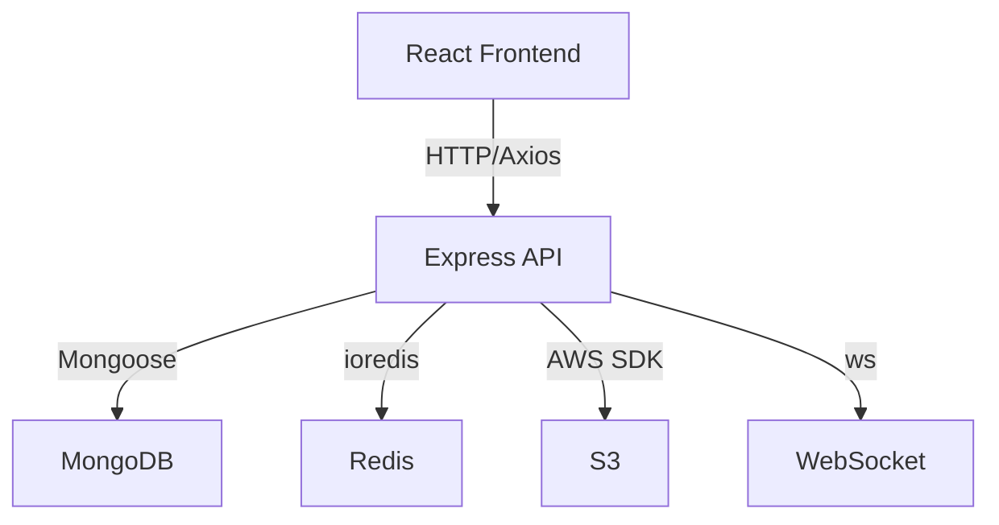

# Story 4.4: Architecture Diagrams

Status: complete

## Story

As a Dev,
I want to produce system overview, data flow, and component relationship diagrams,
so that the system architecture is visually understandable for both humans and AI agents planning future sprints.

## Acceptance Criteria

1. **Given** the complete schema map, relationships, data flows, and controller dependencies from Stories 4.1-4.3
   **When** Dev creates architecture diagrams
   **Then** a system overview diagram shows all major components and their interactions
   **And** a data flow diagram shows how data moves between models in key workflows
   **And** a component relationship diagram shows frontend → API routes → controllers → services → models → database layers
   **And** all diagrams use Mermaid notation and are renderable in markdown viewers (NFR11)
   **And** diagrams are included in `database-architecture.md`
   **And** the existing `_bmad-output/architecture.md` is updated with a reference to the new document

## Tasks / Subtasks

- [x] Task 1: Create system overview diagram (AC: #1)
  - [x] Mermaid diagram showing: React Frontend ↔ Nginx ↔ Express API ↔ MongoDB, Redis, S3, WebSocket
  - [x] Include all major subsystems: LMS, Shop, WTF, FR, Medical, RBAC
- [x] Task 2: Create data flow diagrams (AC: #1)
  - [x] Purchase lifecycle flow (from Story 4.2 documentation)
  - [x] Coin economy flow
  - [x] LMS grading flow
  - [x] Use Mermaid `flowchart` or `sequenceDiagram` notation
- [x] Task 3: Create component relationship diagram (AC: #1)
  - [x] Layer diagram: Pages → Components → API modules → Express Routes → Controllers → Services → Models → MongoDB
  - [x] Show key relationships between layers
  - [x] Use Mermaid notation
- [x] Task 4: Add diagrams to documentation (AC: #1)
  - [x] Append all diagrams to `_bmad-output/database-architecture.md`
  - [x] Verify all render correctly in markdown preview
  - [x] Add reference link in `_bmad-output/architecture.md`
- [x] Task 5: Final review of complete database-architecture.md (AC: #1)
  - [x] Verify document has: schema map (4.1), relationships (4.2), dependencies (4.3), diagrams (4.4)
  - [x] Add table of contents
  - [x] Verify completeness against NFR9-NFR13

## Dev Notes

### Mermaid Diagram Examples

### Critical Constraints

- **Mermaid notation required** (NFR11) — must render in GitHub, VS Code, and standard markdown viewers
- **Diagrams must be accurate** — based on actual architecture, not assumptions
- **Reference existing architecture.md** — don't duplicate, link

### References

- [Source: _bmad-output/project-planning-artifacts/prd.md#FR25, FR26, FR27, FR28, NFR11]
- [Source: _bmad-output/implementation-artifacts/4-1 through 4-3 — prerequisites]

## Dev Agent Record

### Agent Model Used
Claude Opus 4.6 (1M context) as Paige (Tech Writer)

### Debug Log References
None — documentation-only story, no debugging required.

### Completion Notes List
- 7 Mermaid diagrams created covering all required views (system overview, component layers, 4 data flows, domain relationships)
- All diagrams sourced from actual architecture data in Stories 4.1-4.3 (not assumptions)
- Table of Contents added/updated to cover all 4 stories in database-architecture.md
- Header metadata updated to reflect all contributing stories and key statistics
- Reference link added to architecture.md pointing to database-architecture.md
- Medical check-in lifecycle added as bonus diagram (4 data flows vs 3 required) since it was documented in Story 4.2

### Change Log
- 2026-03-16: Created 7 Mermaid diagrams, updated ToC, added cross-reference to architecture.md

### File List
- `_bmad-output/database-architecture.md` — Modified (appended Architecture Diagrams section, updated header and ToC)
- `_bmad-output/architecture.md` — Modified (added Related Documentation reference link)
- `_bmad-output/implementation-artifacts/4-4-architecture-diagrams.md` — Modified (status: complete, tasks checked)
